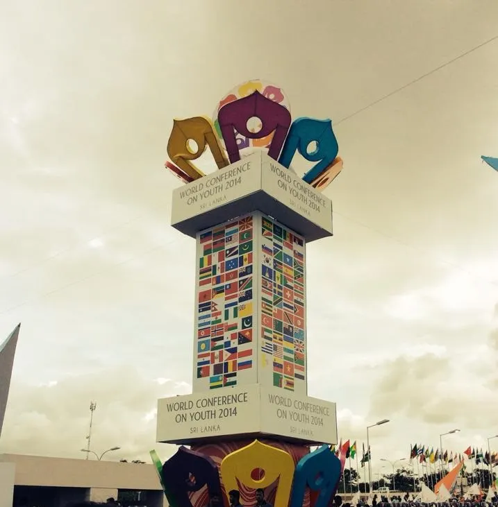
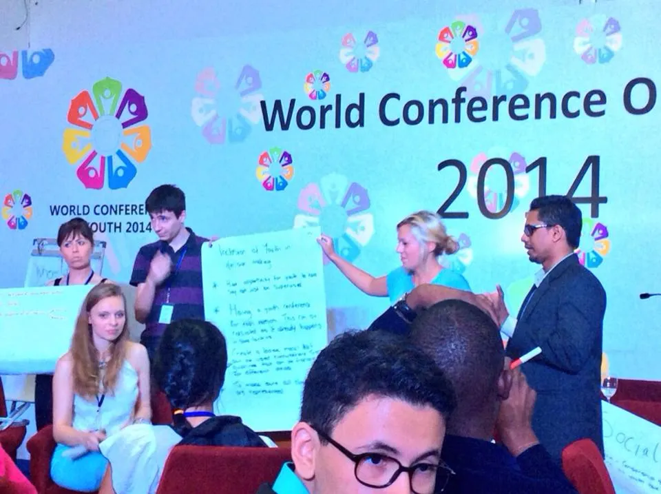
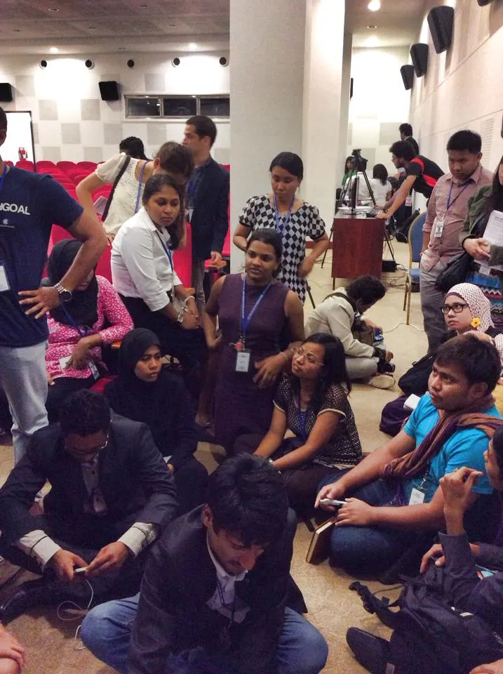
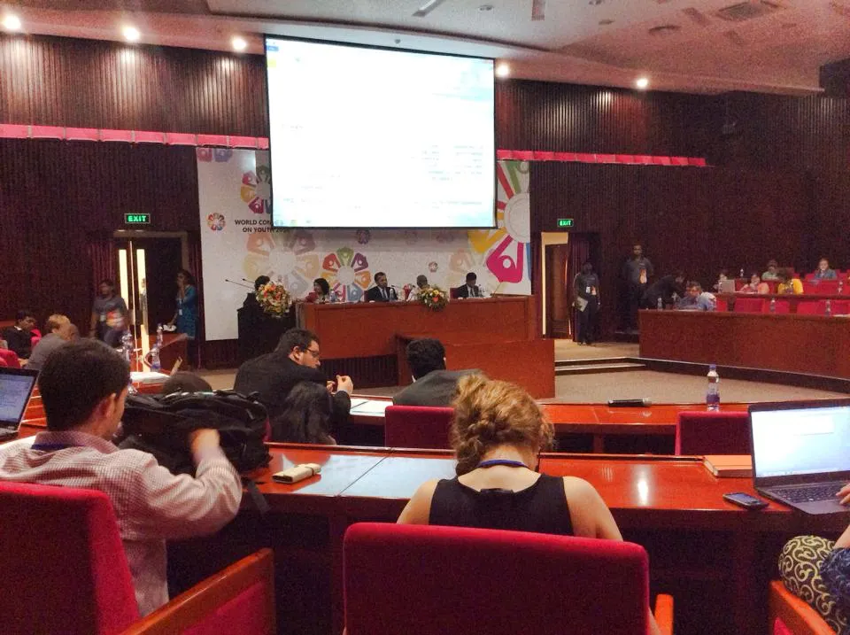

More than two weeks have passed since the conclusion of the World Conference on Youth and the subsequent launch of the [Colombo Declaration on Youth](http://wcy2014.com/pdf/colombo-declaration-on-youth-final.pdf), and the hype has practically died down. But my mind still ails at the very thought of all that hustle, all those multitudes of people and multinational smiles, for I have always been the silent guy given to emotion, and not the best when it comes to meeting new people. So I confess that I’m painfully missing all the good friends I met and the hours we spent to try and change the world.

<figure>

<figcaption>The obelisk that greeted us at the opening ceremony.</figcaption>

</figure>

Given that [#WCY2014](https://twitter.com/search?q=%23wcy2014&src=typd) grossing on social media is skimming by the hour, my readers need not fight away the obvious frustration as to why the late reaction. But after two weeks tied up in exams, I could not resist the temptation to write this piece because to my mind, what really matters is the way forward; the aftermath of the conference.

The [social media fellows](http://wcy2014.com/blog/wp-content/uploads/2014/04/WCY2014-Social-Media-Fellows-FINAL1.pdf) assigned to the conference did a commendable job in giving out detailed accounts of the happenings at the conference. So I will not make any attempts to dig into the nitty gritties with this article. The conference proceedings went as smooth as any Sri Lankan event would unfold. Let us put aside the negatives where the vegetarians had to comfort their empty stomachs with the ample hot air and where some delegates found it hard to survive without free wifi in their hotels, among many others, and bear in mind that the Sri Lankan organisers lacked prior experience of handling an event of this magnitude.

Nonetheless my motive here is not to sing their praises, neither is it to to blame the mishaps.

As the youth delegates gathered around the round tables to discuss matters of great interest to them, it was only based upon the innocent belief that their input would be given due attention and recognition. But that belief did not outweigh our suspicions. Prejudice is by no means an advisable notion, unless your fears turn out to be true.

And they did turn out to be true, and substantially so.

<figure>

<figcaption>From the Day 1 round table session on Globalisation and Inclusive Youth-led Development</figcaption>

</figure>

Simultaneous discussions were held on the 7 thematic areas and the 7 foundations that the conference was based upon. The evenings saw delegates sitting at Regional Meeting that were aimed at bringing together people of common geographical regions and to open up a platform where regional issues were discussed. There were also several parallel events focusing on a wide variety of issues ranging from volunteerism to health and well-being. There was active participation and so much energy, because unlike the majority of the easy-going 100-odd local delegates, their international counterparts took things seriously.

Together we came up with recommendations, drafted policies, proposed actions and arrived at conclusions. We dreamt of Utopia.

<figure>

<figcaption>The Asian Regional Meeting</figcaption>

</figure>

The Colombo Declaration on Youth was to be our gift to the world, our contribution to the post 2015 development agenda. It was to be the voice and the view of the youth. Whether it really is I am not certain.

It so happened that the negotiations to improve the Colombo Declaration materialised with minimal youth participation. The edits to the Declaration was proposed, discussed, opposed with and adopted by the national delegations of each participating country, which usually consisted of the respective Ministers on youth affairs or representatives of the ministers. [Lloyd Russel-Moyle](http://russell-moyle.co.uk/), co-chair of the [International Youth Task Force](http://wcy2014.com/task-force.php) appointed to handle #WCY2014 affairs, lead the youth delegation that represented the views of the youth that came from the round tables. The negotiations, chaired by Dr. Palitha Kohona, went on for several hours on all three days of the conference.

<figure>

<figcaption>The negotiation room. Dr Palitha Kohona sat at the head table, chairing the negotiations.</figcaption>

</figure>

Those hours saw the world communities leveraging diplomacy to fight for their beliefs. Those 3 days saw people from around the world find common ground on the issues that affected them. And at the end of the 3 days this (arguably) constructive pragmatism gave birth to the final version of the Colombo Declaration on Youth.

When all this happened, another document was being drafted. The [WCY Annex](http://wcy2014.com/pdf/annex-colombo-declaration-youth.pdf) included detailed content of the conclusions that were reached at the round tables. In its essence the document was a clear portrayal of the youth view, untouched (and possibly unspoilt) by an older generation. Needless to say, the content gap of the Annex versus the Declaration was huge.

After the closing ceremony, I asked my Serbian friend [Aleksandar Linc-Đorđević](https://www.facebook.com/linc.alex) whether he thinks the Colombo Declaration as a thing of the youth. He told me that he thinks otherwise since the declaration was not formulated by us. The WCY Annex was what the youth came up with. That sould have been the real declaration ‘’on Youth’’. The sentiment was mutual. [Ksenia Klimova](https://www.facebook.com/ksenia.klimova.92) from Russia and [Saul Zenteno Bueno](https://www.facebook.com/saul.zenteno) from Mexico who sat with me at the round tables shared the same opinion.

So a week of dreaming went by and a not-so-youth Colombo Declaration was produced and [Ahmad Alhendawi](https://twitter.com/AhmadAlhendawi), United Nations Secretary General’s Special Envoy on Youth is supposed to undertake the task of taking the Declaration to the UN. Whether he would do it is not what I’m worried about. It is neither the possibility that the United Nations would not approve of the recommendations in the Declaration. It is that what the World Conference On Youth produced, was not necessarily a thing of the Youth.

Nothing about us, without us!