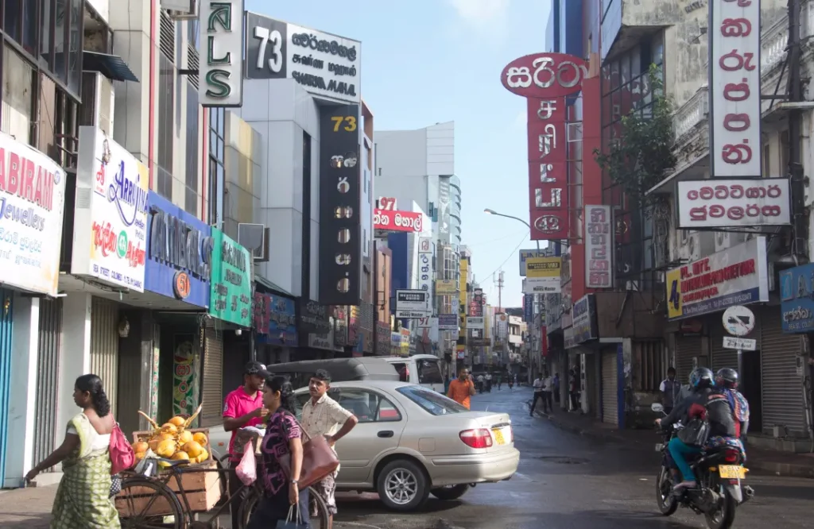
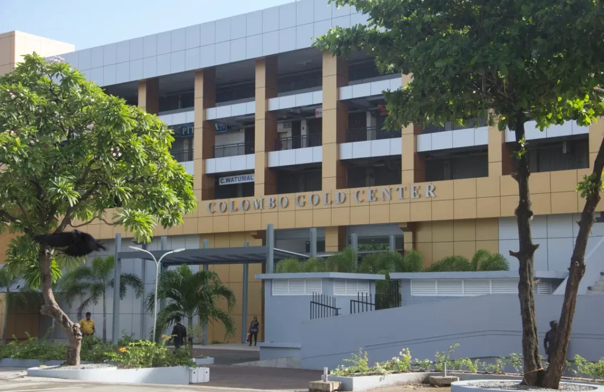
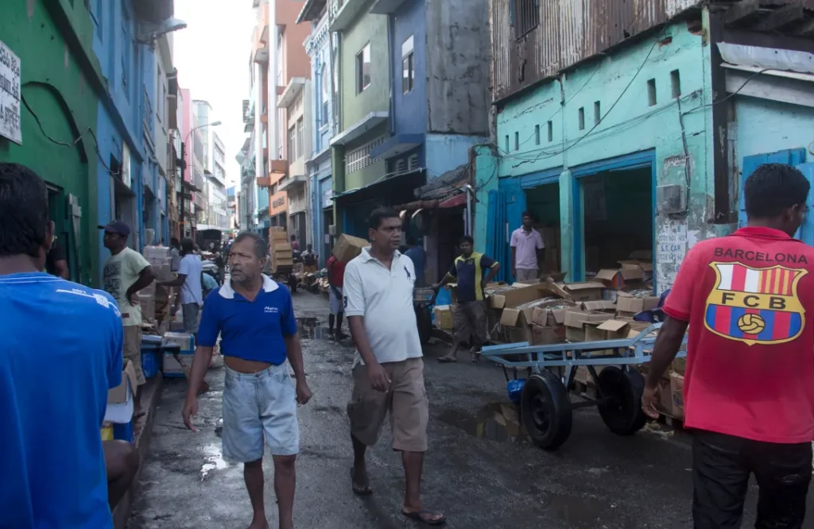
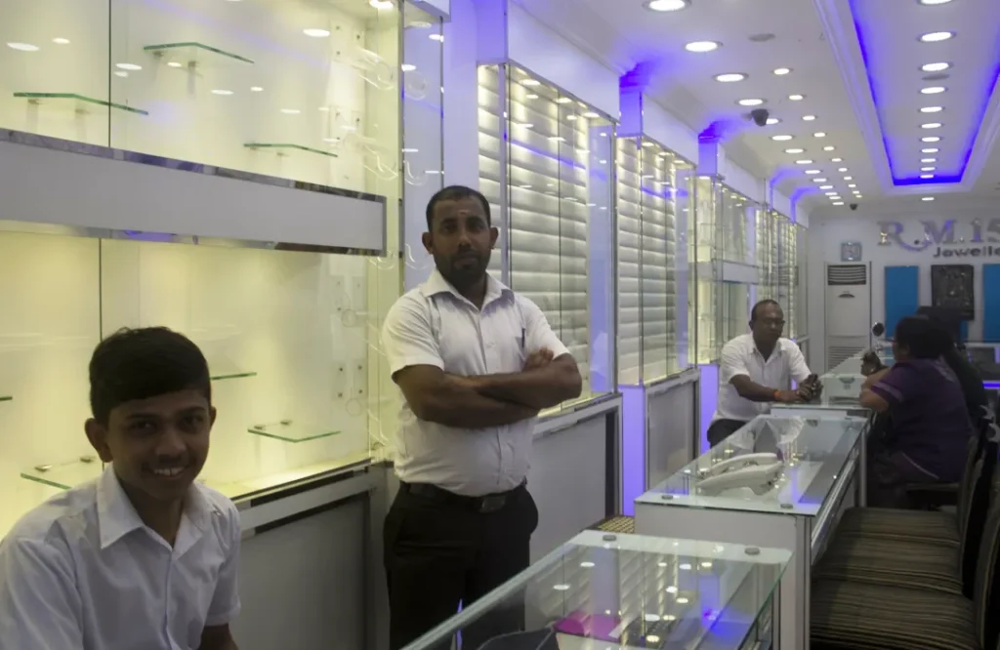
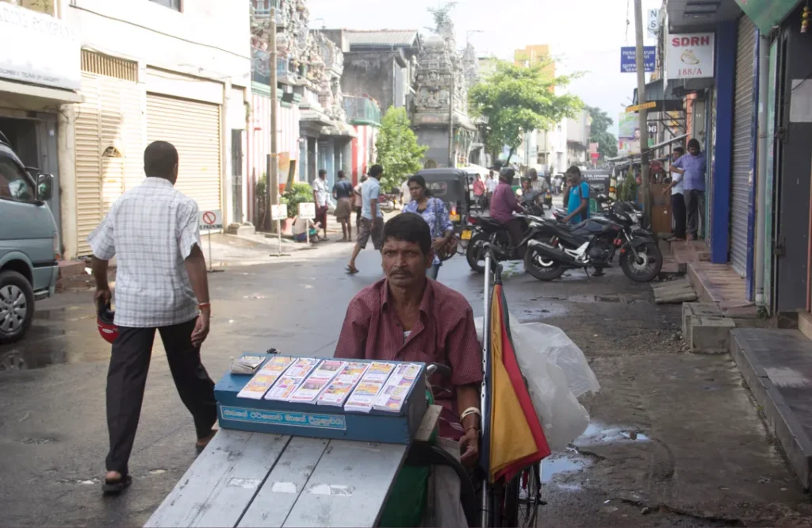
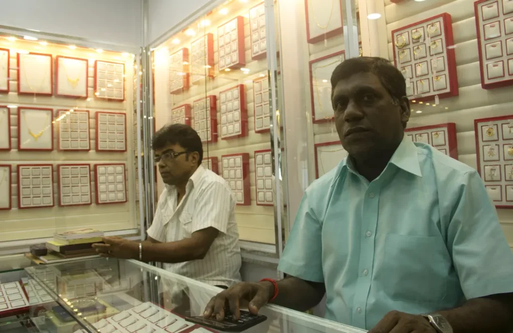
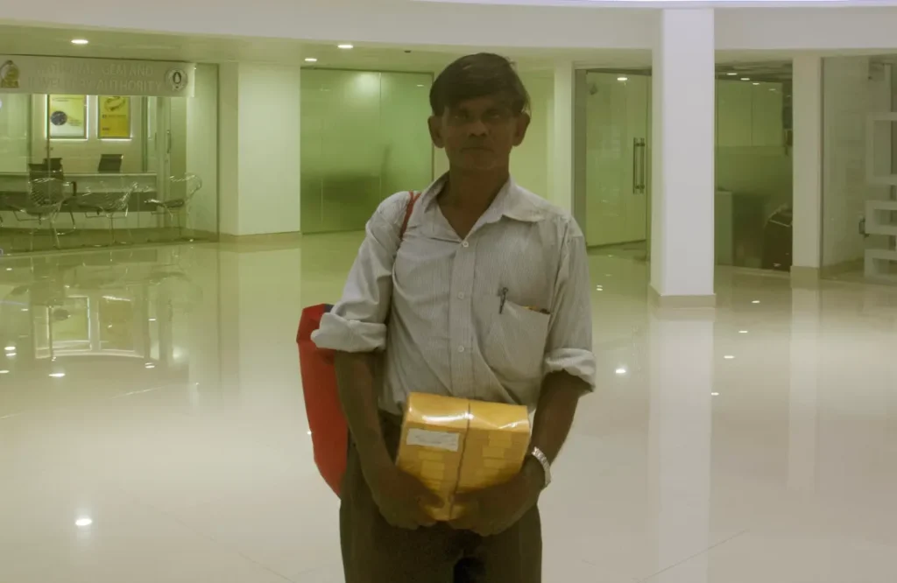
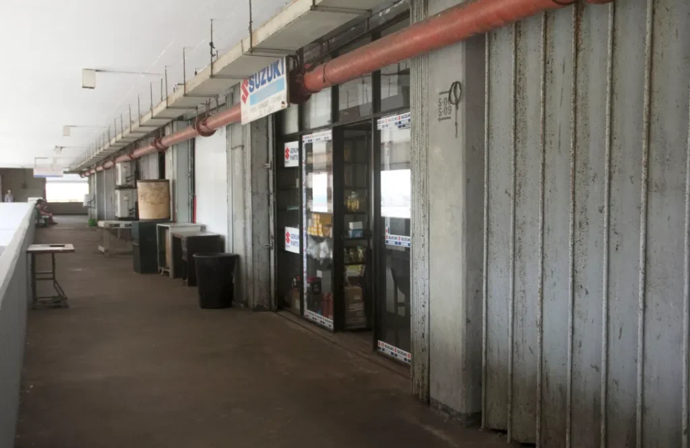
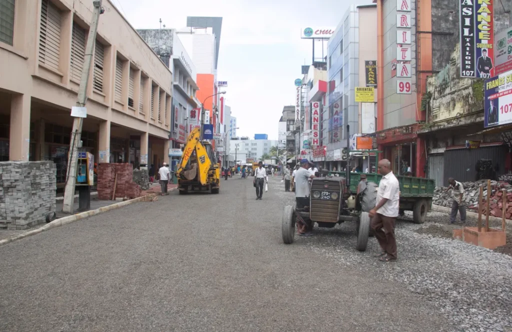

**_The Old Sea Street._** For years, Sea Street (Hetti Veediya) was known as the one place for best gold jewellery in Colombo. The closely packed street is is home to hundreds of Gold merchants, mostly of Tamil origin, who have for long dominated the local gold market. During times of low Gold prices, Sea Street witnesses a huge influx of buyers from all over the island, often blockading the shops and making movement impossible. The street also houses the Old and New Kathiresan Kovils. The merchants in Sea Street have done considerably well in their trade for many years, and they have grown in numbers.

**_The new home for jewellers._** Colombo Gold Center, which was opened on 5th September, is located in the old building which housed the famous St. John’s Fish Market which is now relocated in Peliyagoda. The building has been renovated to make it fit for purpose, and the multimillion rupee investment has transformed a once smelly, disorderly marketplace into a cozily lit arcade with a lush interior. As of yet, only the first two floors have been refurbished, but many merchants who were previously stationed in Sea Street have now bought space and set up new shops here. When I was inside, I could see that many were still moving in and putting things together, getting ready to try their prospects in the new precinct. Banks have moved in, a cafeteria is in place, and the Gold Center is already attracting some good business.

**_Scaring the fish away._** In I. X. Pereira Street near the Gold Center, hundreds of merchants still continue their trade of dried fish. At any given time of the day, the street is bustling with dealers, their lorries and the delivery boys who push around two-wheeled trolleys loaded with packed dried fish.Word is that these shops will also be removed and the buildings razed to the ground. This is, as these people say, to make room for a new set of buildings that will serve as tourist attractions — recreational space, walking paths etc. Nothing is known as to what would happen to these dried fish sellers when the new constructions come about, but they hope for the best.

**_We prefer the old life._** This is a shop in the Sea Street. When I went in, the shelves were empty and they had not opened up for business. I asked them whether they’re ready to try their luck in the new Gold Center. “Well, we prefer to stay here; in the old Sea Street, in our old shops. People know thisplace, not the new one. And there is another reason: we don’t want to pay over a hundred thousand rupees a month as rent for a shop half this size. This place is much better”. I asked them whether they disliked the new development drive in the area. “No, but we have our own fears. If the dried fish sellers are also relocated, we are going to have a hard time, because they are our biggest customers.” As I was stepping out of the shop after our conversation, they said “Snap some photographs if you go inside the Gold Center, it’s a nice looking place.”

**_It’s always for the rich._** This man, who refused to give his name, is selling lottery tickets on his wheelchair. He has lived all his life in Sea Street. “The people who own these shops are not what they seem, mahaththaya” he says. “They claim to be broke and having a hard time, but in truth they’re well off. In fact, many of them have bought new shops in the Gold Center for their children.” I asked him what he thought about the new Gold Center. “It’s nice and all, and I am glad that nice things are coming up around these parts. But as always. it serves the rich man. We are always left out.”

**_We like it here._** New Archana Jewellers have been successful in their trade for more than 30 years in Sea Street. Now they have moved to the new Gold Center, with hopes of better fortunes. “We like this place — when we were in Sea Street, we were constantly worried about burglars and thieves; brokers meddled freely with our business using stolen jewellery. Here, there is a sense of security and freedom.” I asked them whether it was a sensible decision to move to a place with high rent and other expenses. “This place just opened up for business. No one can expect a sudden boom in a situation like this. When word spreads and people start to come here for Gold instead of Sea Street, we will have enough business to cover all our expenses.” Optimism has driven many merchants like these two of New Archana Jewellers to try out their luck in the new precinct.

**_They can’t sell gold without me._** When I first saw this man, he was being chased out of a newly opened shop inside the Gold Center. I walked up to him and asked him whether he worked here. “Not yet” he said. ” But soon, I will be working here. I need to find a way to work things out in this new place.” He showed me a set of envelopes that he was carrying and a pack of paper tags tucked inside his bag. “These people, they don’t know what they’re doing” he was referring to the Gold merchants. “These tags that I have, they are a mandatory item for gold trade. It is illegal to sell gold without these tags. These people don’t know that.” He went on to say that he has been supplying the tags for Gold traders around the island for many years. He even claimed to be the brother-in-law of Norman Palihawadana. I asked him whether the new Gold Center is going to be a disadvantage for him. “No,” he was confident, “I will work things out. Until these traders realise that they need my tags, I will work as a cleaner here.”

**_In with the new, out with the old._** This is the fourth floor of the building which houses the Gold Center. Here and in the floor below, old shops are still functional. But they won’t be for a much longer. From what I heard, these two floors will be refurbished to house a cinema, a gym and a even a mini-hotel. I asked around, and people say that they would love to see the project being completed, so that they could attract more customers and especially tourists.A mega mall is coming up in the heart of Pettah, and there are hundreds of people looking forward to benefit from it. But whether they would, is the question. While providing the Gold traders better opportunities and facilities for the future, it should be made sure that benefits flow down the societal hierarchy.

**_Work in progress._** The Pettah Main Street, which leads to the Gas Paha Junction (Main Street Roundabout), and which also provides entry to the Gold Center, is being revamped. Therefore in a sense, the beautification project surrounding the Gold Center is already being carried out. After completion, people will expect to see a new city; a cleaner, tidier city. What happens to the old city and it’s old residents is an issue beyond our control, and it’s illogical to question the pulling down of old structures to make room for new and more sensible edifices; but the remnants of the old city will continue to remind some people of a “home” that was robbed of them.

