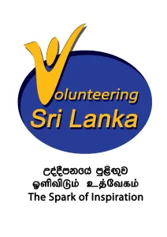

I was invited to an event yesterday. The Ministry of Social Services of Sri Lanka, along with UN Volunteers and UNDP, launched the National Volunteering Secretariat (NVS) at an extravagant event held in Galadari Colombo, with First Lady Shiranthi Wickramasinghe-Rajapaksa attending as the chief guest. I was among the few young people present, as the Grand Ballroom was full of middle aged and elderly ministry officials, representatives from government institutions, media personnel, academia, and others. The launch was followed by the 2-day National Conference on Volunteerism.

I learnt at the event that the NVS was conceived by the authorities sometime back, and like many “launches” and new initiatives that we see in Sri Lanka, it has supposedly been the brainchild of Minister of Social Services Honourable Felix Perera himself. The motive behind the concept is to facilitate volunteerism and volunteering actions in the country through a formally established body under the government. The crowd also witnessed the subsequent launch of the official website [vsrilanka.lk](http://vsrilanka.lk/), which will serve as a platform of connectivity for aspiring volunteers and the organisations who are in need of them, through a database feature developed by the University of Moratuwa.

In the process, the First Lady was praised as an outstanding volunteer for the work she is doing with her personal initiatives such as the Carlton Pre School. The Honourable Minister also basked in the adoration of admirers. One speaker went to the extent of lauding all politicians for taking up a job with high risks involved rather than resorting to a stable government job with a fixed salary, thus portraying the true qualities of volunteers. According to him, politicians make this “sacrifice” solely for the betterment of their communities and the people around them. Although my friends who sat next to me were busy commenting on such statements, it was not at all surprising that the majority of the audience sat through these speeches comfortably, without twitching.

Such subjects as corruption in politics, abuse of political power and loopholes in the political process call for a separate discourse and there is enough arguable material to go on for days. This post however, is not on politics. We have _Volunteerism_ to talk about.

So leaving the politics aside, to my mind there were other issues that were conveniently left out and conspicuously overlooked at the event.

Volunteering, a concept as old as humanity itself, is given new definitions in the 21st century. In Sri Lanka, the volunteer movement is spearheaded by the UN Volunteers. I myself was once a member of the [V Force](http://www.unvlk.org/v-force/), which is the volunteer group under the UNV. There are several other independent groups, mainly composed of youth, based in several parts of the country. Over the past few months, I have seen impressive work being done by these young volunteers.

There are some who teach English to needy and underprivileged children; some who distribute water in drought affected areas; some who promote and work for gender equality, interfaith harmony and similar social dialogues; some who work on poverty alleviation. Many of them are self-motivated genuine volunteers who want to make a difference. And they do so by going out there are making things happen.

And then there are _soi-disant_ volunteers.

There are enough and more events happening around the country today for which the organisers request the support of volunteers. It is easy to sign up — in most occasions there is a hassle free online application — and it is easy to be a part of the event after that. Social media networks give a boost to the online sign up process, and within a few days you have hundreds of enthusiastic volunteers, waiting to be of service. You can conveniently end up organising an event with 100 participants and 250 volunteers. And what do the volunteers do? They sit around, socialise, make friends, take selfies and eventually go home without contributing and without even knowing what the event was actually about.

Quite interestingly, I have observed that there is a certain group of “volunteers” who turn up at every nook and corner just to do this — have some fun, enjoy the free food, take the T shirts and go home. Omnipresent fun-loving selfie-maniacs with zero worries, and zero responsibility.

Socialising is a good thing, people do it all the time at all sorts of events and it is perfectly normal that volunteers do the same. But, is that what volunteering is all about? There is nothing wrong in having fun with friends when you work together, but is it right to do so at the expense of a greater cause? The ones who have consciously been a part of all this drama may argue that there are more than enough volunteers who have signed up for an activity, so some of them might as well take time off to have some fun. I agree, because this is a part of the problem. If I want to do a project of my own, and if I want the support of volunteers, I would make sure that I stick to minimum number of capable people. Sadly this is not the case with many institutions (including the UNV) which promote volunteerism today. There are sad consequences to this. An average Sri Lankan youngster would understand volunteerism to be a fun-filled activity where you’re given fancy T shirt and good food. Yes, volunteering (in its true sense) _is_ fun if you want it to be, but before the fun comes the satisfaction.

The UN system has done remarkable work around the world in promoting volunteerism, but the UNV’s approach has sadly failed in Sri Lanka. Oftentimes, it has set a bad example.

Perhaps the National Volunteering Secretariat should get busy now. They have already coined [a new definition for volunteering](http://vsrilanka.lk/site/index.php?option=com_content&view=article&id=72&Itemid=468&lang=en), and now it should be made sure that the youth in this country understands it in its true sense. Let me make it simple for those who are reading — having a V Force T shirt does not make you a volunteer, helping that old man cross the road does; Your Facebook albums with photos of this event and that is not a qualification, a word of thanks coming from a pregnant woman on the bus to whom you offered your seat is. And yes, I am aware that I would be offending hundreds of “young volunteers” by writing this, but let your heart decide. You know your true self better than anyone else does. And there is a comments section down there if you want your rebukes to flow free — after all the internet is an ideal platform for debate.

This generation cares, but we have failed in showing it to the world. It is just that we have more rascals with Facebook accounts than true-hearted and honest volunteers without. We have long been content being the [Generation Stupid](https://medium.com/bad-words/generation-stupid-b2bc21dc3ed5), and now, time has come for us to change. We have embraced this institutionalised format of volunteering, and we have forgotten that it is simple deeds of love and kindness that make us true volunteers.

Let us hope that the NVS would make the change happen, once and for all.