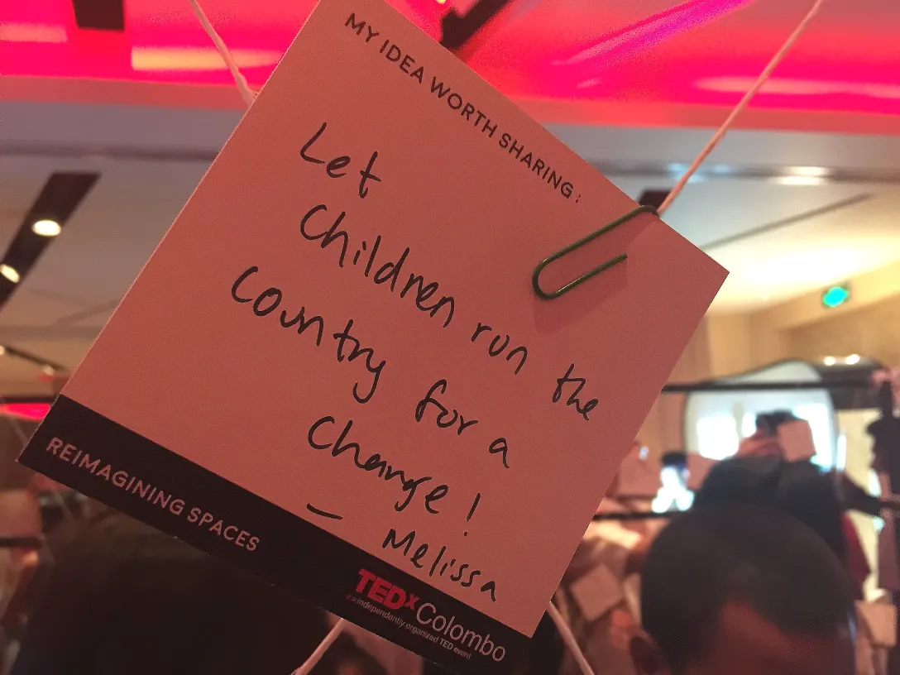
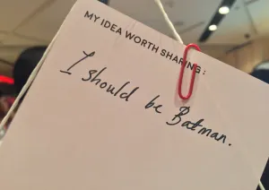

I’m so glad that I bunked my evening CIM lecture yesterday to attend TEDxColombo 2015.

It was a first for me. I had never been to a TEDxColombo before. Despite my love for all the “Ideas Worth Spreading” consumed on Youtube, the fact that experiencing it firsthand would be different had escaped me for a long time. But let me not over-glorify the affair; I was not paid to write this. In brief, here’s what I learned:

## We’re not lost

Over the years, I have come to believe that as a nation, we’ve lost our way. I’ve shamelessly (?) concluded that Sri Lanka is not the place I’d want to spend my life in. It pained me very often to think back to the enormous pressures I had to bear as a student, and as a teenager growing up. It pained me to think about thousands of others who went through the same pain thanks to a badly designed education system. I used to hate many people of older generations around me for not taking me for who I am (I still do, to be honest). The Sri Lankan society was one big mess beyond saving.

Interestingly enough, I had been always searching for facts that could build a case against these preconceived notions of mine. I was building a wall, but at the same time I was dreaming of demolishing it. I was a Westerosi, secretly craving to be a Wildling. And yes, there had been a good deal of inspiration along the way that made me question my stance. TEDxColombo 2015 was good enough to be one of them.

## We’re not powerless

I can still think of a multitude of people who would scoff at me if I were to speak my mind about something of importance — politics, a social or economic issue, whatever it may be. To some people, young voices still don’t matter. As [a friend once put it](https://www.facebook.com/yudhanjaya/posts/10206516582209774?pnref=story) beautifully, “The trouble with Asian cultures is that people tend to mistake age for wisdom. Contrary to popular belief, growing old is very easy. Being wise is not.” And so it was deeply satisfying to watch young people received with nods and applauses by a fairly large audience.

We’re much more powerful than we know, and think, ourselves to be. Mine is a generation poised for greatness. And of course, thousands before me would have thought the same about their own generations, and thousands after me will, but it helps me to realise that I’m convinced.

<figure>

<figcaption>One of the unconventional ideas I saw at the event, presented by an attendee.</figcaption>

</figure>

## But, we have a lot to do

We have groundbreaking ideas. We have inspiring people. We’re blessed with technologies that our fathers would never have imagined seeing in their lifetime. But we’re still falling behind, for the simple reason that the number of us who are acting is not enough to make a difference. There’s more to life than drinking and partying away when you’re young. There’s so much to learn and so much to be discovered. Yes, you’ve accomplished some things in life if you went through school and university to land a job that pays you well. But don’t settle. _NEVER. SETTLE._

<figure>

<figcaption>Some of the less serious folk had also weighed in. But is this an attempt at humour, or an overwhelming desire for justice? You never know.</figcaption>

</figure>

TEDxColombo featured a social media activist, a Big Data junkie, a social entrepreneur, a dancer, a spoken word artist, an engineer and two corporate executives (if you have no clue what any of these terms mean go [here](\"http://www.google.com/") and start typing). A nice combination of wonderful people from different walks of life, with different goals, aspirations and accomplishments. Rarely do you see all these flavours laid out on a single stage. Another very interesting prospect in the TED ecosystem I discovered yesterday was the TED Open Translation Project. If you’re interested in helping make TED content available in Sinhalese or Tamil for Sri Lankans, check it out: [ted.com/translate](http://www.ted.com/translate) and [ted.com/transcribe](http://www.ted.com/transcribe)

That is not to say that everything about the event was perfect. Some of the speakers could have been a little more thoughtful in their delivery. [Halik](http://tedxcolombo.org/abdulhalikazeez/), I thought, would always be a better photographer and a writer than a speaker. [Sohan](http://tedxcolombo.org/sohandharmaraja/) could have made things a little more relevant to the theme “Reimagining Spaces.” [Tilak](http://tedxcolombo.org/tilakdissanayake/) could have made life a little bit easier for the less tech-savvy folk. I hope for your understanding because I would never walk up to you and say this. I’d much rather write about it afterwards because I’m weird (=socially awkward?) like that.

That said, the imperfections were largely a part of the alluring nature of this event. They kept one fact alive; I’m listening to a group of human beings who could be as flawed as I am.

A Sunday evening and 1800 bucks well spent. I’m already looking forward to next year.