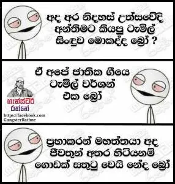

I’m returning to the blogosphere after a long time. It has been too long, in fact. But I had to come. While I don’t yet know if this stay would last, I’ll say what I have to say.

We commemorated the 68th Anniversary of National Independence today as a nation. The usual arrangements were made — the celebration, the parades, the complete package. Except for one unusual element — the National Anthem was sung in Sinhala AND Tamil. As one would have expected, the internet exploded within seconds.

Self-professed “patriots” emerged out of nowhere. The case was strong against supporters of the Tamil rendition. Facebook became a battlefield amidst the racial slur, proclamations of ethnic superiority and everything in between.

## What do I make of it all?

Nothing, really. Just another day in the paradise isle. (In all seriousness though, I do think this is relatively temporary cause of the misguided lot which will eventually die down with the course of time).

## What of the present though? And what course will time take?

There is a legal issue involved. I’m not qualified to make a statement on the legality but according to what I’ve read The Tamil National Anthem is arguably against the Constitution as we know it (read Rear Admiral Sarath Weerasekara’s comments on the matter [here](http://www.dailymirror.lk/68405/national-anthem-and-nationalism)). My more learned friends in the legal profession would agree that the Constitution itself is a mess and has been a source of contradiction every now and then.

Leave the legalities aside. Answer me this simple question. What’s wrong with paying homage to your motherland in your own language? Would my Sinhala-speaking friends rather sing an English translation of our National Anthem when the same thoughts crafted in your native language would feel much closer to home? Why cannot it be the same for our Tamil friends? If it helps feed their sense of pride and the notion of beloging, why not? They aren’t singing praises for _The_ _Eelam_, are they? It’s for the same Sri Lanka we all share.

<figure>

<figcaption>For instance, take a look at this meme making rounds on social media. This is nothing short of stupid. Why would Prabhakaran be happy knowing that the Tamils would sing praises for Sri Lanka? He wanted a separate state — The Tamil Eelam — he never wanted us to be together in one. For all I know he’d be turning in his grave now.</figcaption>

</figure>

I see the pseudo-Nationalists popping up on Facebook; their slogan — “one country, one nation, one anthem!” Isn’t it one anthem after all, simply translated for the benefit of a fellow community?

There is another part to this equation — the politics — of which I’m tired. It’s the same politics that fuels Sri Lanka’s well-known racists that is trying to make an ethnic issue out of this. If we can have a conversation about the damages a poorly designed Constitution has brought upon us, great! Instead, it’s racist slur and political propaganda.

The law of the country should be representative of all who reside in it, and if that means amending the law (and like in this case, granting the Tamil speakers their wish to pay homage to the country in their native language) I’m all for it.

I can’t see how this will grow into a conflict or create a separation between the ethnicities — simply because the only difference between the two versions is the language it’s projected in, not the motive or the meaning, which is what really matters.

Another thing, does allowing the Tamil rendition make things better for us? Would it help the arguably ill-treated Tamils in the country? Would it, for instance, make the hundreds of rural Tamil girls forced to labour away in the households of the affluent feel any better?

_It wouldn’t_. But that’s the point. This is just a beginning; The means to an end, and not the end itself. It’s what you make of is that matters eventually. If you’re too blind to see that, you can Unfriend me on Facebook.

If my patriotic friends are worried about the Tamil “minority” taking over the Sinhala “majority” — just as you thought the Muslims would — go ahead, give in to your occasional outbursts, enjoy your fifteen minutes of fame and bask in the adoration of your imbecilic followers. But please, return to the lives of idiocy you chose to follow and leave us in peace.

Because we have a country to build. Together.