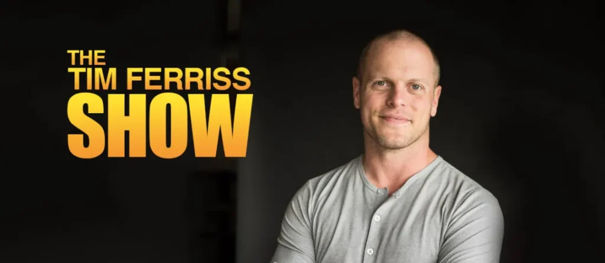
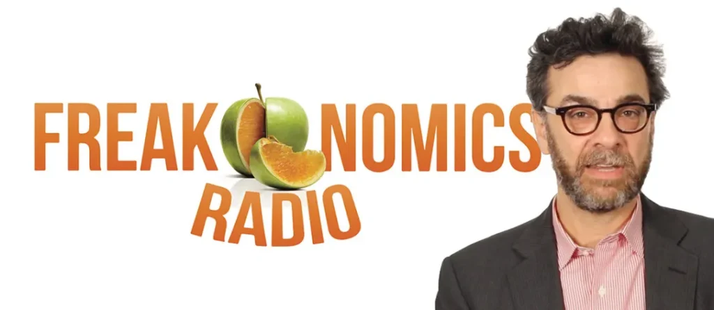
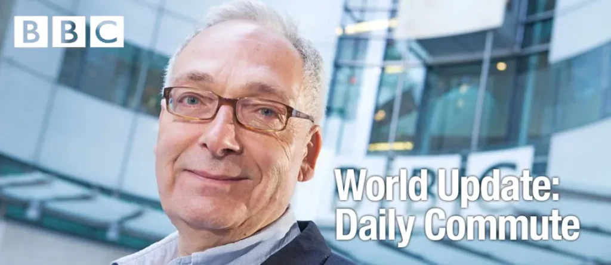
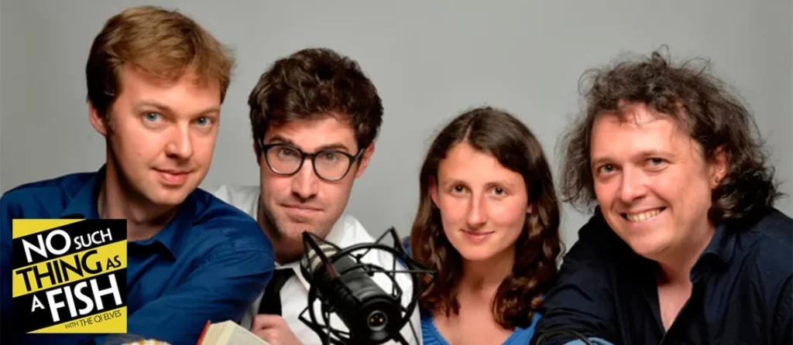
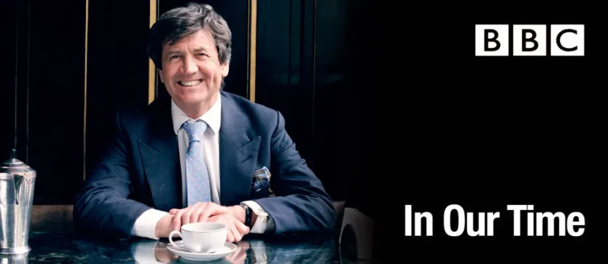
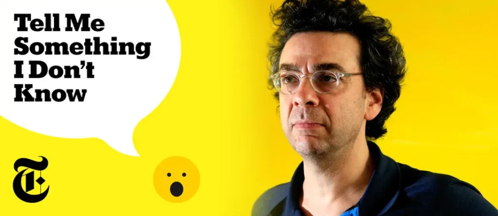
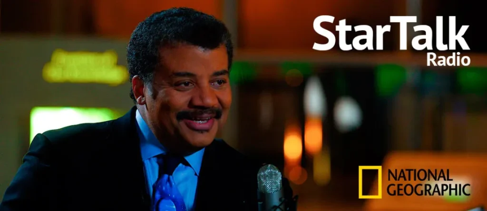

For a long time, the Podcasts app has been sitting silently in the Extras folder on my Home Screen without ever being touched. It’s only been a year since I actually started using it.

I realized that about 3 hours of my time are being wasted every day in the commute to and from work (after 11 months of doing so!). It also occurred to me that the time I had to consume-information-by-reading was growing thin. Listening was the logical choice.

I’ve been hooked since then. At any given time, there are about 12 podcasts I’m actively listening to on iTunes. Some have been there from the start, some others are temporary. Throughout this year, I have tried and cast aside many. I thought I should write about the ones that stayed.

If you’re into podcasts, I invite you to try these out. Even if you aren’t, try anyway. You might just end up liking them. And you’d be smarter than you were.

In no particular order, these are the podcasts I listen to on a daily basis.

## The Tim Ferriss Show

During the two short years I’ve been working, I’ve learned that there’s one thing everybody can’t get enough of: productivity. In many ways, Tim Ferriss is the poster boy of productivity and self-improvement. But, a lot of people actually hate him. He’s frequently dissed for his ego and carefully “curated” lifestyle that seems too good to be true. However, there’s an equally large, if not larger, fan base who worships him. He has 700K+ fans on Facebook, 1.4 Million followers on Twitter, and over 100 Million downloads for his podcast. This guy is basically God to some people.

Why do I find his podcast interesting? There’s one simple reason — the interviews. Ferriss serves one purpose with his podcast — interview interesting and successful people, learn about their habits, and explore ways to apply these habits in his and his listeners’ lives. The range of people he has featured over the years is nothing short of phenomenal. Some of my favourites are [Arnold Schwarzenegger](http://fourhourworkweek.com/2015/02/02/arnold-schwarzenegger/) (go on and listen, you’ll find out why), [Ed Catmull of Pixar](http://fourhourworkweek.com/2014/08/12/ed-catmull/), [Mike Shinoda of Linkin Park](http://fourhourworkweek.com/2014/08/04/mike-shinoda/), [David Heinemeier Hansson of Basecamp](http://fourhourworkweek.com/2016/11/25/david-heinemeier-hansson-on-digital-security-company-culture-and-the-value-of-schooling/), [Ezra Klein of Vox](http://fourhourworkweek.com/2016/12/13/ezra-klein/) and [Matt Mullenweg of Automattic.](http://fourhourworkweek.com/2016/10/01/matt-mullenweg-on-the-characteristics-and-practices-of-successful-entrepreneurs/)

Ferris’ ego is tolerable if you focus on the amazing stories. Honestly, it hasn’t bothered me yet. If you really want to dig deep into the self-improvement game, try the episode [Testing The “Impossible”: 17 Questions That Changed My Life](http://fourhourworkweek.com/2016/12/07/testing-the-impossible-17-questions-that-changed-my-life/) as well. Some of these episodes tend to be long, running up to about two-and-a-half hours, but they’re definitely worth trying out.

## Freakonomics Radio

If I had to pick a favorite, this would be it. Stephen Dubner, of his [Freakonomics fame](https://www.goodreads.com/series/102787-freakonomics), is continuing the inquisitive tradition via audio. Apparently Dubner’s partner-in-crime Steven Levitt is not involved in this podcast save for some occasional appearances.

Freakonomics Radio is for anyone curious about how the world works. [Why are we still using cash?](http://freakonomics.com/podcast/still-using-cash/), [How can you win a Nobel Prize?](http://freakonomics.com/podcast/how-to-win-a-nobel-prize-rebroadcast/), [Why do economists love Uber?](http://freakonomics.com/podcast/uber-economists-dream/), [Does the President of the United Sates have any real power?](http://freakonomics.com/podcast/much-president-really-matter-rebroadcast/), [How can you be like Tim Ferriss?](http://freakonomics.com/podcast/tim-ferriss/), [Should you tip when you dine at a restaurant?](http://freakonomics.com/podcast/danny-meyer/): these are some of the topics Dubner has explored in the past. Like Tim Ferriss, Dubner is heavily into interviews. The premise of each topic is backed by someone living and breathing those realities — that’s the beauty of it. The extensive research that goes into each episode is a big part of Dubner’s appeal (Check out the 3-part series _Bad Medicine_ — Part [1](http://freakonomics.com/podcast/bad-medicine-part-1-story-98-6/), [2](http://freakonomics.com/podcast/bad-medicine-part-2-drug-trials-and-tribulations/) and [3](http://freakonomics.com/podcast/bad-medicine-part-3-death-diagnosis/)).

Dubner, like Ferriss, is originally a writer who has now taken up extensive podcasting.

## World Update: Daily Commute

BBC. I know.

This is mostly a marriage of convenience. BBC’s _World Update: Daily Commute_ is a 30 minute podcast which rounds up the top trending news from around the world each day. This fits in perfectly for my commute. It’s concise, yet comprehensive.

Dan Damon has been with the BBC [since 1974](http://dansupdate.typepad.com/about.html), and embodies the world view of a typical BBC journalist. He despises Donald Trump, blatantly vilifies Vladimir Putin, and condemns Brexit. And so on and so forth. However, the reporting is decent and the news is presented in an easily consumable manner. It’s basically what I’m looking for in a daily news digest.

## No Such Thing As A Fish

If you love Stephen Fry like I do, you probably know _QI (Quite Interesting)_, the comedy quiz he hosted (Fry doesn’t do this anymore but the past episodes are [available on YouTube](https://www.youtube.com/playlist?list=PLtp2mkTkkFrdhlxjGmbr-iBe29VyhHhyx)). _No Such Thing As A Fish_ is a podcast which is put together by the new generation at _QI._

Remember that scene about mixing up Facts and Opinions in _Inside Out_? _NSTAAF_ is here to help you in the Facts department. Every week [Dan Schreiber](https://twitter.com/Schreiberland), [Andrew Hunter Murray](https://twitter.com/andrewhunterm), [Anna Ptaszynski](http://qi.com/people/elves/anna-ptaszynski) and [James Harkin](https://twitter.com/eggshaped) — the _Elves_ (_QI_\-talk for researchers/fact-finders) — bring in 4 random, interesting facts/discoveries to talk about. The facts cover a wide scope, from Paranoid Ants to Mucus Pajamas to Boa Constrictors and Giant Robot Michael Jacksons. It’s rather fun.

This quartet also created a TV show recently, named _No Such Thing As The News_ which aired on BBC. The episodes are now [available on YouTube](https://www.youtube.com/playlist?list=PLSCKxbYNjB1qfYbOMVqTplCFeX18eqLlZ).

## In Our Time

At school, I practically had a love-hate relationship with history as a subject. All I did was memorize enough content to get me a decent grade at exams. All the school did was make me memorize enough content to get me a decent grade at exams. I did not learn to explore historical events in their categorical significance, and I never developed an appreciation of how history shaped the world I live in today.

It’s safe to say that this podcast has changed things for me. The indispensable Melvyn Bragg hosts a set of experts every week for an in-depth look at a selected historical figure or incident. What’s fascinating is Bragg’s vast expanse of knowledge, and the fact that he uses it as a bridge to connect the listeners with the subject matter experts. Some of my favourite episodes include [Justinian’s Legal Code](http://www.bbc.co.uk/programmes/b082j2q2), the [Epic of Gilgamesh](http://www.bbc.co.uk/programmes/b080wbrq), [Zeno’s Paradoxes](http://www.bbc.co.uk/programmes/b07vs3v1) and the [Gettysburg Address.](http://www.bbc.co.uk/programmes/b07c2w5j)

This is one of those experiences that opens your eyes to see the world in a new light. Cheesy. But true.

## Tell Me Something I Don’t Know

This is another gem from Stephen Dubner.

This podcast is not an investigative venture like Freakonomics; this is a game show. The contestants in the game have to present a fact that the judges don’t know about. They are fact-checked and ranked in order of importance, and a winner is chosen. One would think that a show like this is easily overwhelmed by useless “fun facts” — but what happens here is fascinating. People from diverse backgrounds participate in the game, and the result is a wealth of knowledge for the listeners.

For a podcast that started airing a couple of weeks back, this has already generated a lot of buzz. For me, because of its lighthearted approach, this podcast is a convenient way to consume information. [Here](https://dfkfj8j276wwv.cloudfront.net/episodes/5f089f9c-0caa-4880-899a-c8aae38c1a4f/b04d41963d4ad581fc22ec9111f994bd416b2fbe43195ed92a67ead03ec800e71f20db66a6414aff60f8070a5bbc75d9ac57834ac43c97d81f80f5fac4742890/TMSIDK_S01E00_MIX_v09-toNYT.mp3) is a sneak peek of the first episode.

## Seriously…

I have to give BBC credit where its due: this podcast is seriously interesting. Each episode is a documentary rich with emotion and intensity. Sometimes they’re harrowingly painful; sometimes they’re cheery. They’re about [villains in pop culture](http://www.bbc.co.uk/programmes/p049j329), [capitalism in sports](http://www.bbc.co.uk/programmes/p04lj0m9), [songwriting](http://www.bbc.co.uk/programmes/p04flsmq), [boredom](http://www.bbc.co.uk/programmes/p04h7t2l), and [disenfranchised youth.](http://www.bbc.co.uk/programmes/p04f4sdq)

While some episodes are produced in-house, what’s interesting is that many are produced for the BBC by third-party producers. This podcast is also heavily reliant on interviews, and tells real stories about real people. In my experience, many of these stories invite you to see things in colour, not just in black and white.

## Star Talk Radio

Where would the world be without Neil DeGrasse Tyson, right?

I have to admit that I am an unconditional fan of NDT. But in my defense, the Quintessential Black Scientist of the 21st Century (I just made that up) is as brilliant in his podcast as he is everywhere else. Being one of the most ardent science educators that pop culture has ever known (right up there in the big league with Carl Sagan, Brian Cox, Bill Nye et al.) he has a reputation to live up to, and he does.

Star Talk Radio, even though the name has celestial connotations, is essentially about all-things-science. There is a pivot to Astronomy and Astrophysics, but almost all conversations trickle down to realities of everyday life. One of my favourite episodes to date is [the conversation NDT had with Futurist Ray Kurzweil about the new frontiers of inventions (including AI) and their sociopolitical implications](https://www.startalkradio.net/show/conversation-ray-kurzweil/). There are many other amazing episodes which explore science through the lens of pop culture, expanding to topics such as [zombies](https://www.startalkradio.net/show/science-zombies-walking-dead-robert-kirkman/), [time travel](https://www.startalkradio.net/show/physics-fantasy-time-travel/), [colonizing Mars](https://www.startalkradio.net/show/surviving-mars-andy-weir/) and [the science of Star Trek](https://www.startalkradio.net/show/startalk-stars-live-science-star-trek/).

Even though I didn’t do well in school when it came to science, I’m still fascinated by it. That’s why I love this podcast.

## These are my top picks.

I also listen to BBC’s [Business Daily](http://www.bbc.co.uk/programmes/p002vsxs/episodes/downloads), [The Documentary](http://www.bbc.co.uk/programmes/p02nq0lx/episodes/downloads), and [Tech Tent](http://www.bbc.co.uk/programmes/p01plr2p/episodes/downloads) for their news value. Sometimes the information overload is seemingly unproductive, but I take the effort to make sense of everything.

One thing I know for certain: this listening habit is already paying off well. It’s something I’d definitely carry on to 2017.