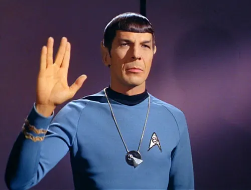

Why does your mother always criticize your driving?

She does that all the time. No matter how fast or slow you drive, she’s got something to say. But why?

Fundamentally, the answer to this question might have something in common with the reason why you might be more scared of a snake than you are of a car. Confused? Let me explain.

Imagine that a snake slithers past you. Even if the animal didn’t bite, you might have been momentarily struck by the mortal dread of imaging the ‘what-if’ of it biting. Now imagine that a car speeds past you. Do ever ever give as much thought about the possibility of it running you over?

Yet, statistics tell us that [58 deaths](http://www.sundaytimes.lk/111030/News/nws_18.html) were caused by snake bites in 2008 (in Sri Lanka — and yes, this was the latest data I could find,) while [2328 people died](http://www.police.lk/index.php/traffic-police/112-traffic-statistics-fatalities-and-no) in road accidents in the same year. So, why aren’t cars scarier than snakes?

## Emotions trump Rationality

Throughout the course of evolution, a big part of which we humans and our ancestors spent in the jungle, our brain functions have been developed to take simple [fight or flight](http://science.howstuffworks.com/life/inside-the-mind/emotions/fear2.htm) decisions. The risks (of predators, natural disasters and such) were often assessed based on our emotions towards them. Emotions are basically decision making shortcuts.

<blockquote>Our emotions push us to make snap judgments that once were sensible — but may not be anymore. —Maia Szalavitz, Psychology Today, 2008</blockquote>

Where human existence is concerned, _Risk_ and _Emotion_ have become inseparable, and while this approach has been helpful in surviving in the midst of predators, it has not fared as useful in the world of news media.

This brings us back to snakes and cars. In our eyes a snake is an embodiment of fear and revulsion. It’s very easy to imagine a snake’s fangs sinking into your leg as it bites you, and it’s easy to detest its slimy snakeskin. A snake is a much more visual threat thanks to our inventiveness. A car simply isn’t.

Following the same logic one can explore why Americans are passing legislation for Muslim bans instead of gun control when in reality terrorist attacks have caused only [a minute fraction](http://www.politifact.com/truth-o-meter/statements/2015/oct/05/viral-image/fact-checking-comparison-gun-deaths-and-terrorism-/) of deaths when compared to gun violence.

## The perception of risk

Several factors affect out perception of risk. As noted by Paul Slovic, a professor of psychology at the University of Oregon, the following seemingly trite ingredients play a part.

1. **Trust:** You automatically assume lower risk in a transaction with a person you trust.

3. **Control:** You assume that there’s lower risk when you are in control. The reason why your mother freaks out when you’re driving is not because you’re in the driving seat. It’s because she’s not. (This is pretty interesting psychological behavior because, even if your mother cannot drive, she’s predisposed to feel safer when she’s in control of, in this case, the vehicle.)

5. **The nature of the occurrence (Catastrophic or Chronic):** A plane crash is scary because it carries the illusion of tangibility. A heart disease you’re going to get in 20 years because of your unhealthy eating habits does not feel so scary right now.

7. **Dread and anger:** A feeling of dread is more likely to increase our risk perception.

9. **Uncertainty:** We associate knowledge with certainty and the lack of it to uncertainty. The more you know about something, the less risky it feels.

Our societal values also come into the picture. For example, arguably marijuana is bad and should be avoided, while prescription drugs are safe. The truth is that (in the USA alone) prescription drug overdoses [kill more people every year](https://www.drugabuse.gov/related-topics/trends-statistics/overdose-death-rates) while there are [no reported cases](https://www.dea.gov/druginfo/drug_data_sheets/Marijuana.pdf) of deaths caused by marijuana overdose. Before I’m accused of being a junkie let me just say that I only mean to point out the fact that we underestimate the dangers of some commonplace items like prescription drugs (and, for example, don’t think twice about leaving them accessible to small children who are at risk of being overdosed unintentionally.)

## The cost

We create impressions about the world around us based on our collective experiences. The thing about impressions is that they’re difficult to change once formed. Because of our inherently irrational nature, we tend to [stick to our beliefs](http://ideas.ted.com/why-you-think-youre-right-even-when-youre-wrong/) even when presented with evidence that confirm otherwise. Facts don’t seem to matter anymore. Thanks, Kellyanne!

Educators like [Hans Rosling](https://en.wikipedia.org/wiki/Hans_Rosling) (who passed away just last month — the world misses him dearly) have made it their life’s work to fight back in the face of this irrationality. The question is, how many of us are willing to listen to them instead of listening to the mainstream media?

<iframe src="https://www.youtube.com/embed/Sm5xF-UYgdg" title="How not to be ignorant about the world | Hans and Ola Rosling" frameborder="0" allow="accelerometer; autoplay; clipboard-write; encrypted-media; gyroscope; picture-in-picture; web-share" referrerpolicy="strict-origin-when-cross-origin" allowfullscreen></iframe>

Media Sensationalism that fuels [availability bias](https://en.wikipedia.org/wiki/Availability_heuristic) (think, the coverage on 9/11 attacks) is not the only culprit here. The rise (and triumph) of populist political camps is disconcerting. The rhetoric today seems to revolve mostly around race and economics, but the long term implications are far greater.

I’ve [written earlier](/notebook/2017/03/the-perils-of-determinism/) about how astrologers make money by playing the determinism card. That analogy applies here as well, because, when we seek knowledge through horoscopes and not through facts and data, we’re discrediting centuries of work in scientific advancement and defecating in the faces of people who made it possible. (I couldn’t put that in a less dramatic way, I apologize.)

Insurance businesses manipulate our inability to evaluate risks to make money off things like flight insurance and diamond ring insurance. I don’t have anything against insurance businesses, but it’s funny how easy it is for us to give into emotions, oblivious to the fact that someone else stands to gain every time we do so.

Another classic example of our distorted risk assessment is the attitude towards self driving cars. Skeptics were up in arms when the [first death](https://www.forbes.com/sites/briansolomon/2016/06/30/the-first-self-driving-car-death-launches-tesla-investigation/#2c9c17037762) in a self-driving car was reported last year. The question nobody cares to ask is, how many deaths do human drivers cause every year? Even if self driving cars eventually killed 1,000 people a year, isn’t that better than 35,000?

Logic, and rational thinking takes effort. There are no shortcuts here.

<figure>

<figcaption>I’m not calling on everyone to be Spock. No, that would be a disaster.</figcaption>

</figure>

Don’t get me wrong. We need emotions. They’re what makes us human. But it’s important to understand that the world has changed too quickly for natural selection to catch up. It’s our burden now to champion rationality, because the biggest killer of our times is indeed misinformation.