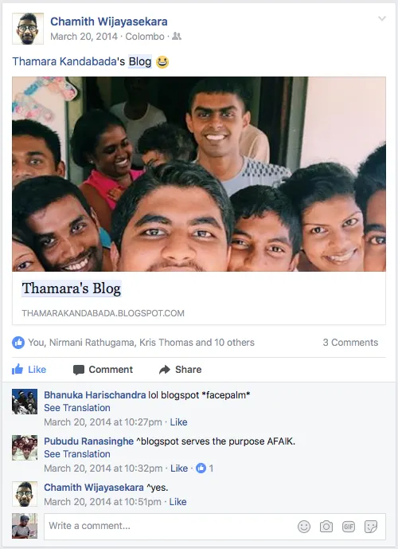

In 2014 I was a 20-year-old, confused, useless kid. I had not done well in my final exams at school, and had consequently lost the opportunity to study in a government university. (In Sri Lanka, this earns you the distinction ‘useless child.’) I was looking for something interesting to do.

I had always had a knack for writing. When I heard about the concept of ‘blogging’ for the first time, even though I did not fully understand why anyone would produce essentially free content at end and put them up on a website, the thought fascinated me. To me, blogging seemed like a perfect medium to let myself be discovered — if I may — and express freely (I was never really good at talking anyway.)

So, I started a blog.

Now, to give you some context, I grew up in a middle class household that had very little money to spend on fancy things. I got my first mobile phone (a [Nokia C5](http://www.techradar.com/reviews/phones/mobile-phones/nokia-c5-694986/review) — oh, the good old days) only when I turned 17, and I didn’t have a proper internet connection at home until after I finished schooling at 19. So, in 2014, the internet was still a new thing to me.

In my innocent ignorance, I had signed up for a [Blogger](https://www.blogger.com/) profile, hoping that things would magically happen and people would discover my blog instantly. I also started a Facebook page — it was a full on virtual ego fest. But I didn’t know better.

<figure>

<figcaption>I went with Blogger. I didn’t know any better.</figcaption>

</figure>

My [first post](/notebook/2014/03/sovereign-states-missing-planes-and-the-cold-war/) went live on the 20th March, 2014. It was a motley concoction of a post about [Flight MH370](https://en.wikipedia.org/wiki/Malaysia_Airlines_Flight_370) which went missing, the Russian annexation of Crimea, and a bold statement at the end about how the Cold War never really ended. Needless to say, I immediately felt like an expert in the trade.

The feedback was hearteningly positive.

For several months after that, I kept writing one blog post a week. They were almost always focused on some international political issue. I picked something I was interested in, did my research, and tried to deconstruct the finer points the best way I could. Now when I look back to those early write-ups, I can’t help but think there must have been unhealthy amounts of pseudo-intellectualism involved. But I was on a mission to make a name for myself, so the blogging went on.

In May 2014, I accidentally saw a post from UNICEF, calling for applications for their [Voices of Youth](http://www.voicesofyouth.org) Blogging Internship. I applied. And to my genuine surprise, I got selected along with 20 other young bloggers from around the world. The terms of the internship were simple: we had to write [a blog post about a youth-related topic](http://www.voicesofyouth.org/en/users/227892) every week.

I was feeling rather good about myself at this point. I had scored my first victory in the blogging game.

Again in May I was approached on Twitter by an Indian media outlet named [IndiaPost Live](https://www.facebook.com/indiapostlive/). For some reason, they had chosen me to represent Sri Lanka in a panel discussed that would be streamed live on their online TV channel. I accepted.

On the program I found myself talking about policy matters that I had never even give any serious thought to. I was faking it like a champ.

There, another victory.

All this exposure (it seemed like a lot back then) meant that I had been doing something right with my blog. I liked writing, so I kept at it for some more time.

Along the way, I lost interest of international politics and my writing suffered as a result. I couldn’t write down anything worth sharing, so I had to abandon my one-post-a-week routine.

Blogging for me was never really a consistent habit after that. Even though I had lofty ambitions at the very outset, it turned out to be temporary high that I enjoyed, simply because I had little else to do. I’ve barely written anything in 2015 and 2016, save for the one article or two that were the result of some trigger event — eg: the [Presidential Election](/notebook/2015/01/why-i-didnt-vote-today/) in January 2015 and the [Independence Day Celebrations](/notebook/2016/02/the-national-anthem/) in February 2016.

Because of all this, in these 3 years of blogging, I have only published about 50 articles in total, which is a dismal number given the span of time.

## A different approach

In December 2017 I told myself that I should get back to writing. This time I had a different approach in mind. This time, there were no illusions of grandeur. After all, writing could only ever be a hobby for me, so I was going to enjoy it.

I was going to do two kinds of writing. **a)** Deconstructing and trying to understand things I was fascinated by, and **b)** Documenting various aspects of my life.

### Things I wanted to understand

As do many of you, I come across all kinds of fascinating things in books, movies, and on the internet. I end up not giving any second thoughts to and forgetting many of these. I wanted to to change this, and the solution for me was to write them down.

Instead of simply documenting the things I was intrigued by, I decided to dig deeper in to each topic, and deconstruct them in the hope of understanding those concepts better, much like I did with international politics back when I started to blog. In this vein, the [Stanford Prison Experiment](http://www.prisonexp.org) became the basis of my post [_What Does a Prison and a University have in Common?_](/notebook/2017/02/what-does-a-prison-and-a-university-have-in-common/), and the movie [_Arrival_](http://www.imdb.com/title/tt2543164/) took me down a deep rabbit hole that manifested itself in the post [_The Perils of Determinism_](/notebook/2017/03/the-perils-of-determinism/).

There is a fair bit of further reading and thinking that goes into a post like this, so they don’t get written all that often. When they do, they’re quite fun to indulge in.

### Documenting my life

This has been particularly insightful, to say the least. I started documenting with a simple post that listed all the [podcasts I was listening to](/notebook/2017/05/podcasts-im-listening-to/) at the time and what I liked about them. Since then I’ve written about my [first job](/notebook/2017/03/lessons-from-my-first-job/) and [the new company I started](/notebook/2017/06/selling-convenience/) recently.

After 3 years of blogging (on and off) I haven’t had my ‘big break’ yet, nor do I expect one, and you can probably say why. I don’t force myself to write regularly either, as I did in the beginning. I simply write when I feel like doing it, and when I do I quite enjoy it. I’m writing for myself, and no one else.

But in all honesty, because I still am an egotistical human being, the occasional like and comment helps me keep going.