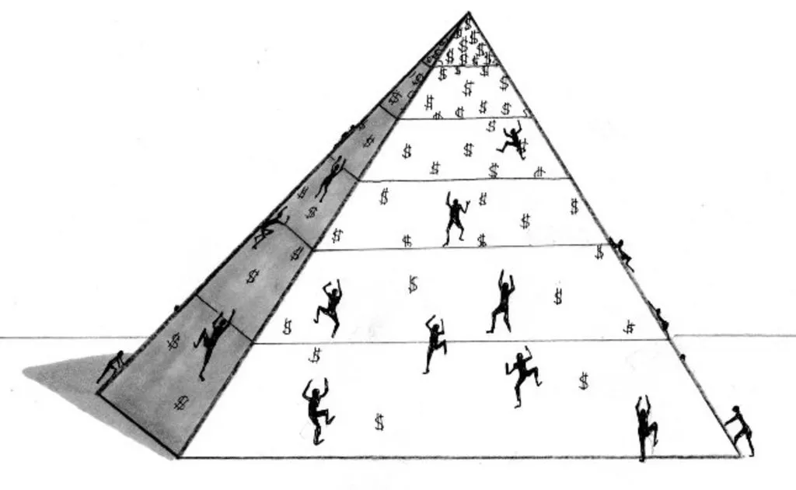

_In an attempt to understand how the meritocracy works, I decided to explore its pros and cons. [A critique of Meritocracy](https://thamara.co.uk/a-critique-of-meritocracy/) was written with the cons in mind. This is a follow up to that post, and in this one I will make a case in favour of the meritocracy and explain why I believe it’s actually good for us._

***

Growing up in Sri Lanka, my entire childhood was defined by the lies I was fed.

When I was 9, I was told that all I had to do was get through the [Grade 5 Scholarship Exam](https://en.wikipedia.org/wiki/Scholarship_Examination) with a good enough grade to qualify for an esteemed school in Colombo.

When I was 15, I was told that all I had to do was get through the [GCE Ordinary Levels](https://en.wikipedia.org/wiki/GCE_Ordinary_Level_in_Sri_Lanka) with a good enough grade to qualify for a _respectable_ subject stream in GCE Advanced Levels.

When I was 18, I was told that all I had to do was get through the [GCE Advanced Levels](https://en.wikipedia.org/wiki/GCE_Advanced_Level_in_Sri_Lanka) with a good enough grade to qualify for an acclaimed university.

I did not get through Advanced Levels with a good enough grade, but the ones who did were told that all they had to do was get through 4 years of university to qualify for a honour-carrying, tie-wearing, desk-occupying job.

At each point, we were told that if we worked hard enough now, rainbows and beds of roses and all the good things in life awaited us.

They didn’t.

All that we were greeted with was more work, even more gruelling and demanding.

And so this false dichotomy — this notion that, the grind now will flip over to an easy life overnight — has taken a toll on our society.

Think of the thousands of graduates who are churned out from universities every year. A majority of them step out into the job market with a false sense of entitlement (that their degrees are reason enough to be offered a job.) I’ve interviewed these people. They disgust me. When they are offered jobs, they fall for this strange myth that the process of learning for them is over — partly because there’s no one to tell them now that all they have to do is get through X to to qualify for Y. I’ve worked with these people. They disgust me equally.

This false idea of success that we infuse in children — this narrative that, the grind is a sequential set of steps that lands you on a plateau, when in fact it is a neverending climb — exhausts them and dulls their minds well before they achieve what they otherwise would have acheived. [I’ve written about this earlier](/notebook/2017/01/redefining-ambition/).

And while we think these nudges help us build and appreciate a meritocracy, they don’t.

Let’s think about the appeal of a meritocracy for a second. Quoting my [previous post](/notebook/2017/04/a-critique-of-meritocracy/):

<blockquote>On the surface, a meritocracy sounds like a wonderful idea, a utopian dream. The truly able and accomplished will take the helm of society, in turn motivating the subsequent layers to achieve more and rise up. It’s a system that offers opportunities to the ones worthy of them, and praises where praise is due. In fact, this is the very system that idealistic, potentially-world-changing, Valley-style companies (mostly operating in economic sectors that have gained popularity thanks to Western Capitalism) embrace in the hope of faster growth, better products and services, and happier employees. It makes people work harder and set more ambitious goals, and it rewards people when they work harder and achieve ambitious goals.  What could possibly go wrong?</blockquote>

<figure>

<figcaption>bigthink.com</figcaption>

</figure>

This indeed sounds like a good deal. You reap what you sow. It’s morally right and economically sound. The Americans even have their own fancy name for it: _The American Dream_.

So why do we in the East hate this idea? Or when we don’t, why do we fail at it?

I think it has a lot to do with how we’re formed as a society. We like free things. Free education, free healthcare, free food at the occasional [_dansala_](http://www.dailymirror.lk/70961/the-unique-dansals-of-vesak). We love it all. This love often extends to nonsensical proportions and manifests itself in Facebook posts like the one below:

The problem is, we’re never taught that we should _earn_ our rights and benefits. Our schools don’t teach us to _create_ before we _consume_.

Taking things for granted is not an option in a meritocracy. Welfare leeches like us Sri Lankans will be rendered irrelevant in a meritocracy.

And that’s what I think is exactly needed to save us from our current peril: a meritocracy. But it’s not an overnight game. And tasting the berries is difficult especially when a large majority of us still worship leaders who blemish the social fabric with nepotism, hate-crimes and unjust gain, and when the ones at the helm of our societies have no validity in a system that credits ability.

We are not beyond saving. Even if this is an illusion, it’s one I would like to embrace.

There’s a precious concept that gets lost in our current social narrative, one that we all need to discover again. It’s that the grind is forever. That just as you face a bigger challenge when you get through your scholarship examination, and the one after that, this journey is one for a lifetime. That if you genuinely work for what you love, you will be rewarded. That when this machine runs at full vigor, we’ll be all the better for it. That you need to be thankful to be a cog in such a machine.