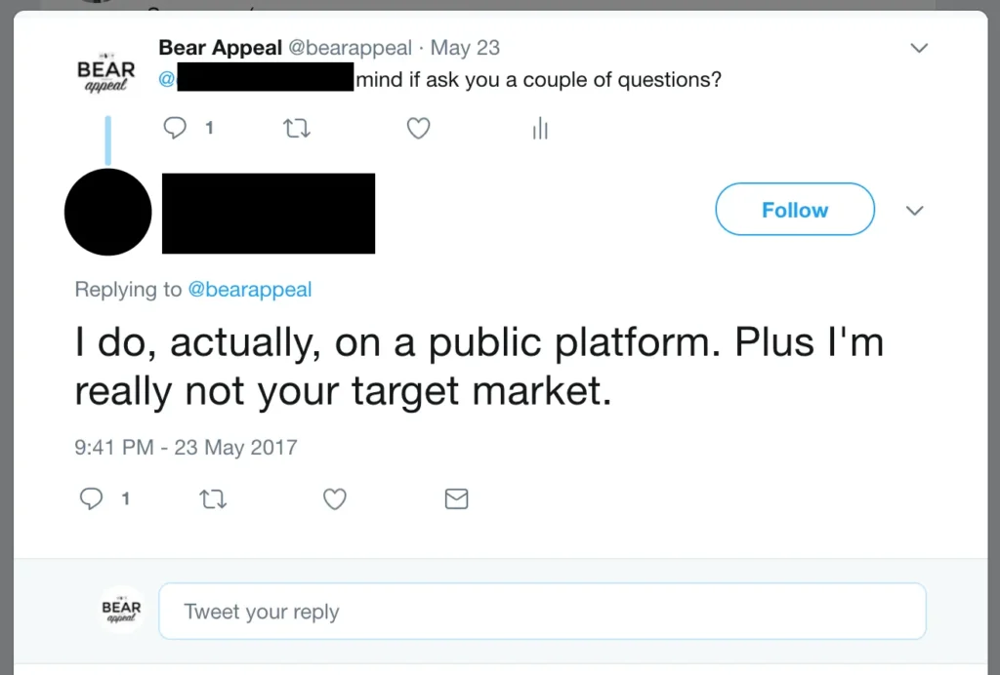
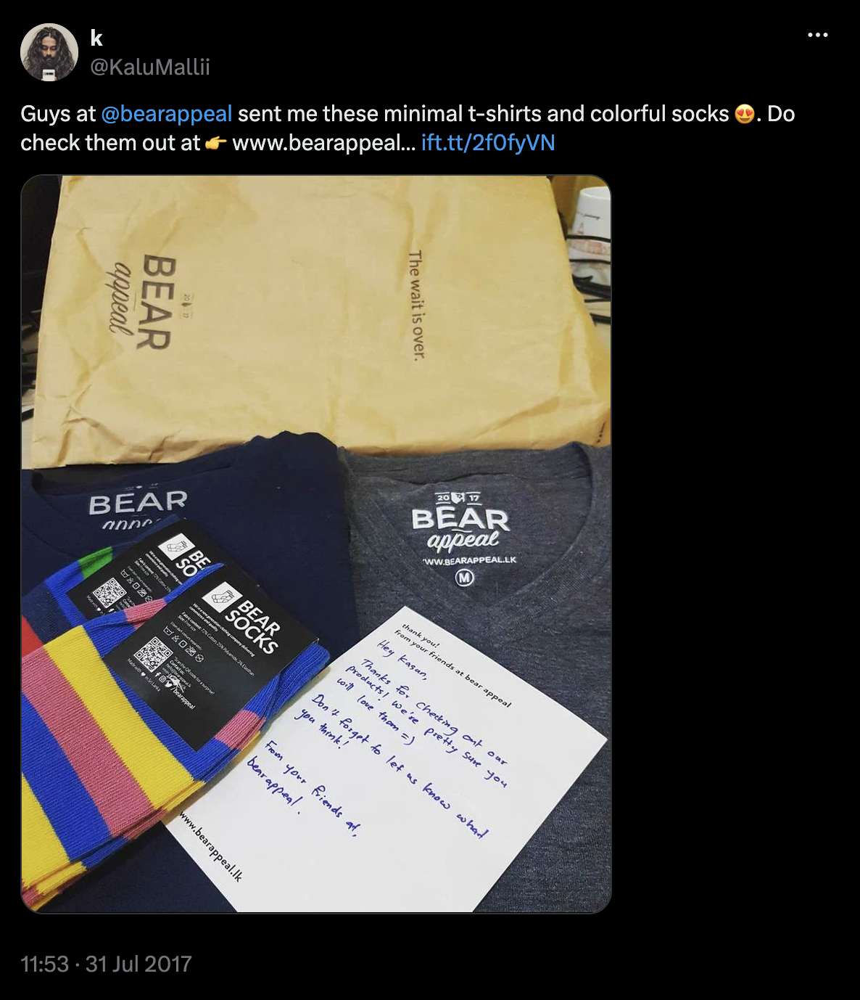
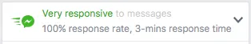

_This is one in a series of posts where I document my startup journey. If you just landed here, go to [this link](/notebook/topics/my-startup-journey/) and you’ll find all the other posts in the series._

* * *

When we launched [Bear Appeal](https://bearappeal.lk), we were mostly trying to [scratch our own itch](https://bearappeal.lk/about/). We couldn’t find a reliable retailer that sold comfortable and affordable men’s basics (mostly plain, logo-less t-shirts) so we decided to start our own.

Our original intention was to launch a subscription service right away, but a host of complications led us somewhere else. For starters, there was no local payment gateway through which we could offer recurring payments to customers (because of local banking regulations) and workarounds like PayPal and 2Checkout were too expensive for us. We chose not to complain, and settle for a less-than-ideal, but practical solution instead: we’d launch as an ordinary online retailer, while offering what we thought would be an enticing enough [experience](https://hbr.org/1998/07/welcome-to-the-experience-economy) to differentiate ourselves.

So we defined the concept of convenience, which we wanted to champion. I have explained the ins and outs of this in detail in [an earlier post](https://thamara.co.uk/selling-convenience/). This was our version of the [MVP (Minimum Viable Product)](https://blog.leanstack.com/minimum-viable-product-mvp-7e280b0b9418). This gave us the opportunity to operate a revenue-generating business from Day 1, while we worked on perfecting it and eventually implementing the subscription-based model we wanted to adopt.

There’s no revenue without customers, and neither me nor [Pavithra](https://www.linkedin.com/in/pavithraperera/) (my business partner) had any previous selling experience. We had our doubts going in, but they seemed largely unfounded during the first couple of weeks. Our first customer, a mutual friend, placed his order even before our website went live. Orders seemed to pour in after that.

This life of ease was short lived. Sales began to plateau and then decline a little after our close friends had made their purchases. It took us a month to realize this: there’s only so many t-shirts you can sell to friends and family. As I’ve said [elsewhere](/notebook/2017/09/one-hundred-days-later/), the first hundred-thousand doesn’t take much effort. And if you don’t break in to circles outside your close friends soon enough, you will loose.

This is when we started to sell actively, despite our lack of experience. As a startup we had enough leeway (and the audacity) to try things, even if to end up failing (as long as the failures were not too expensive.)

What follows is an account of the things we did: the tactics, the media, the mistakes — the whole package. I think these stories would be useful for any small business, so read on.

## Old technique, new medium

The most straightforward way to sell anything is to talk to people about your product. This is not as easy as it sounds, because most of us are predisposed to distrust, and on many occasions hate, salespeople. [And for good reason](https://www.forbes.com/sites/ianaltman/2016/02/09/why-customers-hate-most-salespeople/#186c4e58772f).

This disconnect between the salesperson and the potential customer, more often than not, is due to no fault of the customer. It’s because the salesperson fails to empathize. The aim of sales shouldn’t be to push down anything and everything down a customer’s throat, but to provide something of value. We had this in mind when we set out to have as many conversations as we can with potential customers, simply to understand their preferences at the outset.

Talking in person was not practical (nor was it our strong suit) so we decided to try the purest digital form of conversation available: Twitter.

We started by tweeting at people. The aim was to start a conversation with them, ask as many questions as possible to figure out their t-shirt buying preferences, and if appropriate, plug our business at the end. It didn’t take long for this to happen.

<figure>

<figcaption>Excuse the typo. We were too excited.</figcaption>

</figure>

We took one step back, but didn’t stop. We realized it’s important to keep these conversations private, so we started sending Direct Messages instead. Not every Twitter user allows just about anyone to send them DMs, so this narrowed down our audience. But it was still big enough to try.

Over the next few weeks, we messaged hundreds of people, and asked them all sorts of questions about what kinds of t-shirts they buy, whether they shop online, whether they keep going back to the same shops again and again, whether they’d like to try out a subscription service for this, etc. The rampant [yea-saying](https://www.psychologytoday.com/blog/cui-bono/201404/acquiescence-and-social-desirability-psychometric-bogeymen) notwithstanding, this allowed us to introduce ourselves as a promising new startup in town to a great many people.

When you set out to do this, it’s important to realize that only a fraction will even bother to respond to your messages. It’s also important to realize that it’s this fraction that makes all the difference.

## Influencers: an untapped opportunity

[Social Media Influencers](https://en.wikipedia.org/wiki/Influencer_marketing) in Sri Lanka are a fine bunch. In the Sri Lankan market, Twitter influencers have a lot more traction than most businesses realize. One of the reasons is that Twitter is an incredibly engaging platform where people form tight-knit circles. You grab the attention of one person, you have access to the whole group.

Here’ what we did. We went through a bunch of Twitter profiles and picked out ones that seemed to have **a lot of followers** (usually more than 5,000) and **a lot of engagement (Likes, Replies, Retweets)** for their posts. We reached out to these “Twitter celebrities,” introduced ourselves, and offered them a couple of our products for free. In return (and without us asking, mind you) they offered us shoutouts.

## Being accessible

None of this will work if you don’t become extremely accessible to the customer at all times. We made sure that we replied to all messages (across all platforms) pretty fast, even if it meant interrupting a meal halfway and cutting down on family time. It’s a decision you make, and I leave that completely up to you. We just decided it’s important to prioritize customers at this stage.

## The result

After a couple of months of doing this we’ve come to a place where:

1. **22%** of our sales have been the direct result of direct conversations on Twitter

3. **3 out of every 10 orders** placed are from customers who’ve bought from us earlier. (This is because the “being accessible” part pays off. I’ll write more about this, and on the broader practice of “delighting” the customer in another post.)

We’ll continue to fine-tune these techniques and try out new ones in the days to come. There’s a lot more to do; it’s only been three months, after all. For starters, we’re yet to double down on Instagram the way we did on Twitter.

If you’ve had similar experiences in your struggle to acquire customers, do share them with me. I’ll continue to share our experiences, too. This post was all about gaining access to potential customers and making sales, the next one will be about delighting each and every one of them.

Originally published on [LinkedIn](https://www.linkedin.com/pulse/first-3-months-how-we-acquired-customers-thamara-kandabada).

