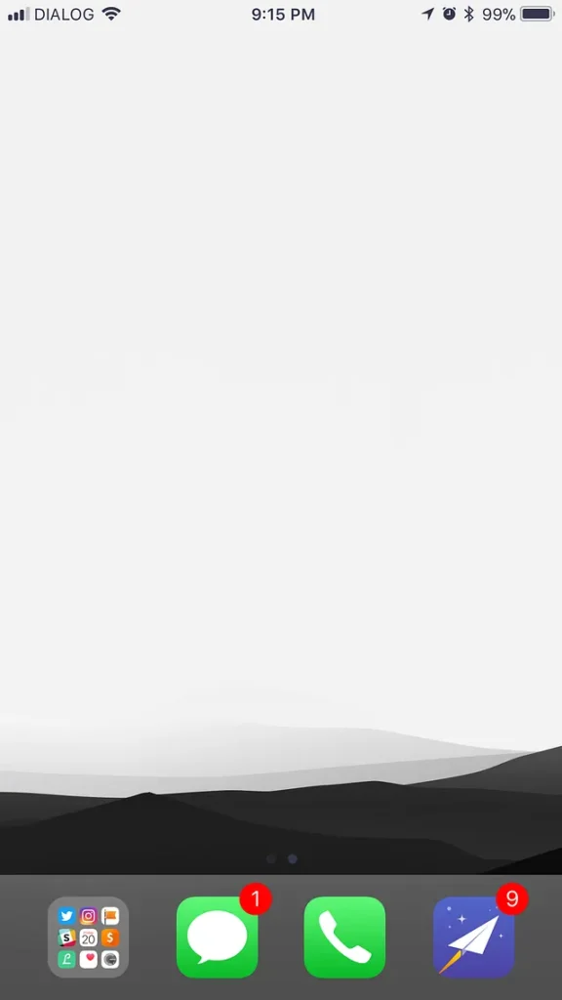
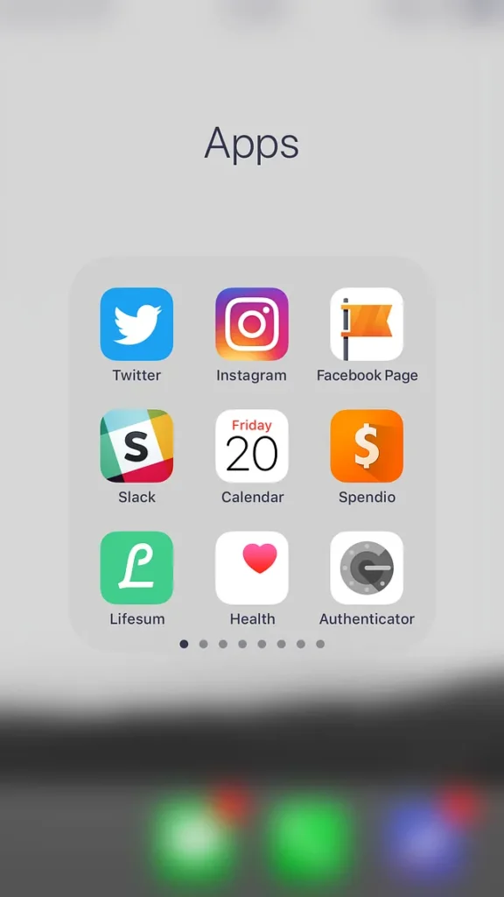
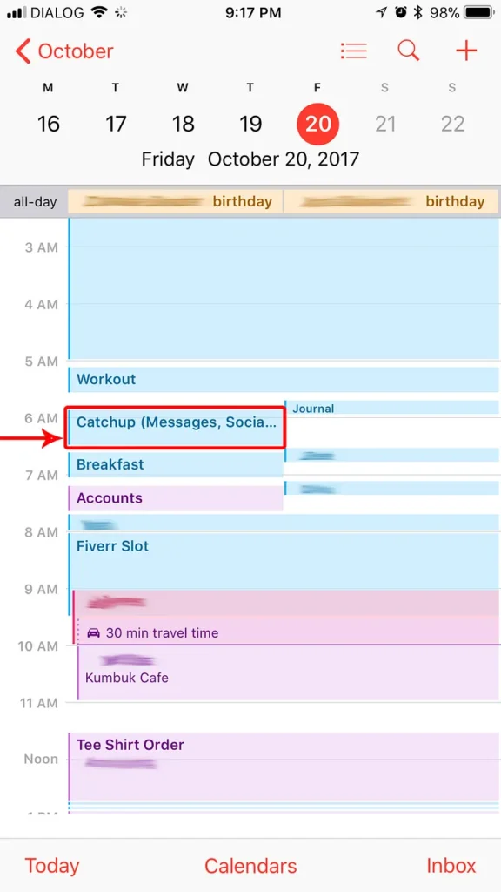

After coming across [Jason Stirman](https://medium.com/u/f2df81c84ea6)’s [_Beautility, My Ultimate iPhone Setup_](https://betterhumans.coach.me/beautility-my-ultimate-iphone-setup-1b3dd0c588a0) on my Twitter feed this evening I felt the sudden urge to go all in.

Notification overload has always bugged me, but I never got around to doing anything about it, thanks to a mild case of [FOMO](http://time.com/4358140/overcome-fomo/). All it took to change this was a short, 7-minute read.

Now, if you haven’t already, I highly recommend that you click on that link above, and read through Jason’s article before continuing.

## Setup

Setting things up is quite easy. I simply followed all the steps Jason had provided, without leaving out any detail.

I downloaded the wallpaper, moved all the apps to one folder and sorted out my notification settings. Here’s how things look now:

The three apps I’ve chosen to be on the home screen are Messages, the good old Phone app, and email. Messages, because iMessage is the primary mode of communication between my business partner and I; Phone, because I still call people the old school way; Email, because many important conversations — business and otherwise — happen via email.

## Notifications

Jason’s advice is to group apps into 3 categories based on priority, and set notification preferences accordingly. Here’s how I did this:

### Important, time-sensitive

<blockquote>…kept notifications enabled for that app and moved the app to the first page in the folder.</blockquote>

For me, the most important apps are the ones that are tied to communications regarding my business. Being available for customers on Twitter, Instagram and our Facebook Page is a priority, so they’ve taken the top shelf.

Slack gives me access to two of my secondary priorities: freelancing on Fiverr and helping customers on the [Trello Experts Community](https://www.directly.com/in/thamara-k).

The Calendar is there because I won’t stay sane without it, and Spendio and Lifesum keep my wallet and calories in check. I don’t check the iOS Health app regularly, but it’s there for now until I find a more suitable app to take its place. Authenticator is my app of choice for Two Factor Authentication.

### Important, not time-sensitive

<blockquote>…left the app where it was and kept notifications enabled.</blockquote>

I haven’t changed the positions of these apps in the folder, but I turned off their notification, not sticking to Jason’s advice on this particular occasion. I might change this later.

### Not important, not time-sensitive

<blockquote>…kept the app where it was and took 30 seconds to disable all notifications for that app in Settings.</blockquote>

All the random notifications that used to bug me earlier, such as Facebook comments, IFTTT applet runs, new Podcast episodes, App updates, etc. are now buried.

## Widgets

I kept the Widgets screen simple, too. The only active widgets I have right now are:

- **Up Next (iOS Calendar)** to see what I have coming up

- **Overcast** to have easy access to new Podcast episodes when I’m on the road

- **Phone Favourites** to enable one-click calling and texting to my most important contacts

## Calendar

To ensure I’m getting the best out of this new hack, I scheduled in three 30–45 minute blocks per day to check up on my notifications (that is, the ones left over once I’ve taken care of the most important ones — eg: the emails I’ve received once I’ve dealt right away with Twitter messages from cutomers.)

I had been doing this for some time now, but every now and then I had sneaked out of whatever I was doing to check my Facebook profile, especially after seeing the notification badges on the app icon. The plan now is to stop this altogether, with no notification badges to tempt me.

I intend to continue this for the next 30 days. And I will certainly put together a follow up post with my evaluation of the experience.

Let me know if you have tried anything similar, and what your experience has been.