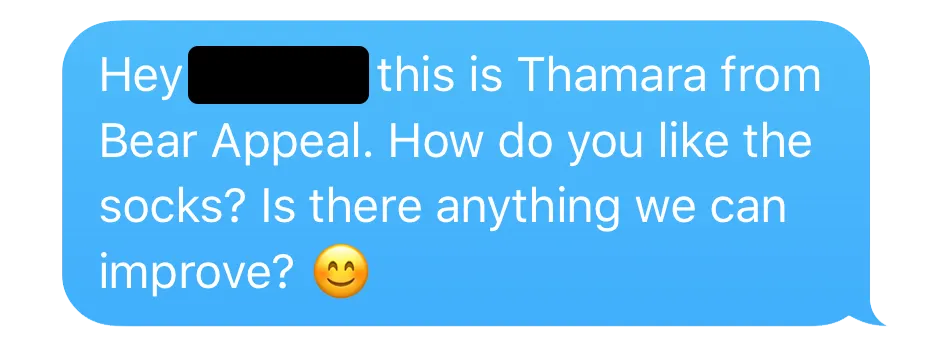
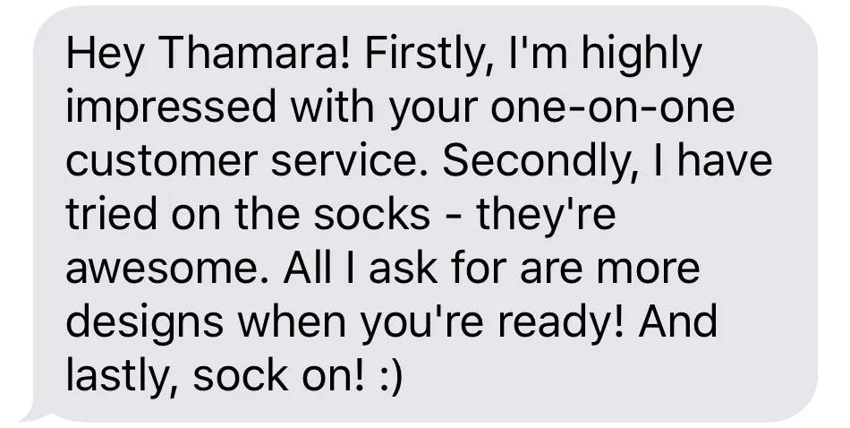
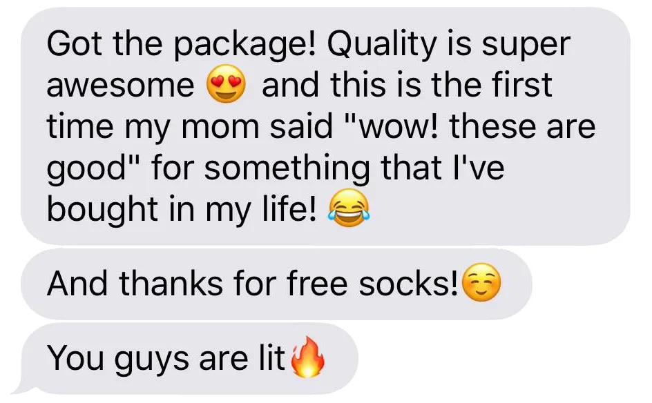
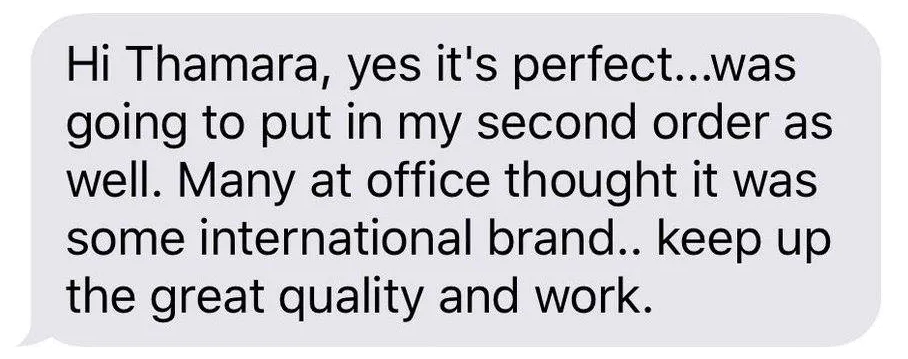
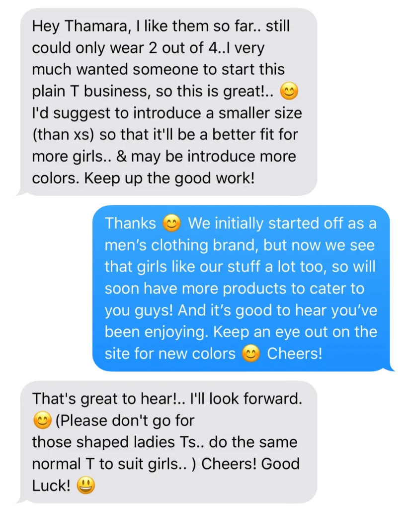
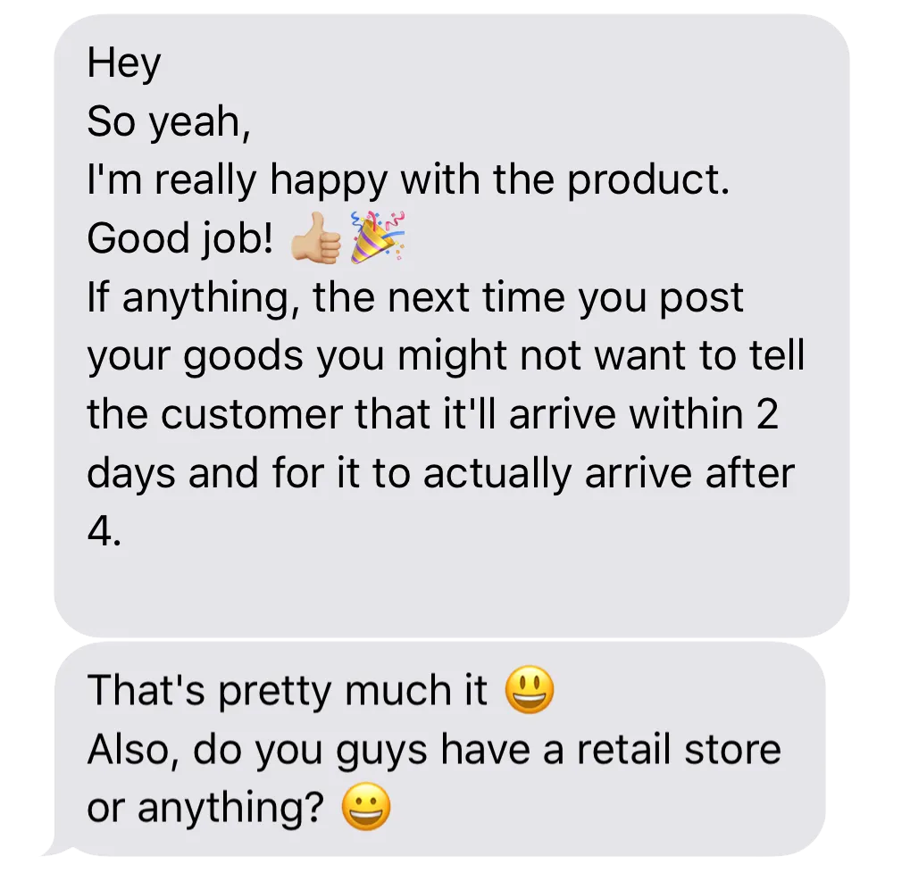
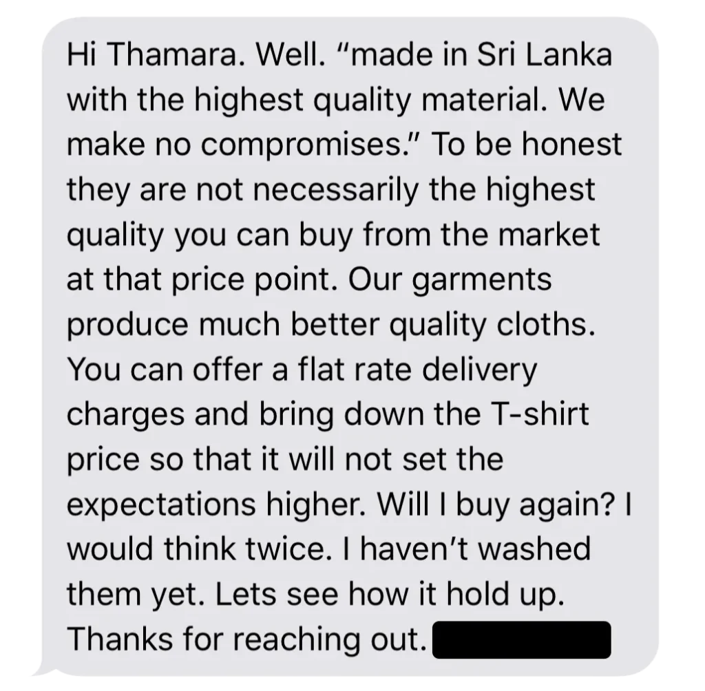
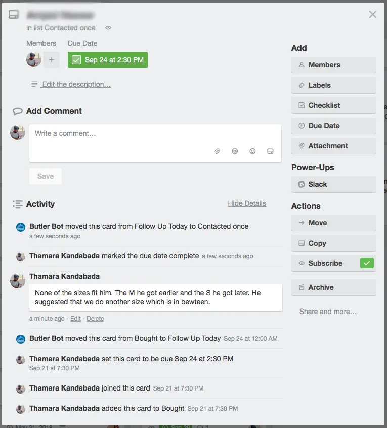

_This is one in a series of posts where I document my startup journey. If you just landed here, go to [this link](/notebook/topics/my-startup-journey/) and you’ll find all the other posts in the series._

* * *

There’s one decisive reality we’ve had to come to terms with during the past five months and this following [quote](https://www.tonyrobbins.com/stories/dont-fall-in-love-with-product/), attributed to [Tony Robbins](https://www.tonyrobbins.com) clearly sums it up.

<blockquote>Fall in love with your customers, not your product.</blockquote>

This sounds rather counter-intuitive. Needless to say, a business is a labour of love and founders put in a tremendous amount of effort to make things work. Many businesses start off with a a grand idea for a product or service that could change, for good, the way an industry operates. This idea itself is mostly a product of the founders’ view of how the world should be. From all the stories we’ve heard, and from what we’ve been through ourselves, we know this to be true.

So when you’re a business just starting off, romanticizing your product is a lot easier to do than listening to your clients. At least this was the case for us. We assigned a certain (irrationally high, I should add) value to our own products even before we had heard any feedback from actual customers.

Based on this arbitrary status, we produced content that we used over and over again to communicate our value proposition. For instance, you could have seen the following copy on ur website until the very end of the last month:

<blockquote>All our products are made in Sri Lanka with the highest quality material. We make no compromises.</blockquote>

We knew this claim to be factually wrong, but we were too excited and full of ourselves.

Even in this state of euphoria we understood the need to ask for our customers’ feedback early on. This, I believe, might have been a result of our familiarity with well-founded advice from the likes of Tim Ferris, Reid Hoffman and Jason Fried. Since our products were well made anyway and because we were always ready to [delight](/notebook/2017/10/the-importance-of-delight/), the responses we received were mostly positive. More about this later.

Let me tell you how this asking (and listening) process went: After every new order, we would wait a couple of days for the goods to be delivered to the customer, then a little more until we felt a reasonable time period had passed during which the customer must have tried on our clothing. Then we’d send them a message that looked like this:

The first thing we noticed was that customers did not expect to receive a personal text of this kind. I’m sure some of them would not have liked this, and there were several occasions when he didn’t ever hear back, but most customers seemed elated.

On many occasions, the replies were delightful to look at. These positive comments not only boosted our confidence, but also validated our business idea. If people liked buying from us this much, then it meant that we were solving a real problem, and reaching the ideal audience.

Many customers shared our knack for intimacy, too.

On some occasions, were quite certain that we did not deserve the praise we received. But it felt rather exhilarating and we weren’t complaining.

Not all these conversations ended at hurling compliments at us. Some have driven very important decisions. For instance, the first batch of t-shirts we made were not the best in terms of dimensions — especially the hight and the neckband — customers told us this. For the next production, we found a better supplier who fixed this problem for us.

These interactions have also led us down paths we didn’t pay any attention to when we started out. Initially, all our communication was tailored towards men, and we identified as a men’s clothing brand. But it turned out that 11% of our customers were ladies. This didn’t warrant a U-turn, of course, but we realized that we had the potential to cater to a niche crowd of ladies who preferred loose-fitting t-shirts and colorful socks.

In this screenshot of the thread I’ve posted above, for example, there are several important signals:

1. Introduce new sizes that will fit ladies better

3. Introduce more colors

5. Keep the unisex shape of the t-shirts as is

7. (And finally, although not explicit,) communicate our value proposition towards ladies a little more

We didn’t start calling ourselves a unisex brand explicitly, but we did loose the “mens” part right away. Now we call ourselves a “basics clothing brand,” with no gender specification at all.

These insights are priceless. In this particular case our listening habit helped us widen our market size, but the possibilities are only just beginning to unfold. I’m certain we only stand to gain if we keep doing this.

All these dopamine boosts help us keep going, but every now and then, we hear of things that truly humble us. In the most basic form these are less enthusiastic (and often delayed) responses like this:

Or the ones that remind us we shouldn’t make promises we cannot keep:

But the best ones are hard-hitting, bubble-bursting conversations that serve as strong reminded to get off our high horse. The screenshot below is of a perfect example.

This was a very clear call to action for us to change the way we communicated about our product. The text this person highlighted, a single unremarkable line of text on our website, had build up a certain level of expectations that we hadn’t been able to live up to. We had to fix it.

Of course, we changed the website copy. We used more grounded, realistic claims that sufficiently explained our products and our service. The next (ongoing) challenge is to stick to this level of honesty across all forms of communication.

After receiving all this feedback, we had to make sure they were all recorded for future reference. Currently, we’re using a loosely built Trello board to do this.

Each new customers is a card, and they go in the _Bought_ list, with a due date on which that initial message asking for feedback should be sent to them. On that day, they are moved to the _Follow Up Today_ list automatically by [Butler](https://butlerfortrello.com). When this follow up is done, they’re moved to the _Contacted once_ list where they may or may not be assigned a due date once again. (For example, if we know their birthday, and it’s coming up, a due date will be set.)

The feedback we receive from them are recorded on the back of each card, like this:

As you can see, this is still work in progress. But it’s been sufficient for now.

All this is in no way an argument to conclude that the customer is _always_ right. They certainly aren’t. Not everyone will like your product, and that’s just how the world works. To me, even with my staggeringly limited experience, it is clear that having [a thousand true fans](http://kk.org/thetechnium/1000-true-fans/) (that is to say, customers who absolutely love us) is a far better proposition than having ten thousand people who “kinda sorta” like us.

And the path to a thousand true fans is stark honesty and delivering on promises, over and over again. For this to happen, conversing with customers regularly, and listening intently is as good a start as any.

Do you agree? Or am I simply not experienced enough to know better? I’d love to hear your thoughts.

Originally published on [LinkedIn](https://www.linkedin.com/pulse/listening-customers-early-stages-thamara-kandabada/?published=t).

