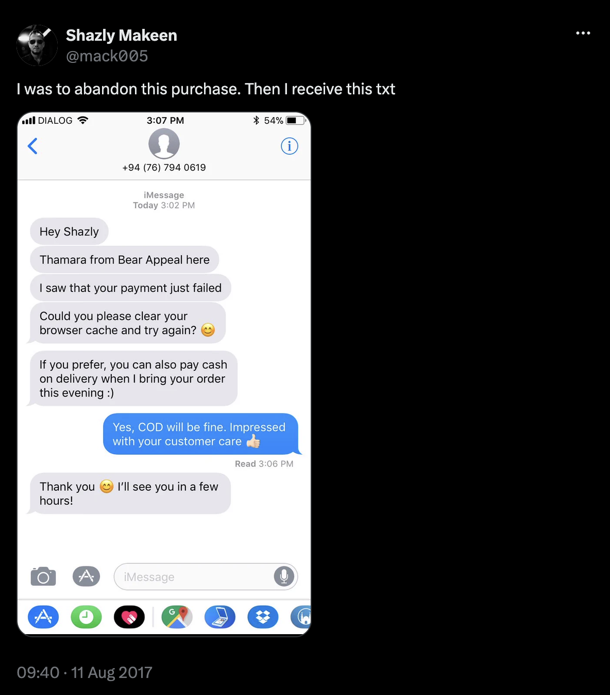
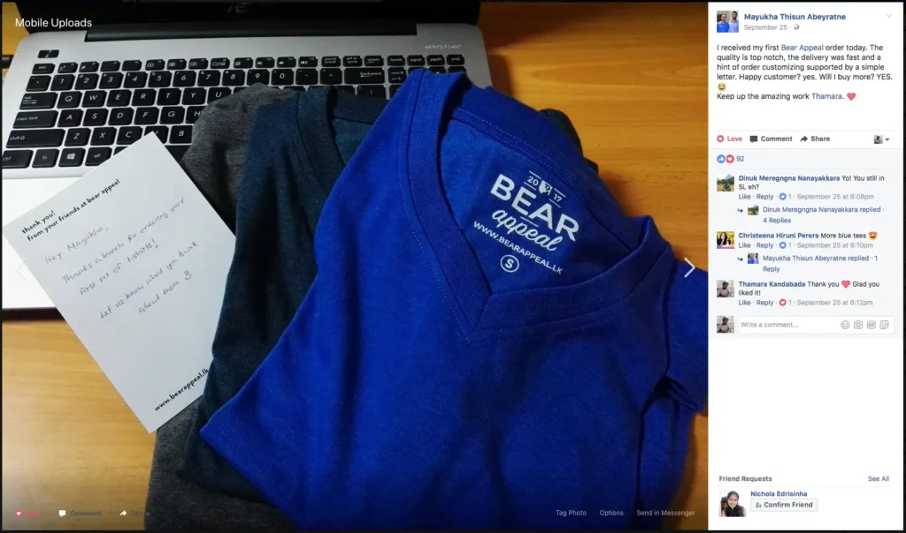
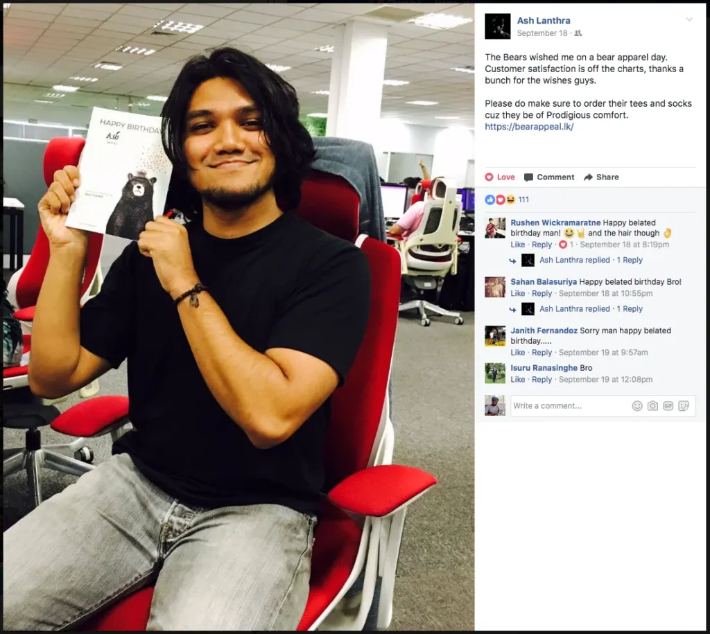

_This is one in a series of posts where I document my startup journey. If you just landed here, go to [this link](/notebook/topics/my-startup-journey/) and you’ll find all the other posts in the series._

* * *

If you are, or have been, a marketer you’ve probably heard these four words a million times: Attract, Convert, Close, Delight. To the uninitiated, these are the four phases of [HubSpot](https://www.hubspot.com)’s [Inbound Marketing](https://www.hubspot.com/inbound-marketing) methodology, which is a simple and practical marketing framework for any business.

<blockquote>Inbound marketing is an approach focused on attracting customers through content that are relevant and helpful — not interruptive. With inbound marketing, potential customers find you through channels like blogs, search engines, and social media.  Unlike outbound marketing, inbound marketing does not need to fight for potential customers attention. By creating content designed to address the problems and needs of your ideal customers, you attract qualified prospects and build trust and credibility for your business.</blockquote>

Having studied and executed Inbound in my [previous role](/notebook/2017/03/lessons-from-my-first-job/) as a B2B technology marketer, I was quite excited to try it out in a retail setting with [Bear Appeal](/notebook/2017/05/the-joy-of-starting-up-for-yourself/). Regardless of the quite distinct context switch, I knew that if we were to succeed, we had to build an unapologetically customer-centric operation from day one. In fact, most of the early conversations between myself and my co-founder [Pavithra](https://www.linkedin.com/in/pavithraperera/) revolved around one topic: how can we give a convenient end-to-end experience to the customer. This, we thought, was the key to build a lasting brand out of a [simple commodity business](/notebook/2017/06/selling-convenience/).

Based on this simple vision we began laying out what our interactions with customers could look like. We thought it would be quite important to “humanize” the brand and show that real people were always behind the operation, no matter what scale it would grow to. Having read [Tony Hsieh](https://en.wikipedia.org/wiki/Tony_Hsieh)’s [Delivering Happiness](https://www.amazon.com/Delivering-Happiness-Profits-Passion-Purpose-ebook/dp/B00FOT936Y/ref=tmm_kin_swatch_0?_encoding=UTF8&qid=&sr=) only a few months earlier, I wanted to make this one of my top priorities throughout every stage of the business. (By the way, Delivering Happiness is a book that I’d recommend to any business owner.)

The first step in this process was to let people know that the two of us were starting this business. I started posting about this on Facebook and documenting the journey on LinkedIn an Medium, while Pavithra made a bunch of [Instagram](https://www.instagram.com/paviperera/) Stories in his signature style. We both used the storytelling techniques and media we were comfortable with.

This was our jab at the first phase of the Inbound Marketing process: attracting people by telling them our story and what we stood for. It worked. Not only did our friends take an interest in what we were doing, strangers started messaging us on Twitter and connecting on LinkedIn because they enjoyed reading the blog posts and watching the videos.

That said, there is a lot more we could do to expand our Inbound efforts. We’ve only just scratched the surface. We have produced little to no content, apart from the occasional Instagram Stories. In the next few months leading up to the new year we plan to roll out a new brand-forward content campaign which we think will resonate with our target audience. More on that later.

This is not to say there wasn’t an outbound element to our sales. We’ve spent a considerable amount of time reaching out to random strangers on Twitter and Instagram. The important thing is, none of these conversations we initiated were done so with closing a sale in mind. I wrote about this, and about a lot of things that could cover the Convert and Close phases of Inbound, in detail in my [previous post](/notebook/2017/09/the-first-3-months-how-we-acquired-customers/).

If there’s one “groundbreaking isight” we’ve unearthed in these 6 months, it’s that there’s one thing every customer cannot get enough of: **_attention_**. This means a customer craves attention even after a sale is completed. We’ve come to understand that serving customers with the same enthusiasm and care is important especially after they’ve given you their money.

This is the Delight phase of Inbound, and here’s how we do it.

## At the point of sale

We keep an eye on the visitors on our website using a tool called [Alakazam](http://getalakazam.com) a set of our friends are building. (It’s in the early stages of being developed in to a “Sidekick for Growth,” and currently offers a sleek chat tool that tracks visitors along the website.) Not only is this an important tool for us, but the visitor on the website too has a convenient, intuitive medium to reach us when they most need it.

When a customer pays us online, they have to go through a payment gateway which processes the payment before registering it as a sale. Every now and then Mr. Murphy says hi and things get broken, and we’ve seen more than one occasion where the customer’s order details get recorded while the payment fails. On these scenarios, we immediately reach out to the customer and work on a fix, or offer an alternative method of payment. This, if you think about it, is a rather simple thing to do, and customers appreciate this flexibility and swiftness.

## After the sale

One of our service guarantees is that goods will be delivered within 5 days of ordering, failing which the total amount of the order will be refunded to the customer. When we started off, our primary mode of delivery was registered post, and even thought we didn’t trust the service fully, we announced this service guarantee. It seems like a silly thing to do, but what this does is instill confidence in the mind of the customer about the quality of our service. We were fully prepared to take a risk and refund customers as we promised if things went south. Nothing has gone wrong yet, but if it does, we’ll stick to our word.

Every once in a while, we ship items on the same day to customers, just to surprise them. This works, too.

Another small detail we add is in our packaging. Every customer receives a handwritten note, and when applicable, we personalize this note to reflect previous communication we’ve had with the customer. So far, customers have loved this.

This next one might sound a little creepy, but we do it with the best intentions. As soon as an order is placed, we try and find the social media profiles of the person who placed the order (either Facebook, Twitter or Instagram.) Most people have their birthdays displayed publicly on Facebook or Twitter, so if this is the case with our customers, we keep a record of it. Then, on their birthday, we send them a birthday card. It’s old school, but it feels intimate, we think.

Sometimes we take this a step further. To randomly selected customers we send a birthday present, and we try our best to make it something useful for them. This is where the social media profiles come in handy. We can find out where they work, their likes and dislikes and a host of other things by skimming through a single profile.

These are the tactics that have worked for us so far. [Gary Vaynerchuk](https://garyvaynerchuk.com) says the [51% Rule](https://www.garyvaynerchuk.com/giving-without-expectation/) (giving more value to the other party in every interaction, ie, 51%-49%) always works and leads to good things. It seems to be true.

As always, let me know your suggestions, criticisms, and comments of any sort. We still have a lot to learn and your input might just prove invaluable.

Until next time.

Originally published on [LinkedIn](https://www.linkedin.com/pulse/importance-delight-thamara-kandabada/?published=t)

