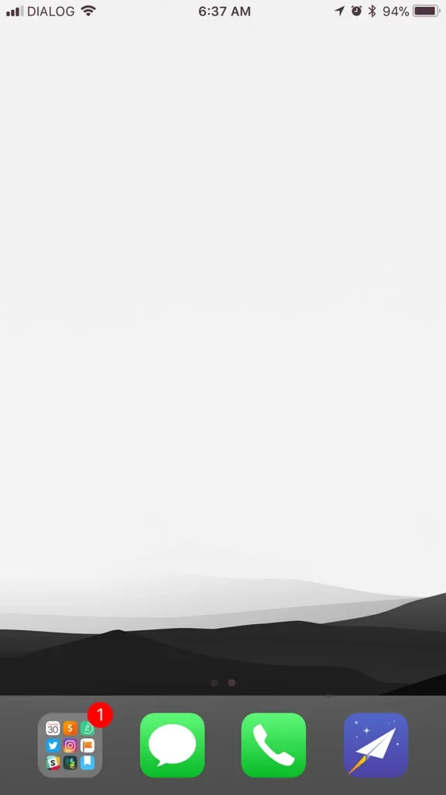
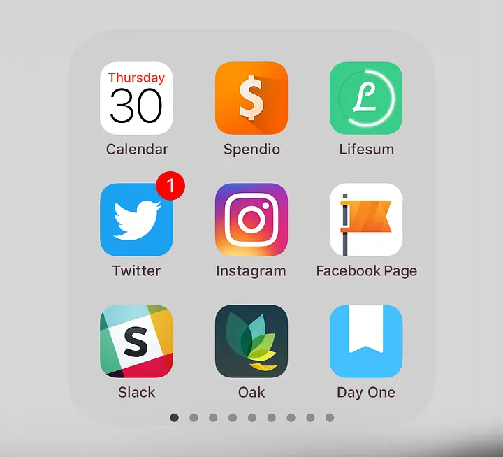

I’ve always had an interesting relationship with clutter.

I dislike it in any form absolutely and utterly, or so I think. I spend time tidying up my work and living spaces, to a point where every single item has it’s own designated place. The idea is that once used, everything will be put back where they belong. I feel rather good about myself, doing this de-cluttering exercise, and I expect these spaces to stay tidy and organized every day.

You know where this is going: _it never happens_.

Within days, I’d see things lying about, in places not assigned to them. Interestingly, I seem to care less about it as the days pass. My initial commitment to keep things tidy has now reduced to an unimportant thought. Slowly but surely my workspace would clutter up again, and I’d get used to it.

The same was true for my virtual workspaces. My phone was filled with apps I rarely used and notifications that didn’t do me any good to see.

But this was a month ago. This is what it looks like now.

There are no apps in the home screen — and the notification badge count was just 1 at the time I took this screenshot. During any time of the day, it doesn\\'t go beyond anything humanly possible to deal with.

I’ve [already written about](/notebook/2017/10/a-challenge-for-the-next-30-days/) how this happened. So here’s an update, after 30+ days of using the phone like this.

## Notifications

I’ve disabled notifications for almost all the apps. The exceptions are ones that require immdiate attention, which in my case are:

1. **Twitter,** with some slight in-app modifications that blocks almost all notifications from my personal account while allowing notifications from the business account (@bearappeal) to come through.

3. **Instagram,** which is set up the same way as Twitter.

5. **Facebook Page,** which in my case is my company’s [Facebook page](https://www.facebook.com/bearappeal/).

7. **Calendar,** because I rely on it heavily to get me through the day.

9. **Reminders, Messages, Phone and FaceTime,** for obvious reasons.

11. **Slack,** which is modified in a similar fashion to Instagram and Twitter, so that it only shows me notifications from important channels and/or ones with predefined keywords.

13. **Trello,** which is my app of choice for task management.

15. **Tawk.to,** because this is the chat tool we’ve set up on the [Bear Appeal website](http://bearappeal.lk/) and I don’t want to miss any chats from visitors, regardless of the time of day.

Almost all the notifications are work-related. This is intentional, because everything is set up in a way that allows me to focus mainly on getting work done.

## **Apps**

The lack of apps on the home screen has been a real game changer. I can clearly see how it has rendered all those _check-in urges_ powerless.

I’ve made tweaks along the way to the way apps are arranged in the apps folder in the dock. Currently I’m settled on this layout:

<figure>

<figcaption>These are the apps I use most frequently.</figcaption>

</figure>

**Calendar** is there since I look at it several times a day; I use **Spendio** and **Lifesum** to track my spending and food intake; **Twitter, Instagram, Facebook Page** and **Slack** are important for work; **Oak** is for meditation; **Day One** is my journaling app.

Although I haven’t quantified it, I know for a fact that I spend far less time scrolling mindlessly down newsfeeds.

## **Spotlight everything**

As I’ve mentioned in the [earlier post](/notebook/2017/10/a-challenge-for-the-next-30-days/), removing all apps from the home screen meant I had to rely on Spotlight search for almost everything. I was a little hesitant at first, since I have a 2-year-old, filled-up-to-the-brim 16GB device. And I known Spotlight to be slow on my phone in the past.

It still is, but boy was wrong about it’s capabilities. Now I use it to launch apps faster (because swiping throough the Apps folder is slower still), search the web and the App Store, search within messages and emails, etc.

I stumbled upon a hack, too. If you stop Spotlight from indexing Slack, [it will become a tad bit faster](https://pxlnv.com/linklog/slack-indexing-spotlight/).

I don’t think I’ll go back to my old layout again. Now that I’ve spent more than a month with this, I’ve gotten quite used to it. Unlike in my battles with physical clutter, I haven’t lost touch along the way either.

I can safely say that I spend far less time slacking now.

If you’re concerned about your productivity, I encourage you to try this out. Let me know how it turns out.