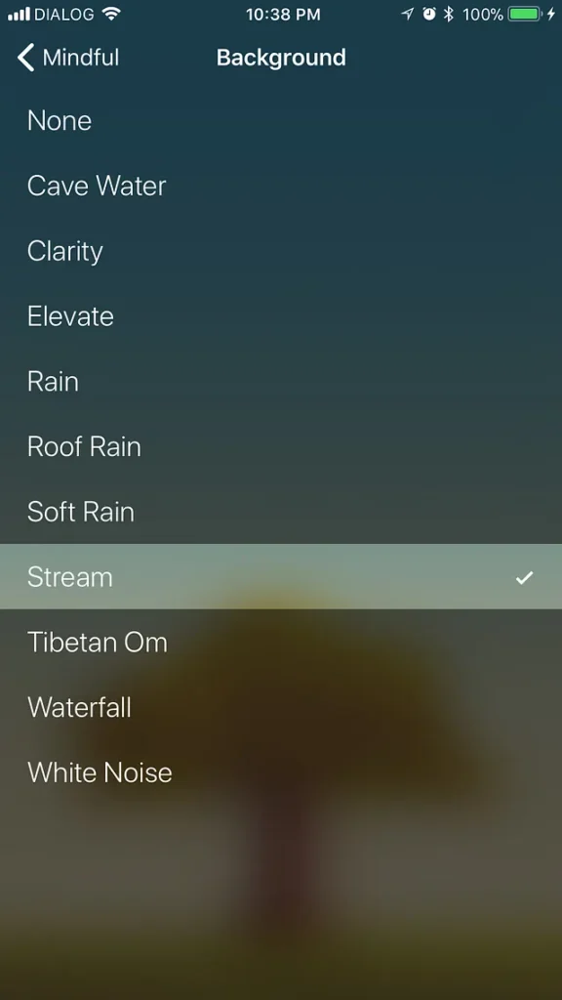
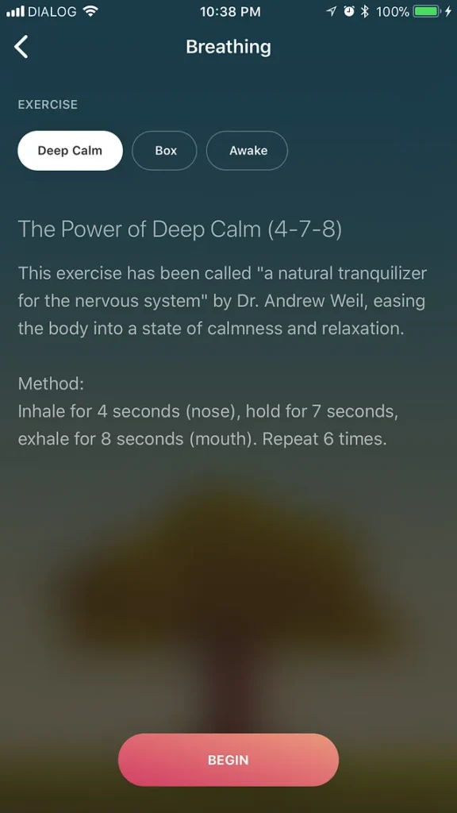

I’ve been meditating for 21 days in a row now. It’s far too early to see any improvements made as a direct result of the practice. But after my initial decision to build this mindfulness habit, a couple of things have changed. So, as promised, here’s an update about what has been happening so far.

## Day 1-10

I decided to start my day with meditation. This is not required, I simply chose to do so because early morning is the best time to fit in a mindfulness practice to my schedule. There were two main reasons for this:

1. **Focus:** At 5 am, when I wake up, I’m usually not groggy, and very alert. This means I can give this practice the focus it requires.

3. **Environment:** Because I live in the middle of the city, things tend to get unbearably noisy outside after the early hours of the morning. I wanted my experience to be as distraction-free as possible.

I’ve realised that it’s important to set small goals and achieve them in the early formative days of a habit, so that’s what I did. Headspace conveniently offers a 3 minute version of it’s basic meditation routine. I chose this, and from 5:02 am to 5:05 am everyday this was in my schedule.

If you’re familiar with Headspace, you’d know that after the free trial of 10 days, you’re required to sign up for a paid subscription in order to continue. On the 10th day, I was not convinced what Headspace offered was worth $7.92 a month.

So I started looking for alternatives.

## Day 11–15

It turned out there was indeed a way to stay in the Headspace ecosystem a little longer without paying, while increasing the intensity a little bit. This was by going through the same 10-day program again, but this time following 5-minute version, in place of the shorter, 3-minute one.

I did this for 5 days, until I discovered [Oak](https://www.oakmeditation.com).

## Day 16–21

Oak is an app developed by [Kevin Rose](https://www.kevinrose.com) (of Digg fame.) It’s completely free of charge. The most basic form of meditation it offers is guided mindfulness meditation. It also gives you room to practice meditation unguided. This, I believe is for the more experienced practitioners, and certainly not for me at this stage.

Perhaps what I like most is the fact that the app plays a sound track in the background while you meditate. There’s a variety of tracks to choose from. I’ve found the breathing exercises quite useful, too.

I have only totaled about 2 hours of meditation, and it’ll be unfair to reach a conclusion about its benefits or the lack thereof based on this very limited experience. Although my original plan was a 30-day challenge, I realise now that it won’t be enough.

I’m hoping to continue beyond 30 days, and you’ll hear from me every now and then about my progress.