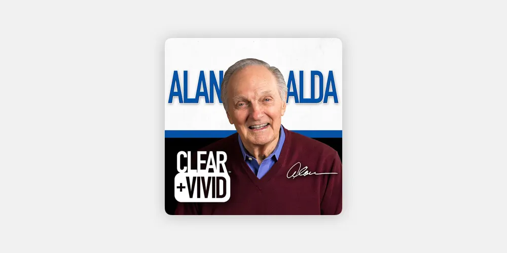
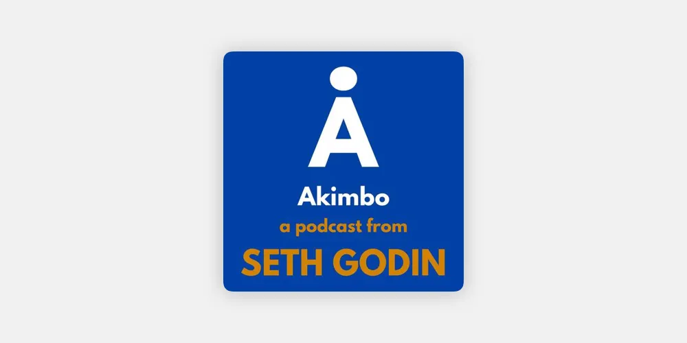
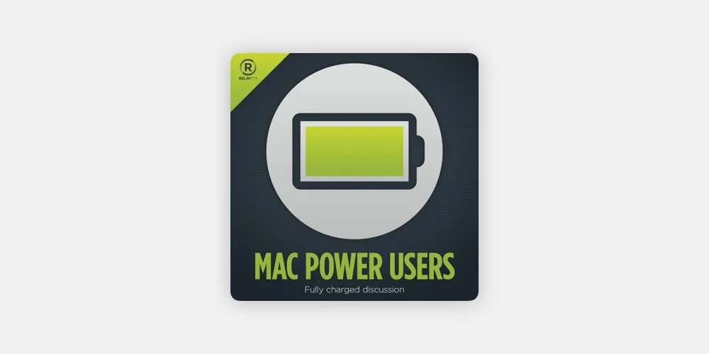
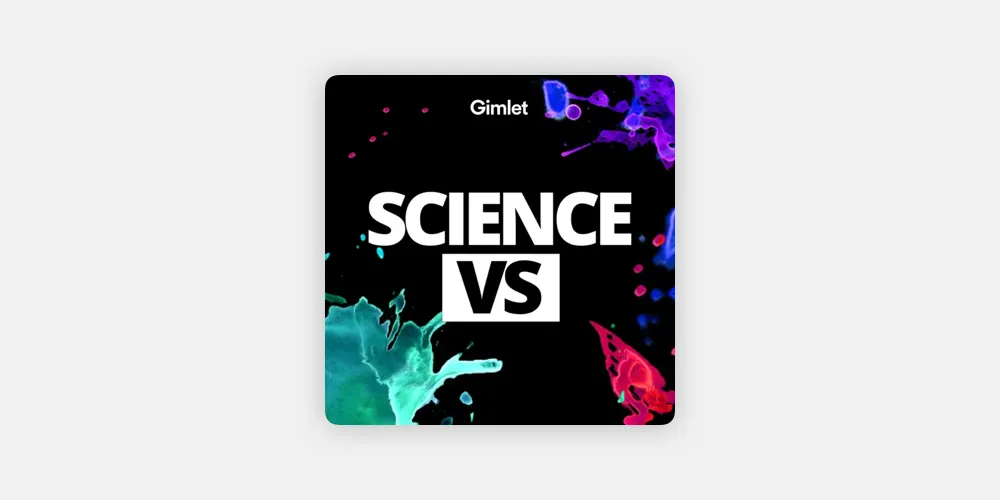
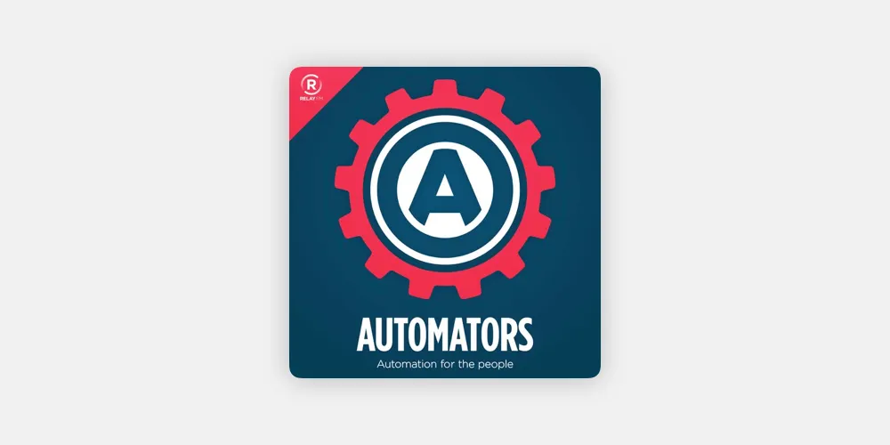
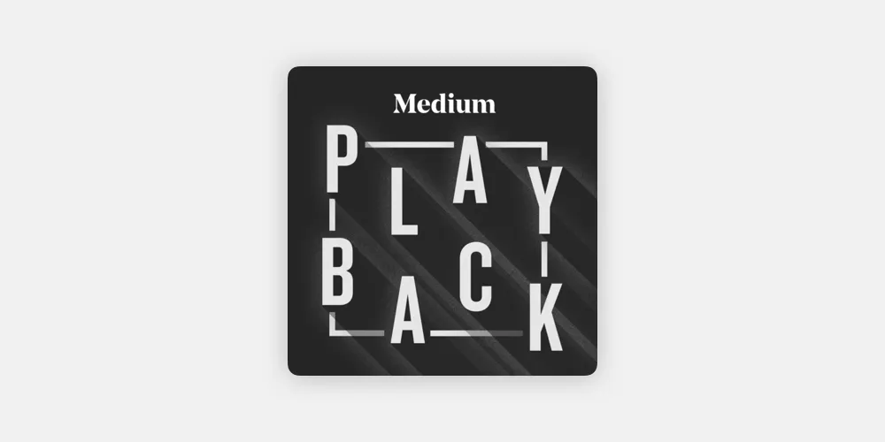

I’ve ventured further into podcast-land since my last [post](https://thamara.co.uk/podcasts-im-listening-to/). (Heck, I’ve even launched [my own.](https://thamara.co.uk/the-bad-take/)) Here’s a quick update on six amazing podcasts I added to my list recently.

Some of these are new, some have been around for a while. In no particular order, here they are:

## Clear + Vivid with Alan Alda

If you’ve seen _M\*A\*S\*H_ or _West Wing_, Alan Alda needs no introduction. He’s a brilliant actor, and an equally brilliant communicator.

He has dedicated much of his life to help people, especially scientists, communicate and connect better with their audiences. The podcast serves the same purpose.

It features his interviews with accomplished people from different walks of life. The conversations are warm and personal. They are a delight to listen to.

## Akimbo with Seth Godin

Seth Godin is a marketing guru. I haven’t read any of his books — he has written 18 of them — so I wasn’t sure whether he was one of these garden variety marketing hacks you see a lot of today.

He isn’t. The guy knows what he’s talking about.

I didn’t know what ‘akimbo’ meant when I first started listening to the podcast. Now that I know the meaning, I can’t think of a better name Seth could have picked for this show.

If you are clueless like I was, go ahead and listen to it anyway. It’s best to find out that way. The podcast is about culture — corporate and otherwise — and how people or events can change it.

The examples are on point. The episodes are short (about 25–30 minutes each) and very well put together so that they tell a memorable story every week.

## Mac Power Users (MPU) with David Sparks and Katie Floyd

I didn’t know anything about this long running show until very recently. I stumbled upon it on a blog post.

This is for Mac users keen to make the best use of their machines. The hosts are well versed in the software and hardware capabilities of Apple’s machines and are pretty good at sharing their knowledge. They are occasionally joined by guests with similar expertise.

The show talks about everything from maintenance, reviews of new products, tips for upgrading, and more. The episodes are fairly long (about 90–100 minutes each) but the good thing is that you could pick and choose which ones to listen to since they’re based on standalone topics.

## Science Vs with Wendy Zukerman

This is for science enthusiasts. The show is all about separating facts from fiction concerning a wide range of topics, especially ones that are hotly debated in contemporary discourse.

The podcast is interview-heavy. I find the discussions with scientists and experts in the featured fields extremely insightful. One of my favorite recent episodes is this [one about the impact of plastic straws and other plastic products filling our oceans.](http://www.gimletmedia.com/science-vs/plastics-the-final-straw#episode-player)

There’s something to be said about the production quality of this podcast, too. The sound design in particular is commendable. I’m all for making science accessible and popular, and this podcast does just that. I’m hooked.

## Automators with David Sparks and Rose Orchard

If you are keen to save time by automating as much of your daily work as you can, this podcast will be a field guide for you.

David Sparks — the same one that co-hosts Mac Power Users — has teamed up with a Mac/iOS automation expert to produce this show, and they do a pretty good job.

Each week after listening I find myself trying out their automation tips. Sometimes the processes involve advanced knowledge in, for example, Apple Script, but most automations are quite simple to set up.

Unlike most other podcasts I listen to (with the exception of MPU), this is utility-driven. It’s good to have in the mix.

## Medium Playback with Manoush Zomorodi and Kara Brown

I have long been a fan of Medium’s approach to support writers through their new partner program. The platform is now home to a number of great producers of written content. Medium wants to go further than that.

The podcast gives prominent writers on Medium an audio platform.

It features a story from a selected writer in each episode. The story is narrated by the writer himself/herself. After the reading, the writer is interviewed by the hosts of the podcast. This makes for very intimate and incisive conversations about topical issues.

I find the interviews very engaging. It’s always interesting to get to know the motivations and experiences behind a well-written piece.

All these podcasts are available on almost all platforms. If you search for them on your podcast app, they should pop right up.