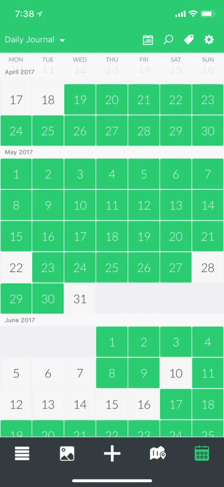
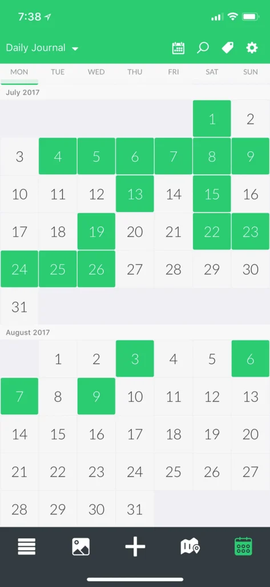
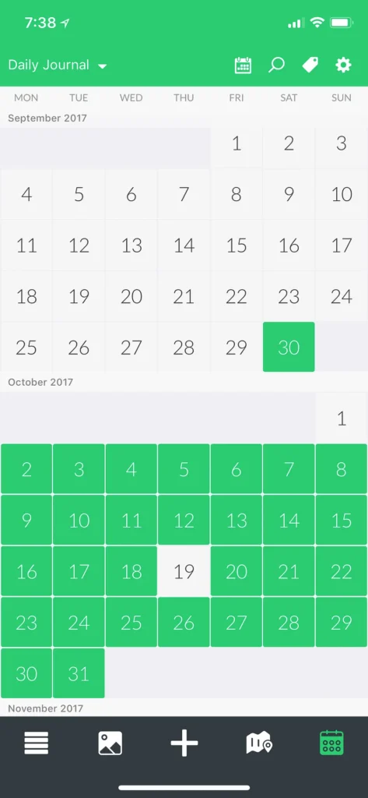
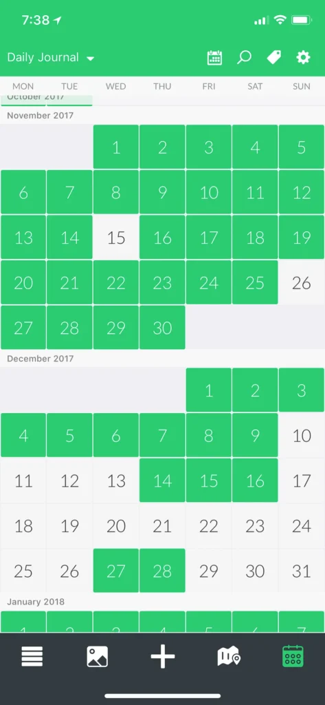
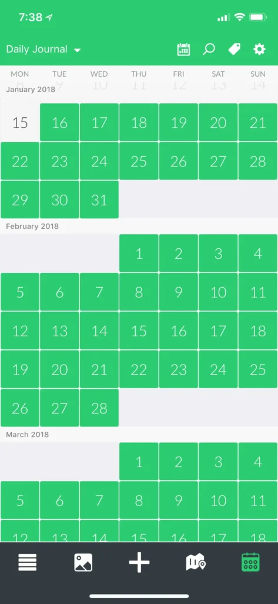

I’m a [slow thinker](https://sivers.org/slow). I don’t grab fast the concepts and ideas I’m exposed to, unless I take some time to sit down and think about them carefully. For the same reason, I’ve never been good at conversation. If you were to debate me verbally, I’d lose spectacularly.

Writing has always enabled me to take the time to think things through and then speak my mind. It has been the medium of expression that fits my circumstances best.

While I enjoy to a great degree the exercise of writing things down, it has recently fallen into the wayside amidst a host of other personal and societal obligations. While [building a business](/notebook/topics/my-startup-journey/) and doing freelance work to pay the bills, writing always became a thing of lower priority as time went by. I had started keeping a daily journal precisely as an answer to this, but it didn't take long for me to dismiss all the prompts from my journaling app in favour of something else that needed my attention.

What started out, and was supposed to be continued, as a daily habit was now dialed down to a simple pastime for when I had the time and energy to spare.

I would often try to write a long piece about all the things that happened on the day, or the one before, and get carried away. Or I would struggle to come up with anything to write about and end up writing something only a few sentences long. Or I would write nothing at all.

I was clearly not going to write as much as I wanted to this way.

The dates highlighted in green represent the dates on which I have made at least one entry in the journal.

This went on for quite some time. Then I finally decided to change it.

**I call it my 250/10 Rule.**

The technique is quite simple. I write 250 words in my journal within 10 minutes. No topic is off bounds.

On some days I write about my plans for the day ahead. On others, about how I spent the day before. I write about how I’m feeling, or the challenges I’m dealing with. On days when I’m particularly not in the mood to write, or when I can’t come up with anything to write about, I write about not being in the mood to write and not being able to think journal-worthy thoughts.

I always make it to 250 words. When I reach the 250th word, I finish off whatever sentence I’m in the middle of, and I stop writing.

My journal is now [a great big mess](/notebook/2017/09/snippets-from-an-incomplete-journal/), but a wonderful mess nonetheless.

It’s been almost 3 months since I _modified_ my journaling habit this way. The result? **Consistency.**

<figure>

<figcaption>Since mid-January up to this day, I haven’t missed a single day of journaling.</figcaption>

</figure>

The 250/10 rule has allowed me to maintain a 62-day journaling streak so far. I’ve written a little more than 15,500 words during this time. That is a small number, and an underwhelming one. What matters, though, is that I’m building a consistent habit.

Once I have the plumbing in place, I can always increase the volume that flows out.

In matters like this, setting a low bar, and taking things slow always helps.