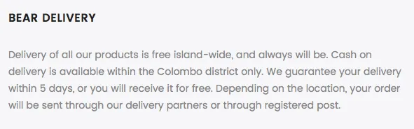
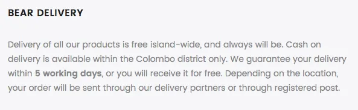

_This is one in a series of posts where I document my startup journey. If you just landed here, go to [this link](/notebook/topics/my-startup-journey/) and you’ll find all the other posts in the series._

* * *

Today we realized that we’ve been offering a rather generous, and somewhat impractical, delivery guarantee at [Bear Appeal](https://bearappeal.com/).

This was our (proud) guarantee:

<blockquote>We guarantee your delivery within 5 days, or you will receive it for free.</blockquote>

It sounds enticing. The delivery partners we’ve paired up with are fairly efficient, and we’ve seen that the postal service in Sri Lanka is quite reliable, too. We’ve been able to stick to the 5-day delivery guarantee with an almost-100% success rate thanks to these. The exceptions were almost always caused by Force Majeure (such as the [fuel crisis](https://www.newsfirst.lk/2017/11/fuel-crisis-ship/) of last November, and heavy rains on some occasions), during which our customers were fully understanding and supportive.

All in all, we’ve never had to refund a customer because we failed to keep up with the guarantee.

This changed today.

Sri Lanka had a slow few days last week. Last Friday happened to be Good Friday, and Saturday was a Poya holiday. Both being public holidays, this meant that neither our delivery partners nor the post office were open for business. Effectively, we had to wait until Monday (yesterday) to ship out the orders that came in on Thursday night, Friday and Saturday last week.

There was a good chance that some customers who placed their orders on Thursday might not receive their orders within 5 days.

As expected, a customer who’s order had been delayed this way reached out to us, and demanded his refund. We had to stay true to our word, so we offered to refund his money right away, without hesitation.

We asked for his bank details, and just as we were about to send him back his money, he decided that he did not need the refund. It was a relief, I should admit, but going through this, I also realized two important things:

1. **Firstly, our guarantee, while generous and attractive, wasn’t always practical**, especially given the insane amount of public holidays that Sri Lanka has. (Take a look at [this](https://www.timeanddate.com/calendar/?country=116) calendar and you’ll see.) It’s virtually impossible to keep up with the guarantee when the holidays fall right next to weekends. It was not sustainable, and we had to change it.

3. **Secondly, it’s rather important that you stick to your word, even when you know that a promise you made is now turning out to be unfavorable to you.** If we had tried to ask for the customer’s sympathy citing the back-to-back holidays, he might not have been in the mood to go back on his demand. I can’t post the conversation I had with the customer, but I could tell that he was rather impressed with the way we followed through with our guarantee.

The fixing has been done. Now we guarantee delivery within 5 _working_ days. I have to admit that I was a little reluctant to do this at first. Although we’re willing to work all 7 days a week, rain or shine, various partners who play important roles in the smooth running of our operation could have different plans, and when that happens, we have to choose practicality over romance.

This seems like the simplest thing, but to me, it just proves that I still have a lot more to learn. If you’ve been in similar situations, I’d love to hear all about it.