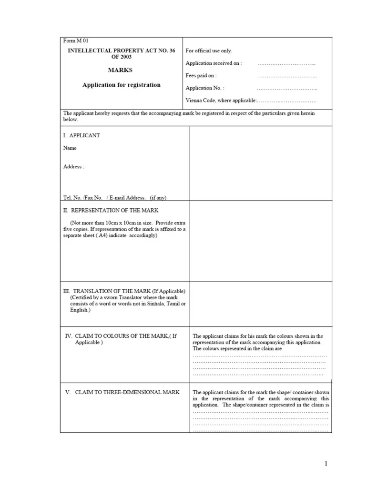
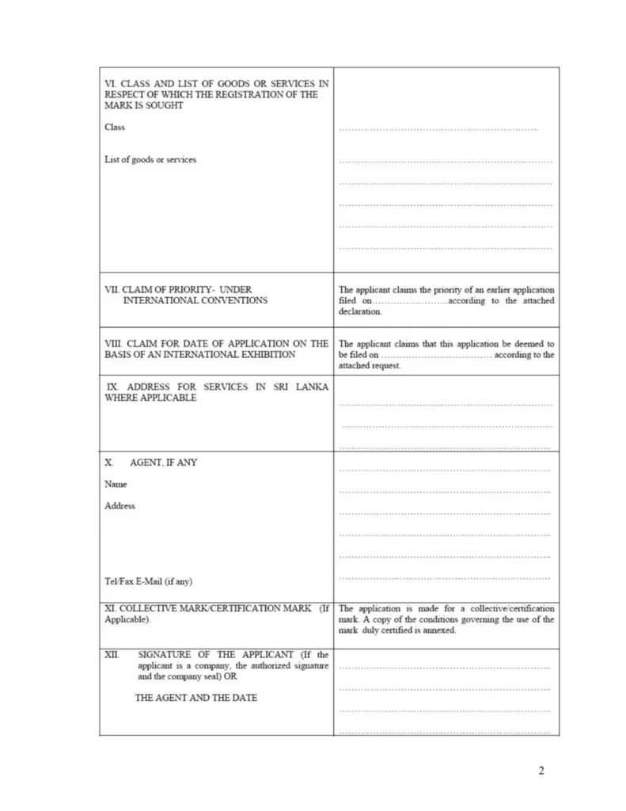

_This is one in a series of posts where I document my startup journey. If you just landed here, go to [this link](/notebook/topics/my-startup-journey/) and you’ll find all the other posts in the series._

* * *

We recently applied to trademark Bear Appeal, and I thought I should share some specifics for the benefit of anyone who’s plannig to do the same with their brand.

If anyone is thinking about applying for a trademark here in Sri Lanka, the process is surprisingly easy.

The registration is carried out by the [National Intellectual Property Office (NIPO)](http://www.nipo.gov.lk/) situated on the third floor of the [_Samagam Medura_](https://goo.gl/maps/WNNtbCBEZVD2), the government building where the Department of Registrar of Companies is housed.

The first step is to make sure that the sign you want to trademark is unique. To do this, you have to search the NIPO database. For example, I made sure there were no other brands named Bear Appeal, or using a sign similar to our logo. This search costs LKR 115.

When applying for the trademark, you also have to make sure you’re applying in the correct category. There are [45 different categories](http://www.nipo.gov.lk/Documents/ClassMarks.pdf) (classes) which represent different industries, and the officers at NIPO will help you find the class your mark belongs to. Apparel, for example, belongs to class 25.

Once this is done, you have to fill in a 2-page application form (Form M01) and hand it over with a printed copy of the sign you want to trademark, and a photocopy of both. If the trademark is for a company, a signature of a Director is required along with the company seal. The application fee is LKR 3,450.

With this you’re done. From what I’ve heard, the approval process could take a while, but all you have to do is wait. I sure am waiting for the day I receive NIPO’s approval in the mail.