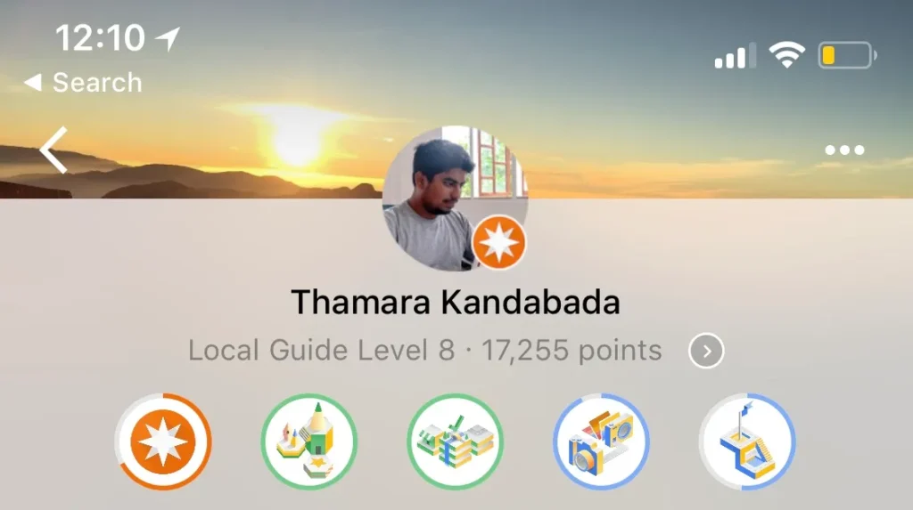
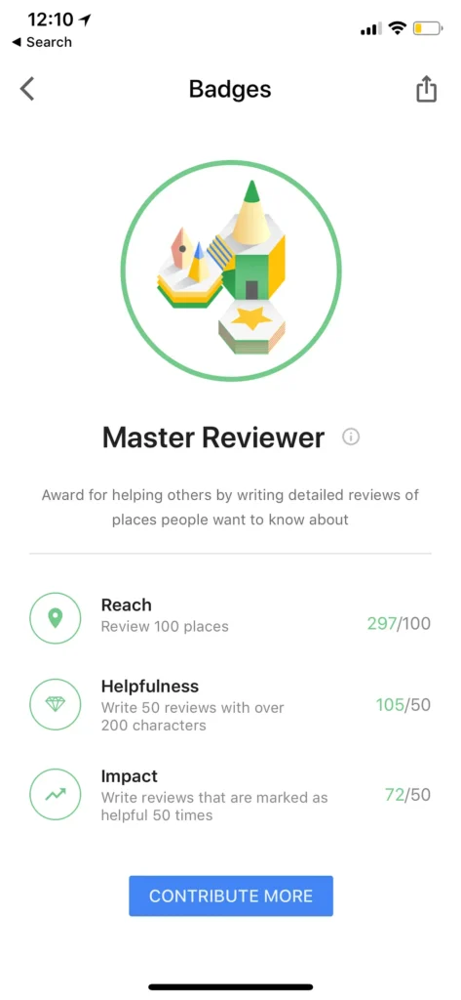
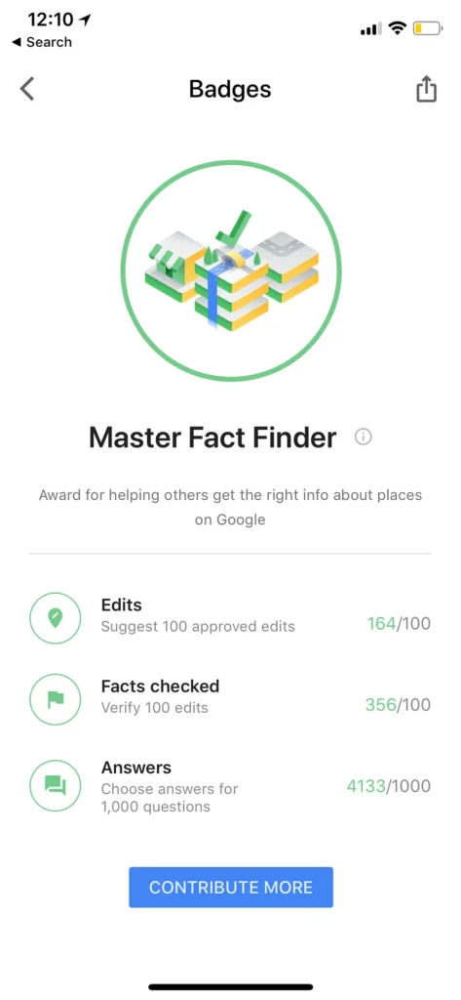
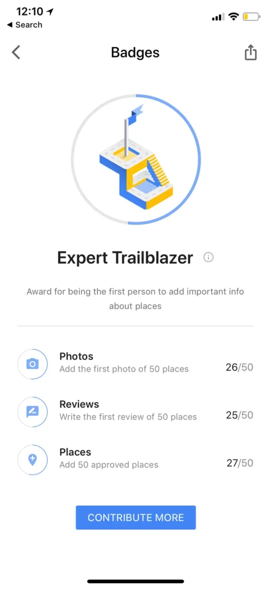
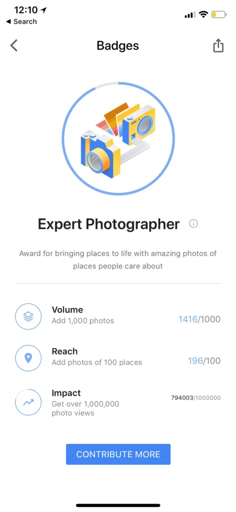
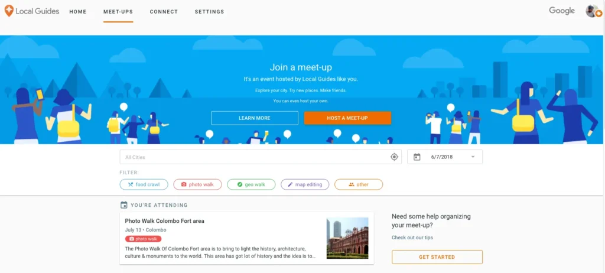
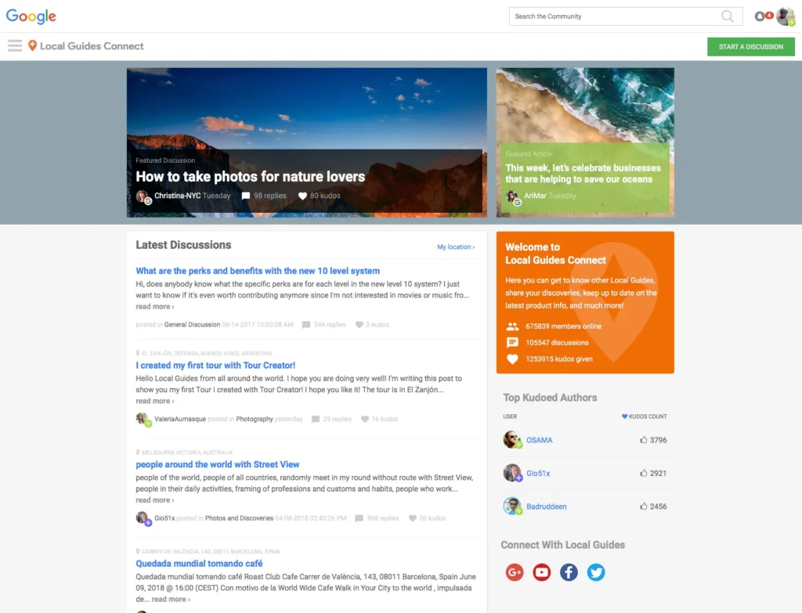
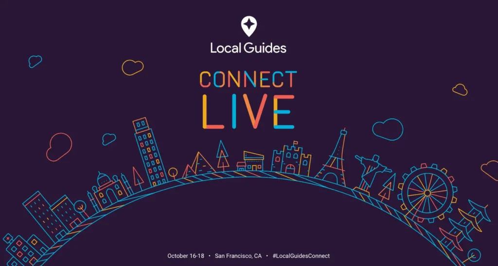

I’m a huge fan of crowdsourcing. I try to be involved in crowdsourcing projects whenever time permits. I contribute to Wikipedia, Google Translate and Facebook Translate regularly, but the platform I’m most active on is Google Maps.

Google Maps has this amazing program called Google Local Guides. Local Guides are the people who contribute to improving the product by adding places, editing information (such as phone numbers and addresses of places), adding pictures of places, writing reviews and validating information added by other people.

They’ve gamified this process quite well by giving points to Local Guides based on the contributions they make. Based on the points you’ve accumulated, you can go up in your Local Guide Level. I’m currently a Level 8 Local Guide.

Local Guides also get together quite frequently by hosting small meet ups. These meet ups usually have a theme, such as ‘photo walks’ (where the focus is on adding more and better photos of places to the map), ‘map editing’ (where the focus is adding and updating up to date information about places to the map) etc. Any Local Guide can host a meet up.

There is alsoa forum for Local Guides, called [Local Guides Connect](https://www.localguidesconnect.com), which is a place for discussion among the program participants. The forum is very active and vibrant, and you can find a lot of Local Guides sharing tips and tricks, stories and photos of interesting places they’ve visited, feedback about the program and the Google Maps app among many other things.

Every year, Google hosts an event in San Francisco exclusively for Local Guides. Any Local Guide with a Level 5 status or upwards can apply to be part of it, and Google will sponsor the selected Local Guides for a two-day conference. Google takes into account the contributions you’ve made to the map, your involvement in the Connect forum and your participation and/or hosting of meet ups for this selection.

If you’d like to be part of the program, please join through [this link](https://maps.google.com/localguides). All you need is a Google account. I’d be happy to answer any question you have about it.

I can promise you that the experience will bring you a lot of satisfaction. You don’t get any monetary returns out of this, of course, but knowing that your efforts are going to help the millions of people using the map everyday is reward enough.