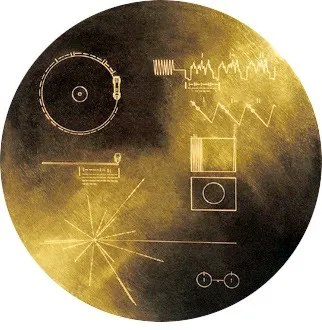

**Ignorance ˈɪɡn(ə)r(ə)ns/**
**_noun_** lack of knowledge or information.

***

20 Billion kilometres away from the sun, a little beyond the vicinity of our estranged cousin Pluto, a lone spacecraft flies in to the depths of the universe. Closely followed by its twin, an identical spacecraft in both appearance and audacity of purpose, it speeds past alien material across interstellar space. Embedded in it is a treasure, one it has safely carried for 40 years: a12-inch copper disk, plated with gold. This is a gift from mankind to the universe.

This spacefaring machine is known to the world as **_Voyager 1_**. Since the beginning of its flight on September 5, 1977 — two weeks after its twin, **_Voyager 2_** left Earth on a similar journey— it proudly carries through the cosmos this gift we so fondly prepared. The copper disk in question, in many ways, is a celebration of a what make our home planet truly exotic.

The sounds and images contained in this **_Golden Record_** essentially make up an [advertisement](https://voyager.jpl.nasa.gov/golden-record/whats-on-the-record/) of our planetary real estate; an invitation of sorts to the spacefaring beings out there in the cosmic vastness to call on this humble abode of us humans.

<figure>

<figcaption>The Golden Record. Image courtesy of NASA JPL.</figcaption>

</figure>

For all its romanticism, this endeavor is a product of the sincere desperation of the human race. At least, that’s my reading of it.

In our quest to understand the cosmos, and through it our place in the grand scheme of things, we have forever yearned for the discovery of intelligent life beyond our _Pale Blue Dot._ For millennia we have looked up to the skies and wondered what secrets lie therein. We have imagined celestial beings and weaved fiction detailing their exploits. But perhaps the most audacious stories we’ve made up are the ones where spacefaring humans travel to galaxies far far away, daring it all time and again to boldly go where no man has gone before.

The same urge that gave birth to these stories, brought the Golden Record into life. Because in our rather dull reality, where we lack the technological might to take to space ourselves like Captain Kirk did, our only option was sending out a machine in our stead.

Curiosity fueled the Voyager. Ignorance gave it wings.

Because ignorance makes us feel vulnerable. It implores us to look for answers, and know better. We venture in to the great unknown not despite our ignorance, but because of it.

But The Voyager — although it is perhaps the most romantic undertaking— is just one such project. A myriad of ambitious endeavors are being worked on every minute of every day.

While some are content to have the [gaps in their knowledge filled by a God](https://youtu.be/ytaf30wuLbQ), Science asks questions and conducts experiments of galactic proportions to curb our ignorance. The indefatigable bastions of our quest for knowledge do not rest.

Until we unravel all the mysteries of the universe, we will keep looking up. We will go as far in to space as we can, with Voyager, and more like it to come. Every once in a while we will take hard blows, for not all the leaders of the world will find _The Final Frontier_ fascinating and bask in its wonders. But we will overcome, and keep going still. Because our collective ignorance keeps us going.

Ignorance _is_ bliss, because it pushes us forward.