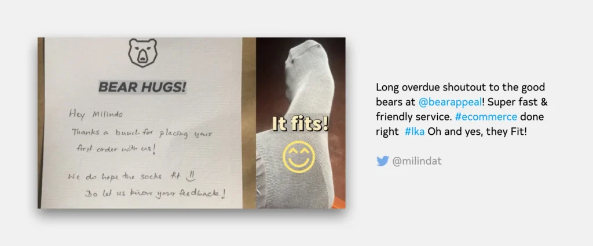
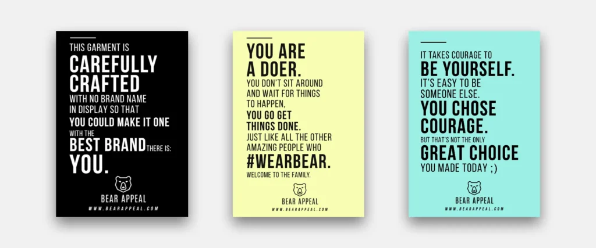
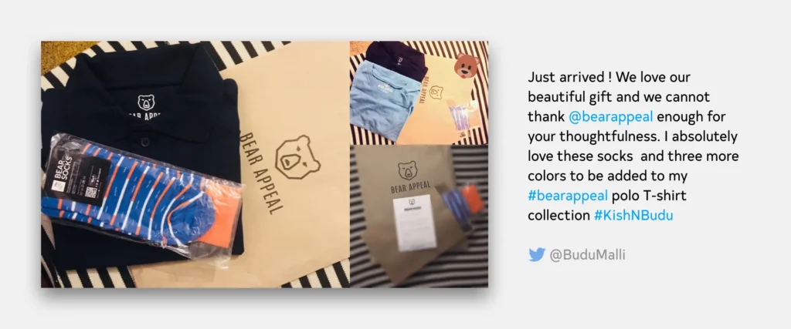
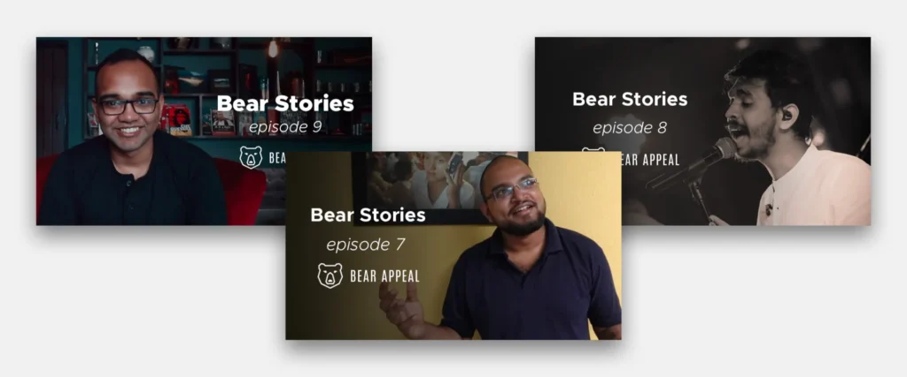

_This is one in a series of posts where I document my startup journey. If you just landed here, go to [this link](/notebook/topics/my-startup-journey/) and you’ll find all the other posts in the series._

* * *

As a completely bootstrapped business, we’ve never had a huge budget to invest in fancy marketing campaigns and promotions. So we’ve been trying out some small things we thought would help us differentiate from the competition.

These gestures are simple, but (from what we hear,) feel extremely meaningful to customers who buy from us. We try our best not to make these feel unwarranted or out of place, rather completely integrated to the customer experience we offer.

Here are 5 such things our customers have loved.

## I. Notes

Every time we get a new customer, we send them a handwritten note thanking them for trying us out.

There is a ‘template’ for these messages, but if the customer has had previous contact with us in some way, we try to customize the note by referring to those conversations. This makes it more personal.

## II. Cards

We add these cards bearing 3 simple messages along with every order. The messages are supposed to convey what we value as a business at Bear Appeal: integrity, genuine hard work, simplicity, self awareness, etc.

They might sound cheesy to some, but our customers have loved them so far.

## III. Presents

We send presents to our customers on special occasions — birthdays, anniversaries, engagements, promotions and such. The occasions are selected completely at random.

The birthdays we keep track of. Of other milestones — like engagements, being promoted, being selected for competitions, etc. — we hear about from somewhere. For example, if we see in our news feed that two of our customers are getting engaged (this actually happened!), and if it seems appropriate, we send them a small present.

## IV. Stories

I mentioned earlier that there are certain things we value as a business — integrity, genuine hard work, simplicity, self awareness, for example. Our customers live these values everyday, so we created a platform to celebrate them.

The platform is a video series named “Bear Stories,” where we talk to customers of ours who excel at what they do. _Doers_, we call them. The people who make things happen.

We’ve done [9 videos](https://www.youtube.com/watch?v=rVMv8mKUtJ4&list=PLg0IdVDBKSA2RutuN0INQbKF9DBytWaeJ) for this so far, and there’s more in the pipeline.

## V. Names

With the help of [Zapier](https://zapier.com), we made an integration between our website and our Google Contacts account. When a customer places an order, their basic contact details (name, email and phone number) are saved as a contact on our Google account.

This Google account is in turn synced to our company phone. When a customer calls us we know who’s calling, and that makes answering their order-related questions easier and looking up their order history faster. Customers also love the fact that we call them by name when answering the phone.

(Although I have to admit, I haven’t done the calling-them-by-their-name part properly on some occasions in the past, leading to some disappointments. This was not intentional, I merely greeted them with something like ‘good afternoon’ only to realize later that I should have gone for ‘hi X’ instead.)

These little things don’t cost us a fortune, but they do bring us closer to our customers. They are not marketing ploys — the marketability is only a bonus — and our customers see them for their authenticity. It matters.