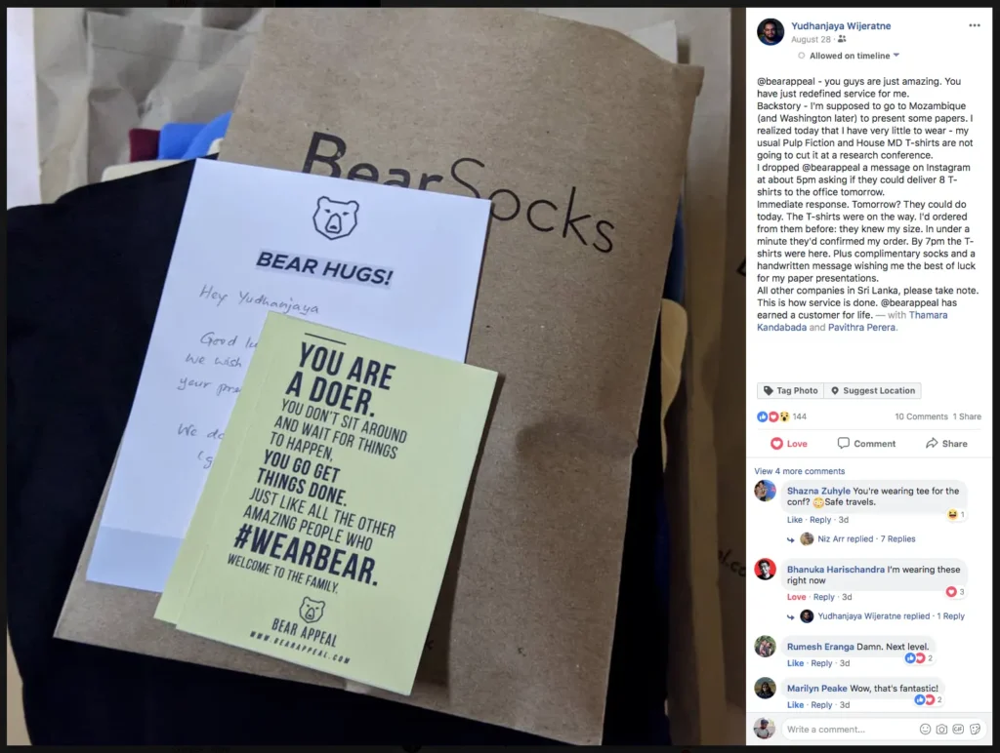

_This is one in a series of posts where I document my startup journey. If you just landed here, go to [this link](/notebook/topics/my-startup-journey/) and you’ll find all the other posts in the series._

* * *

You anticipate a lot of things when you start a business. Getting through the red tape, finding reliable suppliers, finding the right technology, getting your marketing message right — all these are challenges you have to face. We anticipated all this going in.

Perhaps the challenge we were most worried about is finding a suitable payment solution (to process card payments) for our website. We were wrong to do so.

We found a reliable payment gateway, and then another. Setting them up were quite easy.

What did we not worry about enough? Logistics, to be precise, the process of getting an order delivered to the hands of the customer after he places an order.

Because there is a certain reluctance among most Sri Lankans to use online payments, we wrongly assume there are no reliable services built to serve the ones who are eager. Recent popularity of platforms such as PayHere and FriMi are proof that this concern is invalid.

In contrast, reliable companies that provide B2C logistics services are exceedingly rare. This is one thing e-commerce businesses should look out for.

We’ve gone through several phases of organizing our deliveries during the past one-year-and-three-months.

## I. The DIY Phase

When you’re a small business just starting out, you can afford the time and the effort to do deliveries yourself. The order volumes are low, and since you’re not known to the market your customers are spread across a smaller geographical area.

We did this for a good two months. We’d take the bus, or my co-founder’s family car when it became available.

We used the postal service to send packages to customers who were away from Colombo. (In fact, we do the same today. The service is low cost, and works pretty well; well enough that it allows us to ship to anywhere in the island within 5 days.)

## II. The ‘With-A-Little-Help-From-My-Friends’ Phase

One of our friends started a 3PL (3rd Party Logistics) company of his own, and we signed him up. It was a business arrangement, of course, but he offered us a more flexible service than any other delivery company would have offered.

## III. The Big Guns Phase

As our order volumes grew, it became increasingly difficult for our friend’s company to take care of all deliveries. So we signed up with another company, one that claims to be the #1 e-commerce delivery network in Sri Lanka.

A couple of months passed, and our friend had to pause his services for an indefinite period of time while his company went through a merger. We were left with the other guys, and fortunately they were able to handle our order volume.

That is not to say everything was going well.

There were occasions when deliveries were delayed for more than three weeks to some customers. To make things worse, this company would ignore our calls and messages, leaving us with no clue about what had become of the packages.

Another time, a rider from the company confronted one of our customers in a not-so-pleasant way when he offered to make the payment upon delivery with his card. The rider had also claimed that they never carried card machines, and card payments on delivery is not a service they offer. Their website says otherwise.

The customer was not happy at all. It was his first order, and our delivery partner had tainted our reputation for good.

One thing to note here is that the customer does not care at all about the fact that we have no control over the delivery company and the riders they employ. The customer deals with us, not our partners, however important they might be in the fulfillment process. In the customer’s eyes, we had screwed up. He didn’t want to come back.

We lodged a complaint, of course. To this day we haven’t had any updates on the ‘inquiry’ into the incident.

We realized that we had to take things in to our own hands after going through these unpleasant experiences. We did, by doing our own deliveries again.

The process was quite simple. We put out an ad for a part time delivery rider. We also asked some friends of ours to look for a person who’d be interested.

We found one. He came in for a chat, and we got him started the very next week.

The result? **_Faster deliveries. Minimal errors. Happier customers._**

See this glowing recommendation [Yudhanjaya Wijeratne](https://yudhanjaya.com) gave us on Facebook, for example. A fast delivery like this would not have been possible had we not taken matters in to our own hands.

I’m sure there will be mishaps in the future. Our guy will have his own share of misfortune, and Murphy will say hi every now and then.

But we’ll be in control. If things go wrong, we’ll be able to act on them fast. Customers will always be able to depend on us for immediate resolution of issues.

That is a good position to be in.