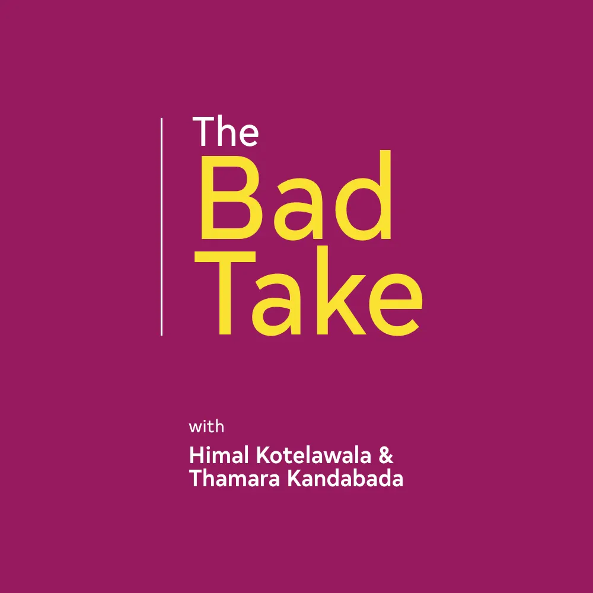

I have been an avid consumer of podcasts for the longest time. So has been my friend [Himal](https://himalkk.substack.com).

After a chance discussion about this listening habit of ours, Himal reached out to me and asked if I’d like to join him in launching our own podcast.

I jumped at the opportunity.

A couple more days, a borrowed microphone (thanks, [Pavithra](https://www.instagram.com/paviperera/)!), some discussions about the topic of choice for our inaugural episode, a hastily put together script, and a boatload of courage to push the launch button later, we have a podcast! We call it _The Bad Take._

Here is the first episode:

<iframe class="podcast-embed" src="https://creators.spotify.com/pod/profile/the-bad-take/embed/episodes/1-On-Censorship--Hate-Speech--Tolerance-e25va1/a-a5717k" frameborder="0" scrolling="no"></iframe>

Many of our friends have already offered us encouragement and a lot of constructive feedback, for which we are grateful.

We call the podcast _The Bad Take_ because it is going to feature our half-baked opinions on a wide range of topics. As we say in the intro we are just “two dudes talking about random crap.”

Our publishing platform is [Anchor](https://creators.spotify.com), where you can find the podcast at [anchor.fm/the-bad-take/](https://anchor.fm/the-bad-take/).

We’ll be publishing show notes (and later, transcripts — we hope) at [**The Bad Take**](https://medium.com/the-bad-take), a new Medium publication dedicated to the podcast.

We are both pretty excited about this, and determined to keep it going.

The next episode is in the works. Until it comes out, do give the first one a listen and let us know what you think.

We have submitted the podcast to all platforms supported by Anchor (such as Apple Podcasts and Google Play) but it looks like the approval process could take up to a couple of days.

