It’s been a little more than 3 weeks since we started [our podcast](https://anchor.fm/the-bad-take). We’ve published 5 episodes so far, and they have been well received, for the most part.

Now is a good time for an update on what’s going on behind the scenes.

I like to document the things I do, privately in my journal, and sometimes publicly on my blog. I do this because I find it immensely satisfying to look back on these accounts.

I thought I could do one better this time and record our podcasting process in a way that would be of use to anyone who wants to start a podcast of their own.

I claim no expertise in this, we’ve only been doing this 3 weeks. What follows is an account of the things we did. A report, if you will, not advice.

Starting a podcast, like starting anything, is easy. There is only one step.

**Start.**

We struggled with this for a bit. [Himal](https://himalkk.substack.com) and I met several times and talked about starting before we finally hit the ‘record’ button one day.

Once we got past that hurdle, we had to figure out certain things to make sure an episode came out each week. We made use of several tools in the process — from preparation, to recording, to editing, publishing and then distributing.

## Preparation

This part is easy. Once you agree on the topic, you simply need to figure out a way to do your research, and organize your notes. Most research is just a Google search away.

The only episode we’ve done so far that needed a bit of factual data was the very first one, [on censorship, hate speech and tolerance](https://anchor.fm/the-bad-take/episodes/1-On-Censorship--Hate-Speech--Tolerance-e25va1), the rest were mostly opinion-heavy. So I won’t go into detail here about what sources to use, for instance, but that should be easy enough to figure out on your own.

To organize notes, I use [Bear](https://bear.app). There are enough and more note-taking apps out there which serve the same purpose. If you’re on Mac/iPhone, I can recommend this one.

If, like me, you think in half-formed sentences, and struggle to articulate your thoughts, it’s a good idea to write things down. This will help when it’s time to record.

## Recording

We record in my office. It’s by no means a soundproof environment. This is why you can hear the occasional bus horn in almost all our episodes.

We first considered recording with our phones. But we had to discard that idea quickly after we discovered that phone mics picked up a wide range of sounds — in our case this meant a lot of room noise, and an endless cacophony of vehicles engines, horns and people from the street outside.

Fortunately my friend Pavithra had a [Blue Snowball](https://www.bluedesigns.com/products/snowball/) for us to borrow. It’s an easy to use USB mic. We plugged it in, and passed the mic back and forth depending on whose turn it was to talk. We could also change a setting so that the mic would only pic up noise coming from right in front of it.

<figure>

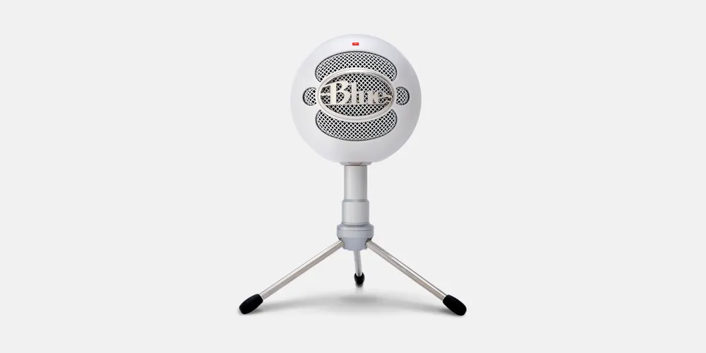

<figcaption>Blue Snowball</figcaption>

</figure>

We recorded the first two episodes this way.

While the mic served our purpose, we found it difficult to keep the conversation flowing while passing the mic around. So we started looking for a device that allowed us to plug in two mics to the computer.

We found the perfect solution, again with the help of a friend. Pramuk, of [Pyramids](https://www.facebook.com/pyramidsSL/) fame, lent me his [Focusrite Scarlett 2i2](https://focusrite.com/usb-audio-interface/scarlett/scarlett-2i2) USB audio interface.

<figure>

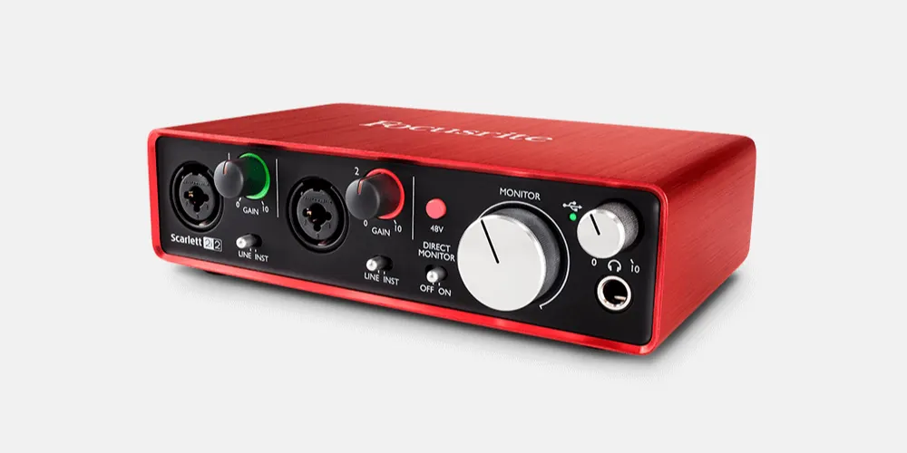

<figcaption>Focusrite Scarlett 2i2</figcaption>

</figure>

This device connects to your computer via USB and allows you to plug in 2 XLR mics to it. The computer can then process the input from both mics.

Himal’s dad lent us 2 mics.

<figure>

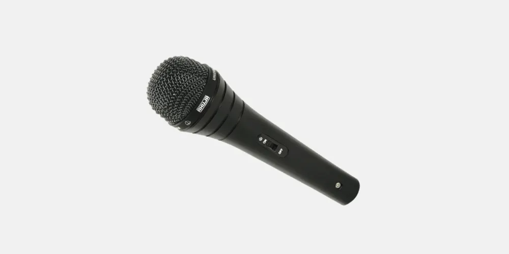

<figcaption>Ahuja XLR mic. This connects to the Scarlett through an XLR cable.</figcaption>

</figure>

Of course, you don’t need all these to start off. A phone recording with a bit of post-processing (to reduce noise) will do just fine.

We capture the recording directly in [Garage Band](https://www.apple.com/lae/mac/garageband/). On Mac, I think this is the best option. You don’t need any fancy audio engineering knowledge to use the app. Plug and play is all there is.

<figure>

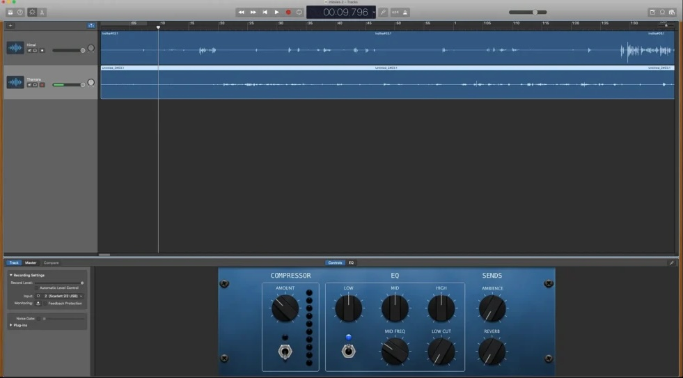

<figcaption>An unedited recording on Garage Band</figcaption>

</figure>

There are other apps you can use, of course. [Adobe Audition](https://www.adobe.com/products/audition.html) and [Audacity](https://www.audacityteam.org) come to mind. It’s a matter of preference, really. Use what works for you.

## Editing

The first two episodes we published were heavily edited. I was hell bent on getting rid of the pauses and “errrrs,” so much so that it sounded like we hadn’t even paused to catch our breath. I wanted to make us sound perfect.

I changed this in the last 3 episodes. More pauses and “errrrs” were left untouched. This way the conversation sounded more natural.

I do 3 key things while editing on Garage Band. First, I listen to the whole recording, and get rid of the obviously bad bits — these are the longer pauses, and parts where we talk but don’t actually say anything, for instance.

Then I listen to it again, and make the more subtle changes. For example, sometimes I have to stitch two separate sentences together for them to make sense.

Then I do a third round of listening to adjust the voice levels. There are times when we are too close to the mic, and other times when we are quite far away. Himal also has this habit of cupping the mic with both hands and talking right into it, which causes the audio levels to spike significantly. All these have to be smoothened out. I’m certainly not good at this, but I can do a decent job.

After this, I add the intro and outro music, bring in some musical interludes if required, skim through the whole recording again for good measure and export it as an MP3 file.

<figure>

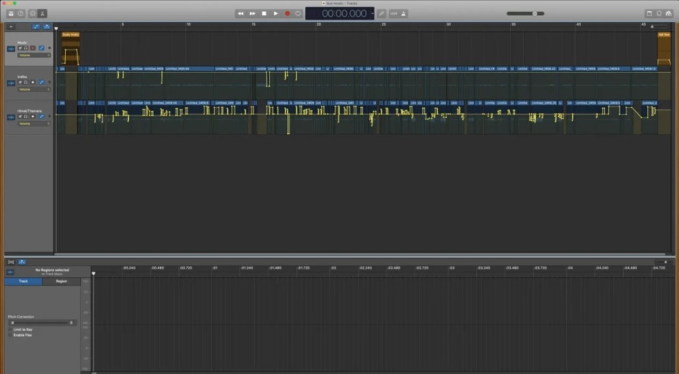

<figcaption>An edited and finalized audio file on Garage Band. The unnecessary parts have been cut out, the audio levels have been balanced and music has been added to the intro and the outro.</figcaption>

</figure>

## Publishing

Our platform of choice is [Anchor](https://anchor.fm). Anchor allows us to publish the podcast on almost all major podcasting platforms in the world, for free, at the click of a button.

<figure>

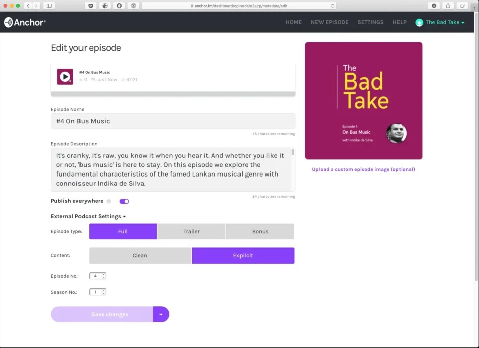

<figcaption>Anchor’s ‘publish’ screen</figcaption>

</figure>

Once the audio file is uploaded to Anchor, I give the episode a name and a description. I also set the episode number, and upload a custom thumbnail to be displayed.

The intro music we use is a royalty-free track downloaded from this SoundCloud account: [https://soundcloud.com/freemusicforvlogs](https://soundcloud.com/freemusicforvlogs). I credit the creator of the music track at the end of the podcast description.

Once you hit the publish button, Anchor pushes the podcast to [all platforms they support](https://help.anchor.fm/hc/en-us/articles/360004954351-Distributing-your-podcast-on-Anchor) within a few minutes. (It could take up to a few days with the very first episode.)

At the moment, Anchor does not have a lot of useful analytics for us to measure the impact of what we do. We keep an eye on the following basic metrics to get a general idea.

<figure>

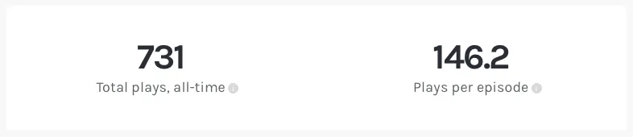

<figcaption>A ‘play’ on Anchor is 30 seconds. This is not very helpful.</figcaption>

</figure>

<figure>

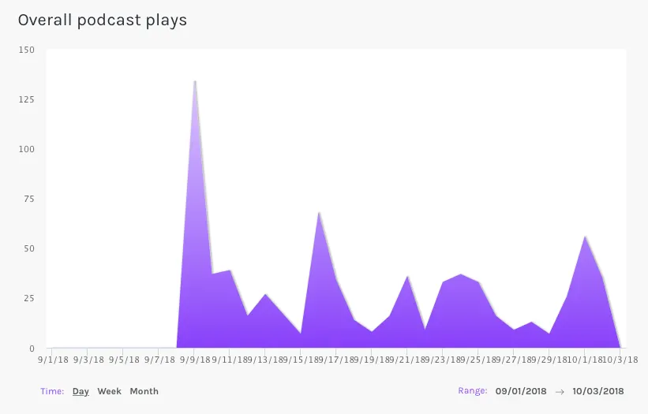

<figcaption>This shows the number of plays across all platforms.</figcaption>

</figure>

<figure>

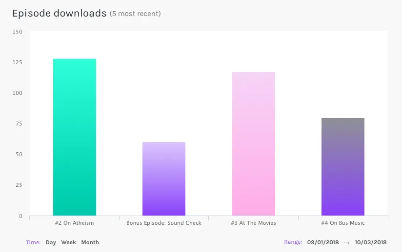

<figcaption>This shows the number of times each episode has been downloaded across all platforms.</figcaption>

</figure>

<figure>

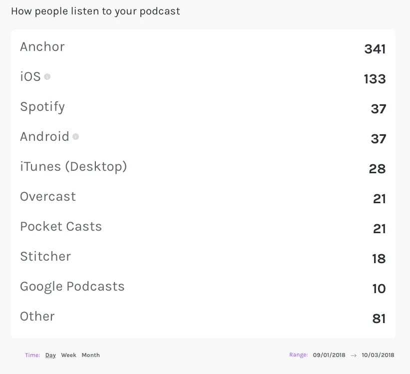

<figcaption>This list is pretty useful. For instance, you can see in one glance that most of our listeners are on iOS.</figcaption>

</figure>

While Anchor does a great job at distributing the podcast, their analytics can get a lot better. But the service is free, and offers unlimited hosting for any number of episodes we want to publish, so we’re not complaining.

Besides Anchor, we also upload all our episodes to YouTube. We’ve found out that there are quite a few people who like to leave a YouTube tab open on their desktop rather than downloading an entirely new app on their phone to listen to a podcast (especially if they are not regular podcast listeners.)

Uploading to YouTube is quite easy, and self explanatory. To prepare the video I use [iMovie](https://www.apple.com/lae/imovie/). Again, this is the easiest option on Mac, and there are several others you can use depending on your preference.

<figure>

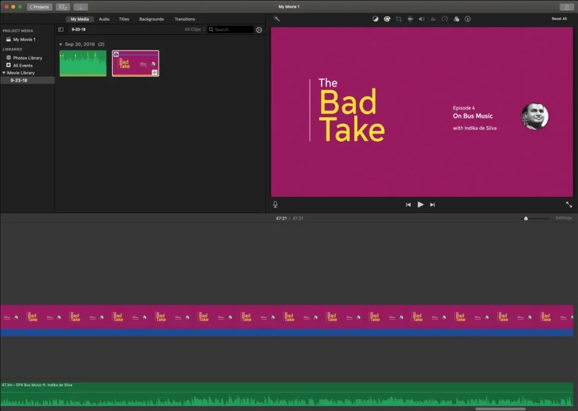

<figcaption>On iMovie, I add an image layer to cover the length of the final audio file, and export as a MP4 video.</figcaption>

</figure>

iMovie creates large files in the export process (450MB+ for a 47 minute episode, for instance.) To create a file small enough to upload to YouTube, I use [Handbrake](https://handbrake.fr) to convert the iMovie output. It converts a 450MB file to a 70MB file while preserving the quality.

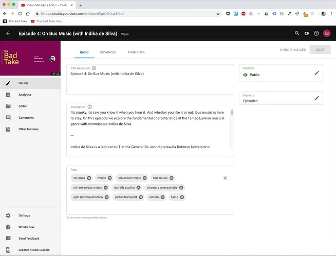

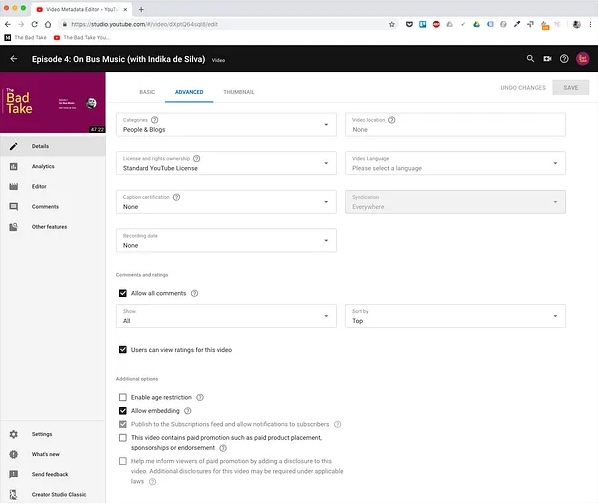

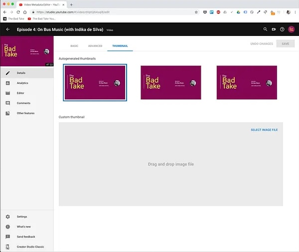

When uploading to YouTube, I pay special attention to the ‘description’ and ‘tags’ fields. The same episode description that goes into Anchor goes here, but I also add a new section with a list of links to all other platforms the podcast can be heard on.

Tags help with discoverability. I use about 10 tags that match the content of our conversation.

## Show notes

We wanted to give the listeners access to the material we’ve consulted in making each episode, for example, books/movies we refer to and articles on the web we quote from. For this, we created a [publication on Medium](https://medium.com/the-bad-take).

For each episode, we create a blog post (or a _Story_, in Medium lingo), and add a list of relevant links there with a short description. These are called ‘show notes.’ Most podcasters do this, but it’s not an absolute necessity.

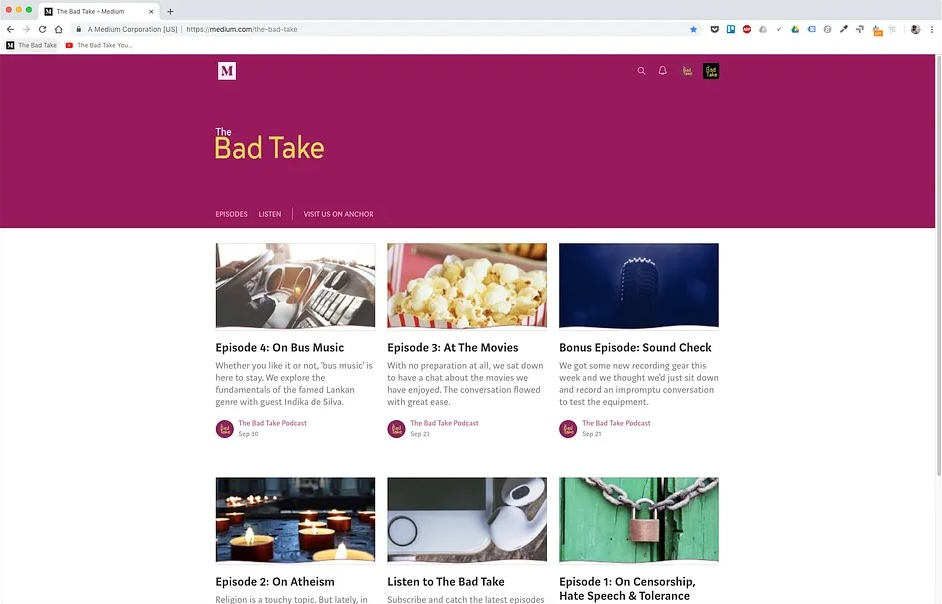

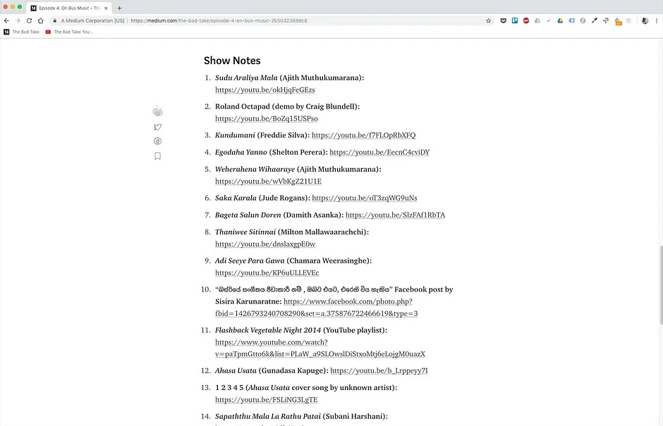

Of course, a link for this show notes post is then added to the episode description on Anchor and YouTube. This way, listeners can easily click through to the article and refer the material while they are listening.

That’s all there is. It looks like a lot but doesn’t take much time to go through.

I’m sure these processes will change as we grow. For example, one thing I want to add to the show notes is a full transcript of each episode. We don’t do that now because it takes a lot of time to transcribe even the shortest episode, and we don’t want to use any paid transcribing services just yet.

This is how _The Bad Take_ reaches our listeners. If this helped, I’d love to know.