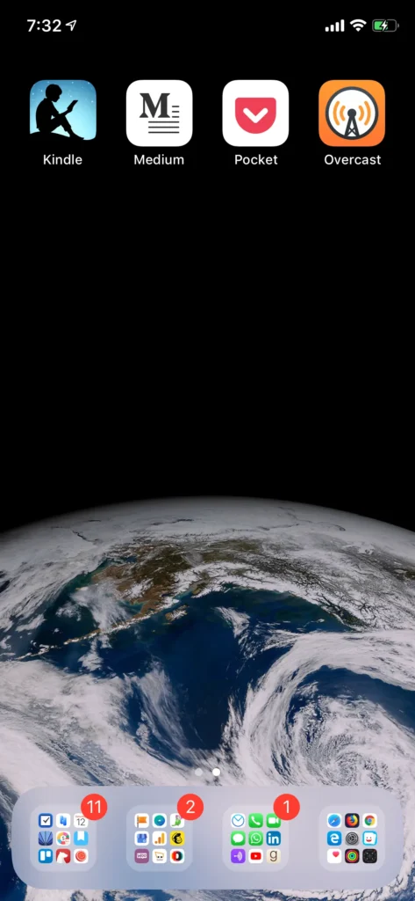

Things have been going pretty well since my [last effort](/notebook/2017/11/declutter/) to declutter my iPhone’s home screen. I have been using my phone less, and thanks to the absence of notifications, I’ve successfully avoided unnecessary distractions.

More than a year after I made those changes, I’m tweaking my setup a little bit more. This time, I have one very specific goal in mind.

I want to read more this year, so I’m placing my favorite reading apps within easy grasp. [**Kindle**](https://itunes.apple.com/us/app/amazon-kindle/id302584613?mt=8), for my books, [**Medium**](https://itunes.apple.com/lk/app/medium/id828256236?mt=8), where I follow a number of amazing writers and [**Pocket**](https://itunes.apple.com/us/app/pocket-save-read-grow/id309601447?mt=8), where I save my favourite articles from all over the internet to read later, will be front and centre on this screen.

I threw in [**Overcast**](https://itunes.apple.com/us/app/overcast/id888422857?mt=8) there as well, my podcast player of choice, so that I can catch up on the avalanche of unplayed podcast episodes I have downloaded.

Little else has changed, except that I no longer have Facebook, Instagram and Twitter installed — because [I’m not on these social networks](/notebook/2019/01/cool-turkey/) anymore. Notifications are still turned off for almost all the apps, and I use Spotlight to search for everything.

That’s about it.

Let’s see how much reading I can get done this year.