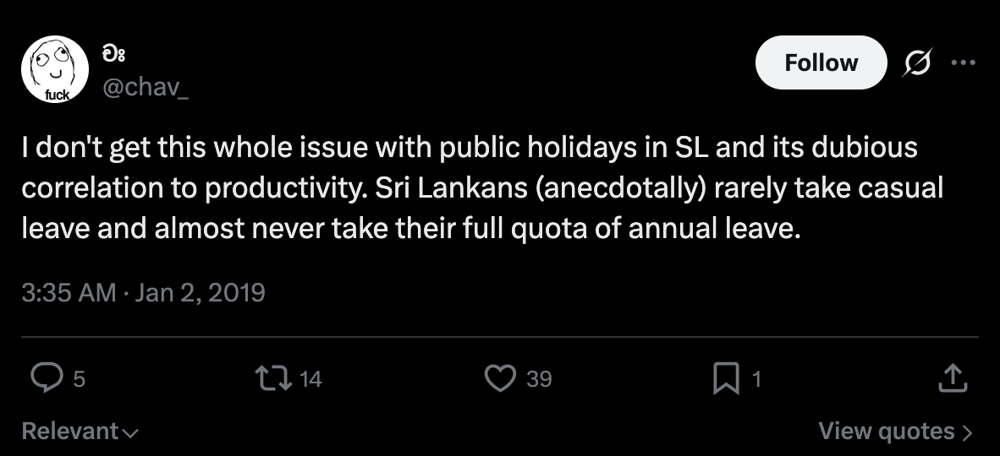
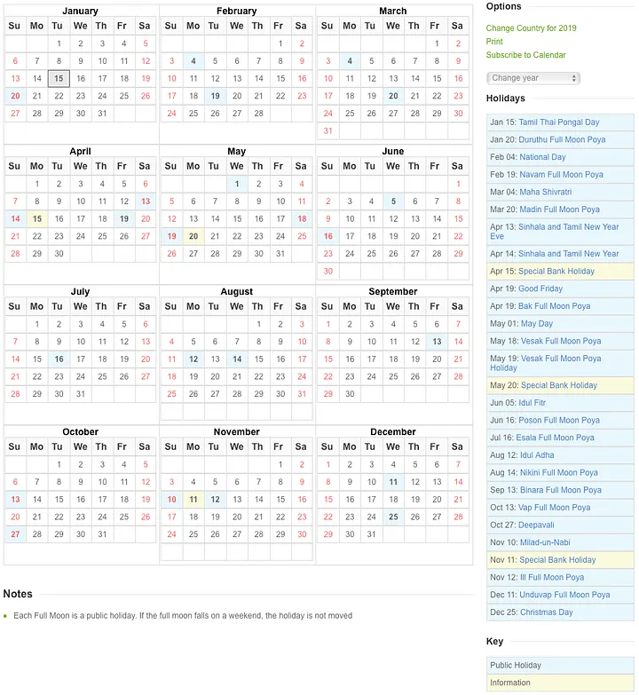

This was supposed to be a reply to a tweet. It isn’t one now. It is rather a carefully thought out answer to my own doubts about work ethic.

## First, the premise.

As the new year (2019) dawned, Sri Lankans discovered, to their dismay (and borderline outrage in some cases) that some of our public holidays for this year fell on weekends. (9 out of 23 holidays, to be exact.) As it happens, this disappointment quickly took the form of tweets and other social media postings. Turns out, many people like holidays.

A particular post by [චඃ](https://medium.com/u/dc5b2949cbc3), which I have linked below, caught my attention.

I don’t share his sentiments here, but instead of resorting to a knee-jerk disagreement, I decided to think about this a little. I told him I’d write a blog post about it. Here it is.

Before I present you with my _verdict_, I have to tell you a little bit about my work life. For context.

Ever since I started working, I’ve viewed holidays as an inconvenience. I was right to do so. See, 4 years ago, I had little to no responsibilities, and apart from my weekend studies, almost nothing else to do. I had avoided going out and socializing like the plague (I still do) thanks to my introversion and teetotalism. This meant I could spend as much time as I liked working.

And I did. And it paid off.

What’s important to know here is that doubling down on work was a conscious choice I made. I liked going to the office at 7 in the morning and leaving after 12 straight hours. I liked the people I worked with. I was enjoying myself.

I quit after 2.5 years, and started my own business.

You’ve heard the usual startup stories coming out of Silicon Valley and elsewhere. I don’t need to tell you that 100-hour work weeks are celebrated, and workaholism is a virtue. I was very much into this drivel when I started working for myself.

## Has anything changed?

If you thought that last bit was rather strongly worded, that’s because 4 years is a long time. Things change. I like to think that I have matured, just a little. I’ve found more things to do, things that are intellectually stimulating, like [podcasting](https://anchor.fm/the-bad-take). And although I’m not very good at it, I invest more time in people now. I’ve come to realize there’s more to life than just work.

Simply put, I now understand the value of a good break. In fact, I took quite a [long break](/notebook/2018/12/stop/) — 3 weeks — last November, leaving my business partner to take care of stuff for me.

I remember telling my old boss once that I didn’t have anything to do on a holiday, so I didn’t ever need one. That me has changed.

So, why am I disagreeing with චඃ?

I think Sri Lankan (public) holidays _are_ rather inconvenient. Take the Poya holidays for example. By way of being a majority Buddhist country, we take a day off every month on the day the moon is full. Granted, Buddhists have appropriated the ritual from Hindu tradition — which I see nothing wrong with, religions and cultures borrow from each other all the time — but they are quite adamant on taking a break on the day each month. I remember all hell broke loose in the company I worked for before when the Dutch, who owned the company, proposed to effectively cancel the Poya holidays. You have to empathize with them for thinking that 12 such days off a year being preposterous.

The Poya holidays are just a piece of a bigger pie. There’s a long list of other holidays that makes an appearance in the Sri Lankan calendar I’m not quite fond of.

I’m not against people celebrating things, for the record, although I’m not a big celebrator myself. No, the problem I have connects directly to productivity, which චඃ nonchalantly claims is of no consequence to.

Think of your average work week, the one that begins on a Monday and ends on Friday. After a two day break in the weekend— which I hope you’re enjoying, doing whatever non-work stuff you like doing — you come in to work fresh. We can all admit it takes a bit of time to adjust to the work environment again, and you’re not hitting peak productivity until, say, Wednesday.

Don’t take my word for it. There’s tons of research out there suggesting that we need long periods of uninterrupted time to do thoughtful and productive work — by which I _don’t_ mean answering emails. These periods of peak productivity build up during the week, and go down again towards the end of it, in other words, they happen in cycles. Read [this email](https://www.fastcompany.com/3054571/the-better-time-management-strategy-this-googler-taught-his-coworkers) one Googler sent to his staff about ‘make time’ and then watch [this TED Talk](https://www.ted.com/talks/jason_fried_why_work_doesn_t_happen_at_work?language=en&utm_campaign=tedspread&utm_medium=referral&utm_source=tedcomshare) by my favorite CEO, [Jason Fried](https://medium.com/u/c030228809f2). Work needs concentration, and extended periods of it, that much we must agree on.

So, what if, on Wednesday, smack in the middle of the week — where you’re running on full steam and looking forward to slow down come Friday — there is a big fat red dot on the calendar?

The reality in Sri Lanka is that, when you have as much as 23 holidays a year, they fall on random days of the week, with no regard for people’s schedules or plans. There’s no one controlling this, it just happens, and we go along with it like mindless drones. So the Wednesday is now gone, you’ve spent a rather uneventful off day sitting at home, gotten back to work on Thursday, and you have to spend the last two days of the week getting back up to speed.

## We don’t plan, and we don’t communicate

Let’s leave out productivity for a bit here, and focus on the people in the workforce. I definitely lack extensive experience, but I have managed teams of people, and I can safely say we’re the worst when it comes to workplace communication.

Here’s what I mean.

Quite a few of the people I worked with used to take casual leave on a whim, almost, without as much as a slight indication to the people they work with. One day, they just wouldn’t be there, and only when you call after them to inquire as to the reason of their absence would you find out a reason. It is perfectly understood that emergencies happen, but people did not have the common decency to let their co-workers know about off days they’ve been planning for weeks in advance.

In contrast, the (notoriously productive) Dutch colleagues I worked with, planned their off days and made it a point to communicate the same to anyone who would be affected by their absence. They even marked those days off in their shared calendars.

We, as a people, have little to no regard for others’ time, and much less for our own.

So, when [චඃ](https://medium.com/u/dc5b2949cbc3) says that we Sri Lankans (anecdotally) rarely take casual leave, I’m tempted to retort, _what a load of bollocks_ (anecdotally.) The Lankans I know use up their full quota of casual leave, and then make up reasons so that medical leave can be applied for their next set of escapades, because they get paid for not using up their annual leave. Anecdotally, of course.

## There’s a hypocrite in all of us

One other thing about our public holidays that irritates me is this: they make hypocrites of all of us. This has been especially made clear to me in my current line of work as an online retailer. If I had a rupee for all the people who seemed not too pleased when they learn that we’re closed on a certain holiday, and unable to make their deliveries — in other words, people who expect others to be at work while they slack off at home — I’d have a whole lot of rupees in my wallet.

I’ve been rambling on for a bit now, and I don’t know if this made good sense at all, but it felt like it needed to be said.

## Don’t work hard, and other nonsense

One of the most misguided recent maxims uttered with lawyerly confidence in the spirit of ‘making it’ must be this:

<blockquote>Don’t work hard, work smart.</blockquote>

This to me is a call to punch all the honest working people squarely in the chest with a full fist. Swindle, not moil; that’s what it says, right?

If you are having a hard time putting this into perspective, imagine saying this to a Lankan government office worker.

Some of the responses that were tweeted in solidarity with [චඃ](https://medium.com/u/dc5b2949cbc3)’s views suggested that we do away with ‘hustle culture.’ I happen to agree with that view, when taken in isolation, but I can’t help but notice a glaring misunderstanding here. Late Stage Capitalism has many faults; the sacrosanct standing given to ‘The Hustle’ and ‘The Grind’ is one of them. But this is not it. Not in Sri Lanka, the Sloth Capital of the World.

[Bury the hustle](https://m.signalvnoise.com/lets-bury-the-hustle-9d8aee8ffe1a), by all means. Hew it to pieces and leave them to rot. But don’t confuse it with honest, productive work.