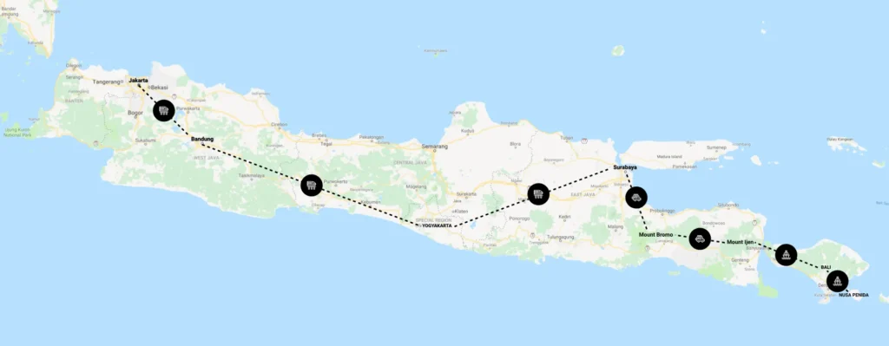

Last November, I took a [3-week break](/notebook/2018/12/stop/) from work and flew to Indonesia. I had 23 days, but Indonesia is an enormous country, so I decided I should explore the Islands of Java and Bali this time. (Yes, I say “this time” because I plan to go back!)

I flew in to Jakarta on the 31st October. I spent 2 days there, and then began my journey eastward. I was traveling light, and I wanted to keep expenses at a minimum, so I used trains along the way, and stayed at hostels. I met some great people along the way.

<figure>

<figcaption>My 23-day itinerary</figcaption>

</figure>

I snapped a great number of pictures during this time. I’m not a photographer, by any stretch of the imagination, but some of these pictures turned out to be quite nice.

Hoping that I have captured the beauty of this country in my own small way, I share these photos now, unedited and raw off my phone — editing just happens to be one other exercise I have no knack for.

[This](https://photos.app.goo.gl/jD8eeNbVhqms4VZZ9) is Java and Bali through my eyes.