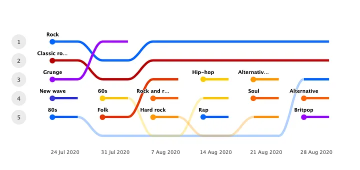
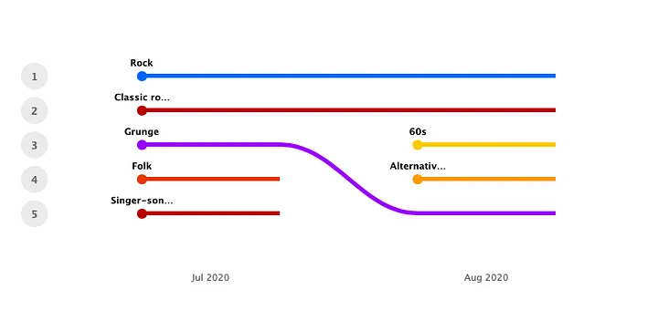

I started using [Last.fm](https://www.last.fm) in July. The streaming services I was using didn’t give me any stats on my listening habits, such as the kinds of music I listen to the most, or the amount of time I spend listening to them. Last.fm looked like a useful tool because it captured this data when I streamed using Tidal or Apple Music.

It has now been six weeks, and looking at the past data I can see that I have not been particularly daring when it comes to experiencing music. I’ve stuck to what I know.

I don’t think of this as a bad thing. You’d notice that across these 6 weeks, while there have been slight variations, I’ve been listening to a set of genres that sound similar, or at least close, to each other. There are lots of distorted guitars in there, and drums. The Hip Hop and the Rap genres coming up on the week of 14th August is not my doing. That happened when a couple of friends came over and played the music they liked on my Tidal.

Here’s the monthly view on Last.fm. My preference is even more pronounced here.

See, I listen to music primarily for two reasons:

**One,** to unwind after a long day (or a short one — I’m human, after all.) For this, I need to stick to music I know I’ll be comfortable with. I’m not looking for adventure and excitement, only relaxation. Classic rock is always a good contender here. I know and love bands like The Beatles, Led Zeppelin, The Rolling Stones and The Who. (There are hundreds more, but you get the idea.) I know their sound, and I can simply let the music wash over me.

**Two,** to enjoy music for the sake of enjoying it. For this, I get serious. I put my phone away, put on my headphones, close my eyes and try to take in every note that comes out of the cans. Since investing in a decent headphone setup, this habit of mine has really taken off. I take at least a few minutes a day to do this. When not using the headphones, I sit in front of my 2.0 speaker system (Q-acoustics 3030i with a Yamaha RX-V485 Receiver) and do the same. Music is the only thing on my mind while doing this, nothing else. The music is not in the background while I do something else, it is my only focus.

But I’m picky. I wouldn't just listen to any kind of music. For example, I’m a sucker for the sound that a guitar makes. Add some distortion, and I’m a happy camper. On the other hand, I’m not a fan of bass-heavy club beats, or any kind of music that sounds pop-y. I haven’t been exposed to most of the mainstream music that gets produced these days — by choice — and I wish to keep it that way.

Here’s where Tidal has really come in handy. It is how I discovered the brilliant Steely Dan album [Countdown to Ecstasy](https://tidal.com/browse/album/2529576), and Jeff Beck’s [Blow by Blow](https://tidal.com/browse/album/33915149).

The funny thing is, I know nothing about making music. I can’t play any instruments, I can’t sing, and I don’t think I could produce anything electronically if I had the tools. But I seem to have a knack for well produced, well performed music.

T̶h̶i̶s̶ ̶h̶a̶s̶ ̶b̶e̶e̶n̶ ̶a̶ ̶M̶u̶s̶i̶c̶ ̶N̶a̶z̶i̶’̶s̶ ̶g̶u̶i̶d̶e̶ ̶t̶o̶ ̶s̶n̶o̶b̶b̶e̶r̶y̶.̶

Last.fm confirmed what I had known for a while. I like to stay in my comfort zone. Regardless of whether I’m doing a serious listening session or simply listening in a state of repose, I seem to be going back to the same sound signature.

It suits me.