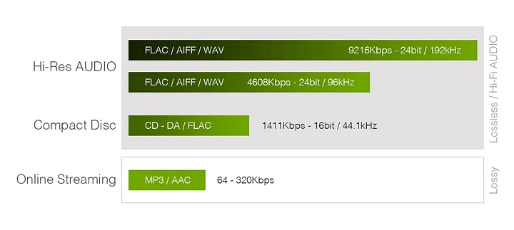
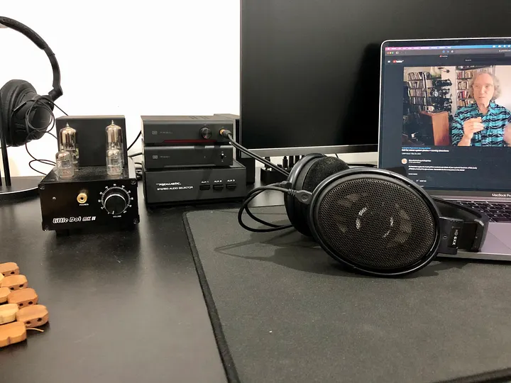
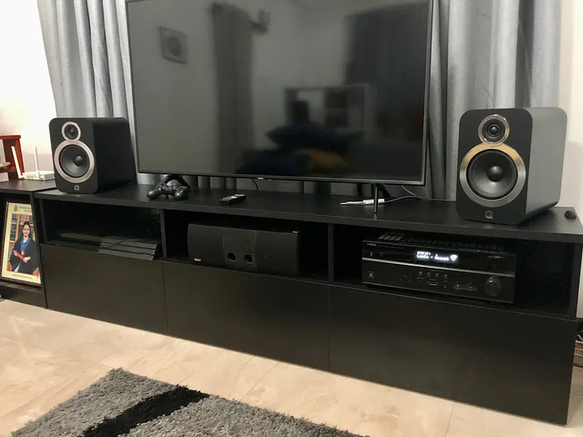
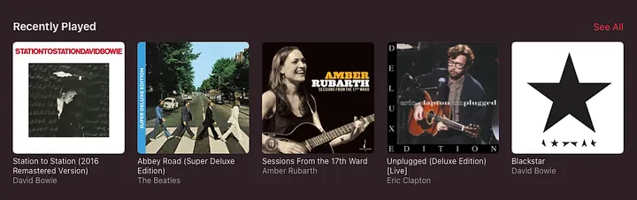
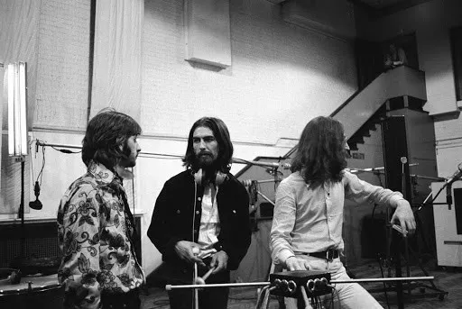
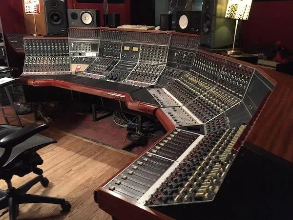
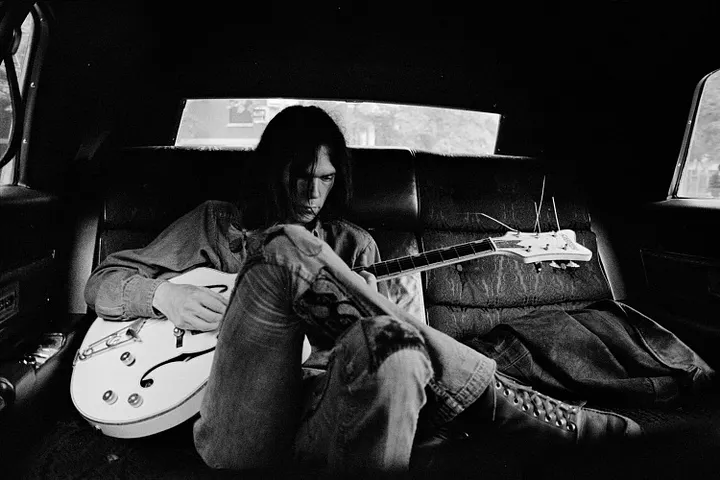

Now that [Spotify](https://www.spotify.com) has officially launched in Sri Lanka, I see [Apple Music](https://www.apple.com/apple-music/) subscribers jumping ship en masse, given the new entrant’s supposedly better [recommendation algorithm](https://ericboam.medium.com/i-decoded-the-spotify-recommendation-algorithm-heres-what-i-found-4b0f3654035b). With no Hifi offering, Spotify is of no interest to me at the moment. But I was curious, and signed up because I wanted to see if this streaming app could get to know me as well as my friends were claiming it could.

A month later, I don’t have any doubts about its recommendation capabilities. But the lack of CD quality streaming has left me wanting. The difference between [Deezer Hifi](https://www.deezer.com/en/offers/hifi)’s FLAC (at 16 bit/44.1kHz) stream and Spotify’s 320kpbs Ogg Vorbis stream is immediately apparent, but this “review” is not about that. Over these few weeks, I’ve seen a number of posts on Twitter and Reddit claiming that the sound quality of Apple Music is superior to that of Spotify. This got me in a curious mood. I had to see (hear) for myself.

Apple Music was the first streaming service I signed up for (I’ve been a customer since launch) before I moved on to Tidal Hifi and eventually Deezer Hifi. Even though I hadn’t opened the app in months, my Apple Music subscription was still active because my wife and my brother were sharing it with me on the Family Plan. So, I signed for for a Spotify Premium trial, fired up the two apps and got to work comparing them, pacing myself, taking time to absorb the subtleties in the music coming out of my setup. What follows is an account of what I discovered.

**_This is by no means a comprehensive comparison of the two services._** I was curious about one thing, and one thing only: audio quality. If you need an exhaustive review— covering such topics as their recommendation algorithms, UI/UX, and other features worth looking for in a streaming app — look elsewhere. This assessment is completely subjective , because a\) my ears may not be as good as yours and b\) as you will see below, I only listen to certain kinds of music. I invite you to make your own mind up if you’re deciding between the two services.

## First, the basics

The music library of Apple Music is encoded using AAC (Advanced Audio Coding) at 256kbps. Spotify uses Ogg Vorbis, an open source codec developed by the Xiph.Org Foundation. The stream can accommodate up to 320kbps, and Spotify’s Premium plan gives you [the option of choosing the quality](https://support.spotify.com/us/article/high-quality-streaming/) you want to stream at. Given these numbers, Spotify may seem to have the upper hand, but here’s where things get complicated.

<figure>

<figcaption>7labs.io</figcaption>

</figure>

Both AAC and Ogg Vorbis are lossy formats. This means they both throw away data in favour of using a lower bandwidth for streaming. Services like Deezer Hifi and Tidal, in comparison, stream in CD quality, which could vary anywhere between 700kbps to 1411kbps. To put it simply, at its highest bitrate, Spotify could be throwing away as much as 78% of the data of a “proper” CD quality recording. (There are [supposedly better](https://www.soundguys.com/high-bitrate-audio-is-overkill-cd-quality-is-still-great-16518/), High Res recordings that use sample rates up to 192kHz and bit depths up to 24bit. But, for simplicity’s sake, let’s focus on CD quality — that is, 1411 kbps at 16bit/44.1kHz — as a baseline). Apple Music could be throwing away 82%.

However, all recordings do not take advantage of the full capability of 16/44.1. A lot of modern mainstream pop records, for example, are so dynamically compressed that listening to them on the highest end audio gear would make no difference to your listening experience.

It’s important to note here that a recording could be subject to dynamic range compression without applying any data compression at all. For example, a recording could use the full 1411kpbs bitrate and still have its instruments turned down or vocals boosted to meet at some sort of a happy middle. This makes sense for artists and record labels whose primary audiences aren’t interested in Hifi audio gear and are happy with their noise cancelling headphones. (Don’t get me wrong, there are some excellent products out there that serve this mainstream. But the fact of the matter is that these products, and their manufacturers, are not prioritising accurate reproduction of audio, rather, consumer-friendly features like noise-cancelling, portability, and connectivity. Nor should they, if their consumers’ primary mode of consuming music is while on their daily commute or while working out of a busy coffee shop). Audiophile records, and record labels that make them — the excellent [Chesky Records](https://chesky.com) and [MA Recordings](https://www.marecordings.com) come to mind — are few and far between and serve a small niche of enthusiasts.

I’ve made you read through all that to make one important point: the music sounds as good as the mastering. The skill of the engineer in the studio, the quality of gear used for recording, the ear of the producer: all these things factor in to make a great-sounding record. This is how you get average-sounding CD quality (or High Res) releases, while some recordings, even when played back through AAC/Ogg encoding, sound wonderful and lively.

So, the 64kbps difference between Spotify and Apple Music streams may not make as much of a difference as one would expect it to make.

Now, on to the real work.

## Preparing for the Comparison: The Gear

I should declare first and foremost that I do not own any high-end gear that can boast the lowest of lows and the crisp-est of highs. But I do think that my current setup sounds quite decent for a beginner, and I’ve used it to make as fair a comparison as possible.

### Headphone testing

- **Headphones:** [Sennheiser HD6XX](https://drop.com/buy/massdrop-sennheiser-hd6xx) (Open Back)

- **Amplifiers:** [Schiit Magni Heresy](https://www.schiit.com/products/magni-1), [Little Dot MKII](https://shenzhenaudio.com/products/little-dot-mkii-mk2-6j1x2-6n6-x2-tube-headphone-amplifier-pre-amplifier) (switched between occasionally using a [Realistic 42–2110](https://www.ebay.com/p/1301875750) RCA switcher)

- **DAC:** [Schiit Modi 3+](https://www.schiit.com/products/modi-1)

The Schiit Magni is a solid state amp, and the [Litte Dot](https://thamara.co.uk/little-dot-mkii/) is a vacuum tube amp with two 6J1 preamp tubes and two 6N6 power amp tubes. By design, the tube amp sounds a bit warmer and fuzzier, and the Magni is mostly neutral. While I prefer the sound signature of the Little Dot for my personal listening sessions, I’ve mostly used the Magni during the course of this comparison, while occasionally switching to the Little Dot when I fancied it. I didn’t use any software EQ while listening, and as you can see in the photo above, I don’t have hardware EQ on my setup either. I also turned off volume normalisation on both Spotify and Apple Music.

### Speaker testing

For speaker sessions, I used my [Q-acoustics 3030i](https://www.qacoustics.co.uk/q-acoustics-3030i.html) pair powered by a [Yamaha RX-V485](https://europe.yamaha.com/en/products/audio_visual/av_receivers_amps/rx-v485/index.html) receiver, while streaming both Spotify and Apple Music directly onto the receiver (with [Spotify Connect](https://www.spotify.com/us/connect/) and [AirPlay](https://support.apple.com/en-us/HT202809).)

For these tests, I opted for Direct Mode (which turns off all tone controls and DSP applied by the receiver) to get as clean a signal as possible.

## Preparing for the Comparison: The Music

It was important to choose music that I knew well. I wanted to use a few records that, to my ears, sounded great. But, most importantly, I wanted to revisit albums I had listened to so much that I knew the track order by heart, and songs I had fallen in love with so much that I knew when to expect a sneaky hi-hat to kick in on the side.

I ended up listening to the following records:

1. **_Sessions from the 17th Ward_, Amber Rubarth** (2012, Chesky Records), [Apple Music](https://music.apple.com/lk/album/sessions-from-the-17th-ward/557714581), [Spotify](https://open.spotify.com/album/5CPO3cYVybEYsE3w0zezXz?si=lZ9CLGXzQ6KHajtAPtIwxw)

3. **_Abbey Road Super Deluxe Edition (2019 Remaster)_, The Beatles** (1969, Apple Records), [Apple Music](https://music.apple.com/lk/album/abbey-road-super-deluxe-edition/1474833332), [Spotify](https://open.spotify.com/album/5iT3F2EhjVQVrO4PKhsP8c?si=lnX27J7qS9O8RtoSCN_RSw)

5. **_Automatic for the People_, R. E. M.** (1992, Warner Bros. Records), [Apple Music](https://music.apple.com/lk/album/automatic-for-the-people/1440949853), [Spotify](https://open.spotify.com/album/0BiNb8HYR4JvuxUa31Z58Q?si=y55syM9OT96QkwBp-9gPnw)

7. **_Station to Station (2016 Remaster)_, David Bowie** (1976, RCA Records), [Apple Music](https://music.apple.com/lk/album/station-to-station-2016-remastered-version/1195104858), [Spotify](https://open.spotify.com/album/0MWrKayUshRuT8maG4ZAOU?si=4SwCRY5gRtWqGSn2QHBE2Q)

9. **_Heroes_, David Bowie** (1977, RCA Records), [Apple Music](https://music.apple.com/lk/album/heroes-2017-remastered-version/1347894082), [Spotify](https://open.spotify.com/album/4I5zzKYd2SKDgZ9DRf5LVk?si=tgZQQXy2TPOCFTl79gmu4g)

11. **_Blackstar_, David Bowie** (2016, Columbia Records), [Apple Music](https://music.apple.com/lk/album/blackstar/1059043043), [Spotify](https://open.spotify.com/album/2w1YJXWMIco6EBf0CovvVN?si=UgiTiafERt63HWXIfbECGw)

13. **_Wanderer_, Cat Power** (2018, Domino Recording Company), [Apple Music](https://music.apple.com/gb/album/wanderer/1400247975), [Spotify](https://open.spotify.com/album/28SMXZ4p2uQGJZJpFXw8em?si=IGhetQeJThaS187J-jHIew)

15. **_OK Computer_, Radiohead** (1997, Capitol Records), [Apple Music](https://music.apple.com/lk/album/ok-computer/1097861387), [Spotify](https://open.spotify.com/album/6dVIqQ8qmQ5GBnJ9shOYGE?si=z9EYXXqEQ1WCU9BkVoomgQ)

17. **_Unplugged_, Eric Clapton** (1992, Reprise Records),[Apple Music](https://music.apple.com/lk/album/unplugged-deluxe-edition-live/718185675), [Spotify](https://open.spotify.com/album/3ebyEGol0Abc7VAxYf7vEg?si=tpRv-5cUTlCFh893D21QVw)

19. **_After the Gold Rush_, Neil Young** (1970, Reprise Records), [Apple Music](https://music.apple.com/lk/album/after-the-gold-rush/1015783330), [Spotify](https://open.spotify.com/album/5EVlXlHbRQI8ybuNt4ArXI?si=j0hdM2kISkyVr--42gObSA)

21. **_Unplugged_, Neil Young** (1993, Reprise Records), [Apple Music](https://music.apple.com/lk/album/unplugged/316825923"), [Spotify](https://open.spotify.com/album/5kkLOZAdBpzxTr51DNN3zy?si=GDQbYhCDT2y-eYVL8y8Lpg)

## Preparing for the Comparison: Rapid Switching and Extended Listening

To pit the two services against each other, I sometimes used rapid switching, where I would start listening to a track on one service and immediately switch to the other service mid-song (and manually seeking to pick up where I left off). Other times, I listened to one service for an extended period of time (say, the full length of an album over one or two days) and then listened to the same set of tracks again on the other service.

## Results

Let me start with Clapton’s **_MTV Unplugged_.** It is one of the best live albums I’ve had the pleasure of listening to. On Apple Music, I thought the strings on Clapton’s guitars sounded a bit livelier, and the audience at Bray Studios sounded close, and intimate. This is not to say that the Spotify playback sounded bad, it certainly didn’t, but after several hours of back-to-back listening, I thought I could feel the room acoustics a tiny bit better on Apple Music’s playback. The differences, however subtle they may have been, shone through in tracks like _Layla_ and _Running on Faith._

I then moved on to Amber Rubarth’s **_Sessions From the 17th Ward._** This brilliant album was recorded binaurally inside an airy Brooklyn church by Chesky Records. There are only four instruments accompanying Amber’s disarmingly beautiful voice: her guitar, a cello, a violin, and some percussion. The record has great depth, and great dynamic range. It’s a prime example of a great-sounding release made possible by people who have mastered their craft.

Take track number 5, titled _Down Under_. There’s some very gentle percussive tapping underscoring the cello-violin intro, which was all but inaudible on Spotify to me, but I could hear it on the Apple Music stream._Tundra_, an interlude track with no vocals that comes in at number 8, sounded quieter on the whole on Spotify. Across the other tracks in general, Apple Music fared better in demonstrating the dynamic range of the recording.

<figure>

<figcaption>The Beatles at Abbey Road</figcaption>

</figure>

**_Abbey Road_** has been one of my favourite albums to go back to every now and then. It doesn’t sound like a recording from 1969, for one, because the mastering is so good. It feels fresh and contemporary. Listening to it, you wouldn’t think it was recorded on an eight-track tape machine and that it was their first album to be released in stereo instead of mono. It sounds bright and exciting. It is perhaps one of the best mastered albums I’ve heard, and worthy of being the closing chapter of the band’s inimitable journey.

With this record, interestingly, there was no clear winner between the two services. As far as I could tell, playback was almost identical, and I enjoyed listening to both of them. I paid special attention to some of the fairly intricate arrangements in tracks like Ringo’s _Octopus’s Garden_ (with the gurgling sounds and the water bubbles) and the backing vocals on _Here Comes the Sun_, and could identify no difference. However, _I Want You (She’s So Heavy),_ in contrast, felt a little lacking in the low end with Apple Music.

The three Bowie records, **_Station to Station, Heroes_** and **_Blackstar_** will forever remain to be three of my favourite releases by the Starman. _Station to Station_ is easily one of his best known. Even while going through a phase of heavy cocaine dependence, the man made magic as only he could. While listening, I noticed that on Apple Music it sounded ever so slightly airier and roomier than Spotify. Just slightly. I could very well be imagining this, and I’m going to ask you to test this on your own, but to me, Apple Music came on top. Notice especially the swooping train sound effect in the beginning of the title track _Station to Station_ and the soft percussion in _Word on a Wing —_ I felt that there was more room for instrument separation on the Apple Music playback.

_Heroes_ is truly a special record because of the collaborators Bowie brought in. Tony Visconti, a frequent collaborator/producer for Bowie’s records before and since, Brian Eno, and Robert Fripp (of King Crimson) were all heavily involved in finding the signature sound of this album together. In the title track, _Heroes_, for example, they glued together three different tracks (almost by accident) from synthesisers they were playing with in the studio one time. On Apple Music, the separation of these tracks sounded right to me, while on Spotify they were a bit thin. _V-2 Schneider_ sounded “cleaner” on Apple Music while the Spotify playback came across a bit muddy.

<figure>

<figcaption>The Magic Shop studio where Bowie recorded Blackstar</figcaption>

</figure>

_Blackstar_ was another record that sounded almost identical on both services. It has a more jazzy signature, and sounds absolutely wonderful, intimate, and “live.” You feel as if the band is there in the room with you. It is one of Visconti’s mastering masterpieces for certain. Released on Bowie’s 69th birthday, just two days before he passed, it’ll be immortalised as one of the great works to remember him by. On both Apple Music and Spotify, the title track sounded airy and had good depth, while the instrument separation was also on point. The drums came to life enthusiastically in _’Tis a Pity She Was a Whore_ and so did his soulful vocals in _Dollar Days_.

With Neil Young’s **_MTV Unplugged_** I didn’t have hard time picking a winner. Apple Music once again made the record sound more open than Spotify did. _World on a String_ sounded deeper and more engaging, the soothing backing vocals on _Helpless_ and _Unknown Legend_ sounded more intimate and Young’s harmonica throughout the album had more life to it on the Apple Music playback. This is one of my favourite albums to listen to and to recommend, and although the production process was famously riddled with issues (not happy with the backing band’s performance, Young walked out of the first recording attempt) it is one of the best live albums ever made, in my opinion.

<figure>

<figcaption>Neil Young while on tour in New York</figcaption>

</figure>

Young’s **_After the Gold Rush_** on the other hand, sounded marginally quieter on Apple Music. The bass line on _Only Love Can Break Your Heart_ didn’t hit as deep either. The solo on _Southern Man_ was another occasion where Spotify really shined with crips highs. On the whole, the album sounded more compressed on Apple Music than it did on Spotify.

**_Wanderer_** by Cat Power (whose real name is Chan Marshall) is a new record I stumbled upon. I fell in love with how great it sounded both on the headphones and on the speakers. For a collection of songs that sounds so “minimalistic” on a first listen, it packs so much emotion. What is more impressive is that Marshall produced the album herself. This record may not be everyone’s cup of tea, though. It never really picks up, or climaxes. It’s meditative all the way through, and listening to it, you will begin to miss long drives through the countryside you’ve never actually been on. Not many artists could manage to sound so fragile yet so confident at the same time. Marshall does.

The second track, _In Your Face_, which happens to be one of my favourites from the album, features a soft strumming intro accompanied by percussion and a piano. It sounded richer on Apple Music, with great separation. On _Horizon,_ her soaring vocals had more space to take wing. I leaned towards Apple Music with this album, simply because Spotify was, to sound a bit dramatic, holding it back.

I really wish I had extensive comments on **_Automatic for the People_** and **_OK Computer._** After multiple listening sessions that spanned a few days, both records sounded identical to me on the two services. There were a few occasions where minute differences were noticeable — like _The Sidewinder Sleeps Tonite_ (from _AftP_) being a shade quieter on Apple Music—but they really were not prominent. Fairly “busy” tracks from _OK Computer_ like _Paranoid Android_ and _Climbing Up the Walls_ did not struggle for space on both services. Both these albums are extremely well mastered and boast a wide soundstage, and their playback through headphones sounded only moderately inferior to a FLAC stream.

## Conclusion

If you managed to read through all this, you’d already know there’s some disappointing news coming your way. There is, simply put, no verdict. While I have waxed poetic in favour of Apple Music on the whole, there really is no telling if it is indeed better than Spotify when it comes to sound quality. Because the fairly limited range of music I had chosen for this comparison may not remotely resemble what you listen to every day, you may just end up with a different result were you to do a comparison of your own. What I had laid out here, you might say, is exhausting yet not exhaustive.

You may think all this is too much trouble to go through to arrive at such a conclusion. You may also think that a comparison like this is not warranted in the first place because barely noticeable difference like the ones I’ve discovered above do not add to or take away from your enjoyment of music. I, however, think that it is the small differences that make the listening experience enjoyable. For instance, I find great joy in “discovering” a quiet instrument I hadn’t heard before in a song.

I also think that, if sound quality is your primary concern, and if you’re in a position to afford it, you should ditch both Apple Music and Spotify altogether and sign up for a lossless streaming service like Deezer Hifi ($8.99/month), Tidal Hifi ($19.99/month) or Qobuz ($19.99/month).

If Apple Music and Spotify happen to be your only two choices — and I can think of a very good reason why they might be: cost. Apple Music costs just $2.99/month in Sri Lanka, and Spotify Premium only sets you back LKR 529/month — you cannot go wrong with either as far as sound quality is concerned. I suggest that you mull over factors other than sound quality before picking a service. [Here’s a helpful review](https://www.whathifi.com/features/apple-music-vs-spotify-which-better) from What Hi-Fi. See, I can be considerate.

I’ve made playlists on both Apple Music and Spotify of the albums I used for this comparison. Enjoy!

1. [Mastering Masterpieces on Apple Music](https://music.apple.com/lk/playlist/mastering-masterpieces/pl.u-RR45C1em3Ya)

3. [Mastering Masterpieces on Spotify](https://open.spotify.com/playlist/6VzC3ATHUeAc6I1cFOt2ut?si=T1W-nWSKR56JhTanZdj2Gw)