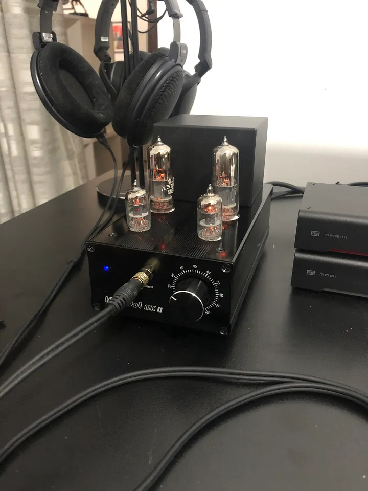

I’ve now had my Little Dot MKII vacuum tube amplifier for a bit more than two weeks. This is my first experience with tubes, and I’ve been enjoying it.

Coming from the Schiit Magni Heresy, which is an entry-level solid state amp ($99) to a budget tube amp ($175) may not sound like a significant upgrade. It isn’t. But the changes (improvements?) to the sound signature are noticeable.

I had been considering the DarkVoice 336SE which comes highly recommended, but I decided that the price tag ($290) was a little high for my entry-level curiosity. So, I got the Little Dot instead. I didn’t want to go into a tube-rolling rabbit hole at the outset, so I decided the stock tubes will be good enough for me, for now. The amp comes with 2 x 6J1 preamp tubes and 2 x 6N6 power amp tubes — they’re Chinese-made. A kind Redditor has pointed out to me that Russian-made 6H6P-I Power Tubes and Voshkod 6ZH1P-EV preamp tubes will work wonders for this amp — I’ll get my hands on those eventually.

One of the most noticeable changes in the sound coming out of this amp is the bass extension. Anyone who has heard Sennheiser HD6XX’s/HD650’s knows that they’re lacking in the low end — this amp does a lot to fix it. (My next upgrade would be to add an EQ to this mix — the Schiit Loki Mini+ seems like a really good option — although I know most audiophiles would shudder at the thought of it. But I’m not one, and I’d love to see what EQ could do to this setup.) The sound is also warm, and fuzzy, and while I would’ve hated to admit it just a few days ago, I think I prefer it to the more neutral Schiit amp. For this reason, I’ve been mostly listening to the Little Dot over the past two weeks. I just love it.

Also, and I don’t want to be quoted on this since I may very well be imagining it, I could swear that the soundstage is a tiny bit wider. You’d immediately notice the crisp highs, too. I noticed that this tends to be fatiguing to the ears with some recordings, but for the most part, given the kind of music I listen to, the Little Dot is a perfect companion for my 6XX cans.