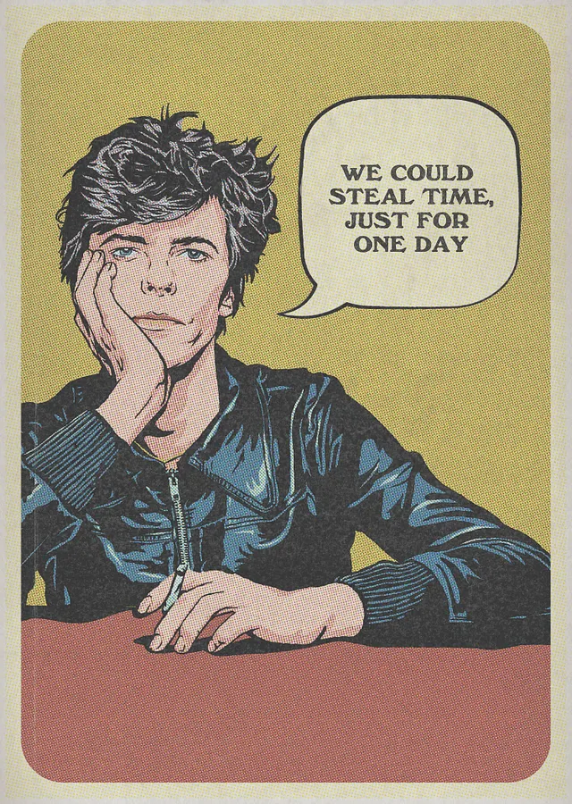
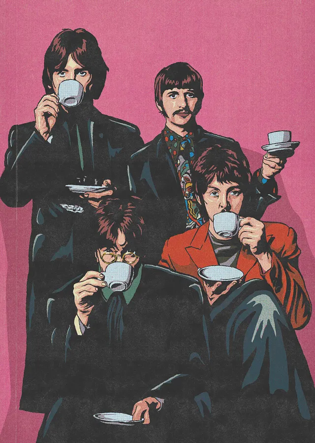
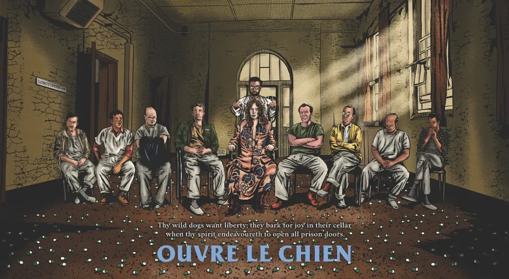

In February, I approached [Akila Weerasinghe](https://www.instagram.com/akilaweera3/) to commission two vintage style artworks of David Bowie and The Beatles. The idea was to get them printed, framed and hung on my living room wall.

<figure>

<figcaption>Heroes</figcaption>

</figure>

<figure>

<figcaption>The Beatles drinking tea</figcaption>

</figure>

I really liked what he did, so I went back to him with a bigger project I had been thinking about for a while: a piece inspired by David Bowie’s _All the Madmen_, the second track on his 1970 album _Metrobolist_ (aka _The Man Who Sold The World._) I wanted to add a number of references from the song to the artwork, along with some other pop culture references from things I like.

The song was written for Bowie’s half brother Terry Burns, who suffered from paranoid schizophrenia and was placed at a mental institution called Cane Hill (and later committed suicide). This was to be the setting for this piece; a ward at Cane Hill. I wanted it to look decrepit and abandoned and the overall tone to be dark and menacing.

Here's what he came up with:

<figure>

<figcaption>All The Madmen</figcaption>

</figure>

As you can see, Akila knocked this out of the park. For those interested, here is a list of the references in the artwork.

1. There are nine people seated in a row, facing forward, inside a ward at Cane Hill, that is, one for each track of the album.

3. The “patient” in the middle is Bowie, in his famous outfit from the album cover (US release)

5. The person to his right is his brother Terry Burns. The letters RAF are on the front left pocket of his top. (He was a veteran.)

7. On Bowie’s left is Jack Nicholson’s Randle Patrick McMurphy (from _One Flew Over the Cuckoo’s Nest_.) This is not a reference to the song itself. I wanted him there since I like the book/movie and thought his character fitted in here.

9. The doctor behind Bowie is holding two rods of an EST apparatus to his head (EST, Electro Shock Therapy, is referenced in the song)

11. Librium is strewn across the floor (Librium, a hypnotic drug, is also referenced in the song)

13. There’s a sign that reads “lobotomies” on the left wall — this is referenced in the song, and also has a connection to _One Flew Over the Cuckoo’s Nest._

15. The quote at the bottom (“Thy wild dogs want liberty; they bark for joy in their cellar when thy spirit endeavoureth to open all prison doors”) is from Nietzsche’s _Thus Spoke Zarathustra_, on which Bowie based the ending chant of the song “Ouvre Le Chien.”

The piece now hangs on my living room wall along with my other posters.

Don’t forget to check out Akila’s work. He’s active on [Instagram.](https://www.instagram.com/akilaweera3/)