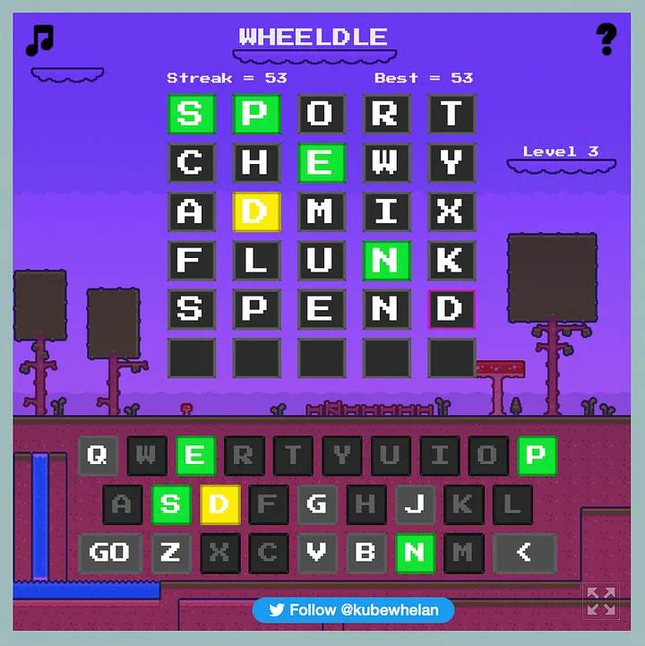

I discovered Wordle a few days ago. After spending some time with it, I’ve come up with a “hack” to maximise the chances of guessing the right Wordle. The strategy is to eliminate the maximum number of characters possible in 4 attempts, and to guess the Wordle right in the 5th (or 6th) attempt.

You may be in the camp that thinks hacks like this take away from the joy of the game. If that is you, don’t read the rest of this post.

Again, the trick here is not to get it right in the least number of attempts, but to maximise chances of success in the 5th or 6th attempt.

The maximum number of non-repeated characters you can use up in 4 attempts is 4x5 = 20. I landed on 4 words that could accomplish this. The words are:

<blockquote>SPORT, CHEWY, ADMIX, FLUNK</blockquote>

No characters have been reused here. All the vowels and ‘Y’ have also been used up.

These 4 words will give you quite a good chance of guessing the Wordle right in the 5th attempt. Sometimes, you may not even need to use all 4. And there may be other word combinations like this.

You may still have trouble with words that use the same character twice or thrice. I had trouble with one such word: VERVE. But I did manage to guess right on the 6th attempt.

Using up 20 different characters in the first 4 attempts makes the elimination process a lot easier.

You can test this out on the Wordle clone that gives you unlimited Wordles a day. It’s called [Wheeldle](https://wheelsrpgs.itch.io/wheeldle).

As an example, here’s my Wheeldle with a 50+ win streak so far. I’m confident I could keep going, but I’m too lazy to continue.

