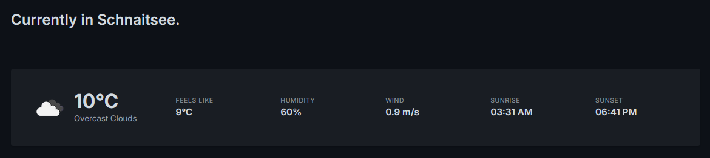
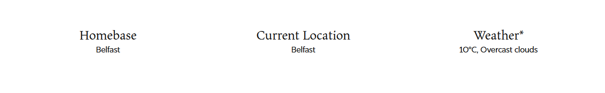

While browsing the [IndieWeb wiki](https://indieweb.org/) looking for `/now` page examples the other day, I came across [Max Dietrich's now](https://mxd.codes/now) page, which has a section that displays his current location and the weather there.



I wanted to add something similar to mine. After a bit of research, I found out that the best way to do this is with a combination of the following:

- An iOS Shortcut: to grab the current location of my iPhone and push it on to a server
- A Webhook: a PHP script on the server that grabs the location sent by the iPhone
- A Weather service: to read the location file stored in the server and output the corresponding weather conditions
- A shortcode: to display the result on the website

There was also the question of costs associated. I obviously didn't want to spend any money on a nice-to-have feature for a web page that—let's be honest here—nobody was ever going to see.

Two tools to the rescue:

1. [OpenWeather](https://openweathermap.org/): a service that provides instant weather updates through an API, with up to 1,000 free API calls per day
3. [WordPress Transients](https://developer.wordpress.org/apis/transients/): a way of storing cached data, which in this case would limit the number of times WordPress will ask OpenWeather for updated weather data (to once per hour)

And now, to implement all this. There was just one problem: **I don't know any PHP.**

It was time to ask [Gemini](https://gemini.google.com/) to write some code for me. I know that the use of LLMs is largely frowned upon in the IndieWeb community. I have my reservations about using them for some things—e.g., I would never use them for prose (all the writing on this site is 100% human) or for image generation / creative design (all my [design](/design/) work is AI-free)—but for others I would take all the help I could get. I've used vibe-coding tools before to make [apps for personal use](/notebook/topics/vibe-coding/), and this felt like another situation where an LLM could come in handy.

Gemini gave me all the code snippets I needed, along with step-by-step instructions to set everything up. I'm sharing it all below. If you're thinking of adding something similar to your WordPress site, I hope this will help.

## Step 1: Webhook

To set up a webhook I first had to create a PHP file (in its own folder) on the server where my WordPress files are hosted. For demo purposes, let's assume the file was named `update-location.php`.

If you're using this script, be sure to update `MY_SUPER_SECRET_PASSWORD` with a strong password of your choosing.

```php
<?php
// update-location.php

$secret_key = 'MY_SUPER_SECRET_PASSWORD';
$file_path = 'location.json';

if ($_SERVER['REQUEST_METHOD'] === 'POST') {
    $provided_key = $_POST['key'] ?? '';
    
    // 1. Timing attack prevention
    if (hash_equals($secret_key, $provided_key)) {
        
        // 2. Rate Limiting: Prevent disk-spamming DoS attacks (10 second cooldown)
        if (file_exists($file_path) && (time() - filemtime($file_path)) < 10) {
            http_response_code(429); // HTTP 429: Too Many Requests
            die("Rate limit exceeded.");
        }

        $city = $_POST['city'] ?? 'Unknown';
        
        $data = [
            'city' => sanitize_city_name($city),
            'updated' => time()
        ];
        
        // 3. LOCK_EX prevents file corruption during simultaneous writes
        file_put_contents($file_path, json_encode($data), LOCK_EX);
        
        // 4. Do not echo user input back to the browser
        echo "Location updated successfully.";
    } else {
        http_response_code(403);
        echo "Unauthorized.";
    }
} else {
    http_response_code(405);
    echo "Method not allowed.";
}

// 5. Strict Allowlist Sanitization
function sanitize_city_name($str) {
    // Only allow letters (including accents), spaces, hyphens, and commas.
    // This absolutely neutralizes XSS, SQLi, or command injection attempts.
    return preg_replace('/[^\p{L}\s\-\,]/u', '', $str);
}
?>
```

## Step 2: iOS Shortcut

Then I needed to tell my iPhone to grab my location and push it to the server so that the webhook could receive it. The steps I followed to set up shortcut are as below:

1. Open the Shortcuts app and tap + to create a new one. Name it "Update Website Location".
2. Add the Action: Get Current Location, with precision set to "Nearest Kilometre" (to make the shortcut run faster, and to mask the exact location).
3. Add the Action: Get Details of Locations. Set it to get City from the "Current Location" variable.
4. Add the Action: Get Contents of URL.
    - Set the URL to your webhook: `https://yourdomain.com/folder/update-location.php`
    - Expand the settings arrow `>`.
    - Change Method to **POST**.
    - Change Request Body to **Form**.
    - Add new fields:
        - Key = `key`, Text = `MY_SUPER_SECRET_PASSWORD`
        - Key = `city`, Text = `City` (this selects the variable output from the previous step)
5. Tap Done.

I then created an automation in the Shortcuts app to run the shortcut every 3 hours. This way, I wouldn't have to remember to run the shortcut manually every time I travelled.

## Step 3: OpenWeather connection

Setting this up was easy. I simply had to create a free account on the [OpenWeather](https://openweathermap.org/) website and generate an API key.

## Step 4: WordPress Shortcodes

This last step ties all the previous steps together, by setting up the logic to display the weather information on my website. It requires editing the `functions.php` file in WordPress, which I like to do using a snippets plugin, specifically, [CodeSnippets](https://codesnippets.pro/).

Here is the PHP snippet to use. (Don't forget to change the fallback city on line 5 to wherever your homebase is, and to change `YOUR_OPENWEATHER_API_KEY` to the one generated in the previous step.)

```php
// Core function to retrieve and cache data efficiently
function tk_get_location_weather_data() {
    // 1. Use ABSPATH for a secure, un-spoofable server path
    $file_path = ABSPATH . 'api/location.json';
    $city = 'Belfast'; // Default fallback city

    // 2. Safely verify file readability before attempting to open
    if (file_exists($file_path) && is_readable($file_path)) {
        $file_contents = file_get_contents($file_path);
        if ($file_contents) {
            $location_data = json_decode($file_contents);
            // Verify property exists before assigning
            if (isset($location_data->city) && !empty($location_data->city)) {
                $city = sanitize_text_field($location_data->city);
            }
        }
    }

    $weather_output = get_transient('tk_current_weather_text');
    $cached_city = get_transient('tk_current_weather_city');

    if ( false === $weather_output || $cached_city !== $city ) {
        
        $api_key = 'YOUR_OPENWEATHER_API_KEY';
        $safe_city = urlencode($city); // 3. Ensure city name is URL-safe
        $api_url = "https://api.openweathermap.org/data/2.5/weather?q={$safe_city}&units=metric&appid={$api_key}";
        
        $weather_request = wp_remote_get( $api_url );
        
        if (!is_wp_error($weather_request) && wp_remote_retrieve_response_code($weather_request) === 200) {
            $weather_data = json_decode( wp_remote_retrieve_body( $weather_request ) );
            
            // 4. Defensive check: Ensure API actually returned the expected data structure
            if (isset($weather_data->main->temp) && isset($weather_data->weather[0]->description)) {
                $temp = round($weather_data->main->temp);
                $condition = ucfirst(sanitize_text_field($weather_data->weather[0]->description));
                
                $weather_output = "{$temp}°C, {$condition}";
                
                set_transient('tk_current_weather_text', $weather_output, 3600);
                set_transient('tk_current_weather_city', $city, 3600);
            } else {
                $weather_output = "Data format error";
            }
        } else {
            $weather_output = "Data unavailable";
        }
    }

    return [
        'city' => $city,
        'weather' => $weather_output
    ];
}

// Register Shortcode 1: Output the City
function tk_shortcode_city() {
    $data = tk_get_location_weather_data();
    // 5. Final esc_html validation before rendering to browser
    return esc_html($data['city']);
}
add_shortcode('current_city', 'tk_shortcode_city');

// Register Shortcode 2: Output the Weather
function tk_shortcode_weather() {
    $data = tk_get_location_weather_data();
    return esc_html($data['weather']);
}
add_shortcode('current_weather', 'tk_shortcode_weather');
```

With that, everything had been set up. All I had to do was to place the shortcodes generated above (`[[current_city]]` and `[[current_weather]]`) where I wanted them. Here is the result.



Don't forget to visit the [/Now](https://thamara.co.uk/now/) page to view the hopefully excellent weather conditions I'm currently experiencing.

In a few month's time, after [the great migration](/notebook/topics/the-great-astro-migration-of-2026/), I would have to re-learn how to set this up in Astro. I'm looking forward to it, and perhaps I would have the wherewithal by then to accomplish it without the help of an LLM.