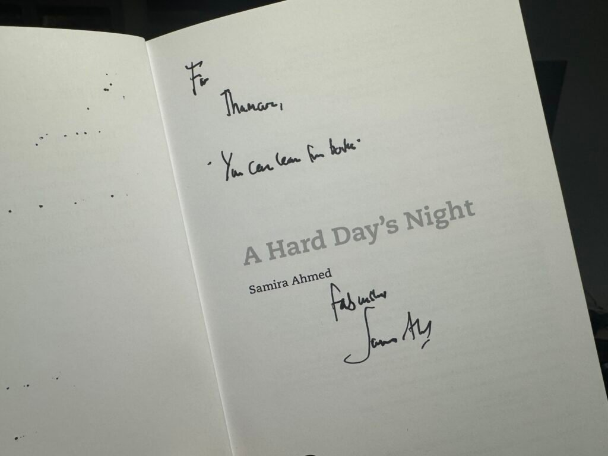

Reading used to be a favourite pastime of mine. For someone who used to ignore school homework to read books instead, I fell off the wagon very hard in my early twenties. I can’t quite put my finger on what did it; but the long and short of it is that I didn't read very much in the past few years. Despite my proclivity to track everything on a public profile—[Goodreads](https://www.goodreads.com/thamarakandabada) in this case—the numbers have been abysmal. See for yourself:

Books read per year:

- 2017 - `32`
- 2018 - `5`
- 2019 - `15`
- 2020 - `6`
- 2021 - `2`
- 2022 - `0`
- 2023 - `2`
- 2024 - `1`
- 2025 - `2`

The sharp decline after 2020 cannot be blamed on anything other than my laziness.

Towards the end of last year, however, I decided to change things. Making a drastic improvement quickly wasn't going to be possible, so I opted for baby steps instead. I set myself a reading goal for 2026: 12 books for the year. That's a book a month. Surely, that's an achievable goal?

Around the same time, my wife started frequenting the local library. I decided to tag along one day, and I'm glad I did. Over the next few months I borrowed and read Mary Shelley's [_Frankenstein_](https://www.goodreads.com/book/show/35031085-frankenstein) and John Le Carre's first 4 _George Smiley_ books. I was off to a great start. Props to the Northern Irish library system here, which is an excellent resource for book lovers. An endless selection of books are available through inter-library loans which can easily be managed with the [Libraries NI](https://www.librariesni.org.uk) app. Having a library within walking distance has also helped. The library visit has now become a weekly habit for us. We spend a few hours there on Saturday mornings, reading and browsing for new books.

<blockquote>"You can learn from books" —Ringo</blockquote>

I didn't mean to make this long preamble but this context was necessary, I thought, for what I'm going to be doing next. I feel that writing regularly about my habits could be a good way to stay accountable; I feel this will complement my extensive record-keeping on Goodreads. So I'm sharing my reading list for this spring (which is almost over) and summer here.

## Library loans and reservations

- **[_Stoner_](https://www.goodreads.com/book/show/166997.Stoner) by John Williams:** This book was recommended by my friends [Himal](https://himalkk.substack.com) and [Jo](https://rothbourne.substack.com), and I'm currently making my way through it. The story revolves around William Stoner, a farm boy from central Missouri who discovers Shakespeare at university, which changes the course of his life. Reading the introduction to the book written by John McGahern made me think of [_The History of Sound_](https://letterboxd.com/film/the-history-of-sound/) and [_Train Dreams_](https://letterboxd.com/film/train-dreams/), two films that I've loved. _Stoner_ also takes us on a journey through turn-of-the-century-and-soon-after America, a time and place that I have a special fondness for, for reasons I cannot explain.

- **[_Tinker, Tailor, Soldier, Spy_](https://www.goodreads.com/book/show/10073506-tinker-tailor-soldier-spy) by John le Carré:** This is book #5 of the acclaimed [George Smiley series](https://www.goodreads.com/series/180842-george-smiley) of spy novels by John le Carré. I collected it from the library this evening, and I plan to start it as soon as I'm done with _Stoner_. The last two books of the series, [_The Spy Who Came In From The Cold_](https://www.goodreads.com/book/show/19494.The_Spy_Who_Came_In_from_the_Cold) and [_The Looking Glass War_](https://www.goodreads.com/book/show/44171.The_Looking_Glass_War) hardly featured George Smiley, but I understand that changes in this book. Le Carré has a style of writing that is perfectly suited for this genre, and quite British, too, in its sensibility. I can't wait to dig into this.

- **[_The Stranger (L'Étranger)_](https://www.goodreads.com/book/show/49552.The_Stranger) by Albert Camus:** I have this book currently reserved, and it should arrive any day now. Seeing [the new film adaptation](https://letterboxd.com/film/the-stranger-2025-1/) made me want to get it. I am told it's a short read.

## New purchases

- **[_A Hard Day's Night (BFI Film Classics)_](https://www.goodreads.com/book/show/242697661-a-hard-day-s-night) by Samira Ahmed:** I adore the [cult classic film](https://letterboxd.com/film/a-hard-days-night/) featuring the lads, and have seen it many times. My first time seeing it on the big screen, which was yesterday, was a special screening at QFT graced by [Samira](https://samiraahmed.blog) herself, who is on tour around the UK promoting her new book on the the film. Of course, I bought a copy and got it signed. She autographed it perfectly.

- **[_Utilitarianism and Other Essays_](https://www.goodreads.com/book/show/273971.Utilitarianism_and_Other_Essays) by Jeremy Bentham and John Stewart Mill:** My cursory interest and knowledge in philosophy has always been a byproduct of consuming morsels of it at the edges of pop culture. This is an attempt to change things. The utilitarian maxim "the greatest happiness for the greatness number" has always fascinated me, so I thought I should start there.

- **[_Project Hail Mary_](https://www.goodreads.com/book/show/54493401-project-hail-mary) by Andy Weir:** I enjoyed the [film adaptation](https://letterboxd.com/film/project-hail-mary/) immensely, along with the rest of the world. While it hit all the emotional beats that usually resonate with me in a film, the hard science was glossed over. I'm hoping to find answers to the questions I was left with in the book.

<figcaption>Samira Ahmed's autograph on my copy of A Hard Day's Night.</figcaption>

## Older books and series I'm still working through

This is cause for some embarrassment, but I always seem to have a list of books that I haven't quite finished for various reasons. That list is currently populated by the following:

- **[_The Lyrics_](https://www.goodreads.com/book/show/57132832-the-lyrics) by Paul McCartney:** This is a career-spanning book that documents (a portion) of the body of work of one of our greatest living songwriters. Although it is peppered with Paul's recollections and stories relating to each song featured, it doesn't quite have a narrative structure, so I'm content to pick it up in between other books. Unsurprisingly, it's a thick volume, which will take me some time to get through. I'm savouring it.

- **[_The Sandman_](https://www.goodreads.com/series/40372-the-sandman) by Neil Gaiman:** I recently finished the third volume in the series, and I will pick up the next volume, I'm sure, when the time is right.

- **[_The Lady of the Lake_](https://www.goodreads.com/book/show/32841081-lady-of-the-lake) by Andrzej Sapkowski:** This is the seventh and the last book in [_The Witcher_ series](https://www.goodreads.com/series/40911-the-witcher). I only have a few chapters left. I couldn't tell you why I haven't finished this; it's certainly not an indictment of the quality of the book. I will finish it some day.

- **[_The Beatles: Get Back_](https://www.goodreads.com/book/show/55286757-the-beatles):** I bought this companion piece to [Peter Jackson's documentary](https://letterboxd.com/film/the-beatles-get-back/) of the same name when it came out. I do have a good reason for not finishing this: it is one of the hundreds of books that never came to Northern Ireland with us when we moved. It's safely tucked away at my parent's place in Sri Lanka and I hope to be reunited with it soon. Perhaps not this summer, but soon.

- **[_Philosophy of 100 Essential Thinkers_](https://www.goodreads.com/book/show/19217126-philosophy-100-essential-thinkers) by Philip Stokes:** This is a book I bought, and started reading, many years ago. It's a crash course on Western philosophy, with condensed accounts of various contemplatives' contributions to it. I only ever made it a few pages in, and every time I think of getting back on track, I'm drawn to a different book (like, say, a _George Smiley_ novel). I will aim to solve this problem this summer, but I won't make any promises.

There are many pages to get through, so I must not delay. To see my progress, follow me on [Goodreads](https://www.goodreads.com/thamarakandabada), or check the [/Now](https://thamara.co.uk/now/) page.