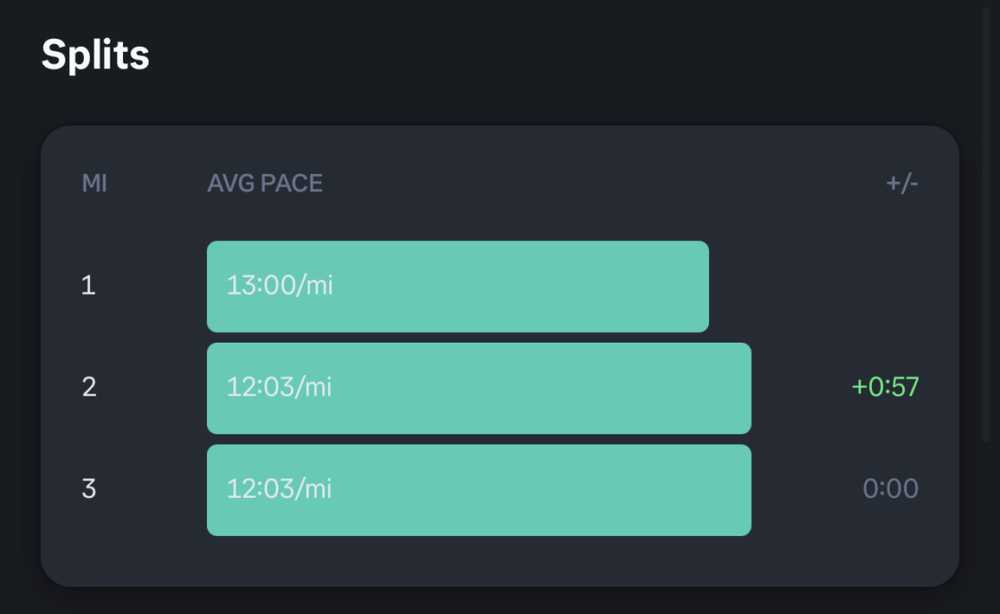

On Tuesday, I finished week 8 of the program. The 3 runs followed this format:

1. 5-minute warm-up walk

3. 28-minute run

5. 5-minute cool-down walk

I picked a slightly different route for the first run. I ran very slowly while listening to Nina Simone and Otis Redding. On the second run, I felt an extra boost of energy towards the end, which prompted me to sprint for the last two minutes. The third run felt much the same and I sprinted for the last minute.

Here are my pace splits from the second run. Splits 1 and 3 generally tend to be slower because they include the walks. But see how the pace on Split 3 is the same as that of Split 2 here.

I’m starting week 9 today, right after I publish this blogpost, and it will be the first time ever in my entire life where I would run for 30 minutes non-stop. I could have kept on going and completed a 30-minute run on Tuesday, but I decided strict adherence to the program is the best way forward.

I feel confident. I feel good. I can take this on. I’m going running tonight in the middle of a heatwave. I must be mad.

[Follow my Couch to 5K progress here](/notebook/topics/couch-to-5k/).
