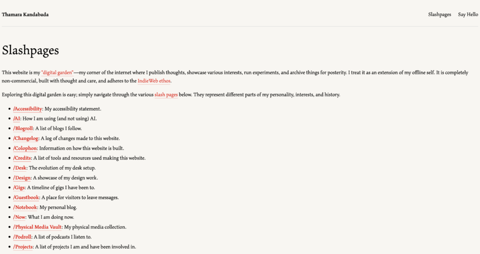

My plan for the new website includes a brand new design, centred around the typeface [Maiola](/notebook/2026/05/typeface-makeover/) and heavily influenced by the design of the [This American Life](https://www.thisamericanlife.org/) website. I’ve made some progress in the past week with the migration, in that a portion of its skeleton has been written in HTML. The serious stuff, like fleshing out the design and injecting a blog, involves wrangling a serious amount of CSS and JavaScript. I’m being a bit stubborn and not using any pre-built Astro themes, and opting to write everything myself from the ground up. It’s going to be a great learning exercise.

This is where I’ve got so far. Note the text-heavy and minimal nature of the design (not necessarily a bad thing) and the fact that it takes up the whole container width. I haven’t touched any viewport configurations or media queries in CSS to make the site responsive, yet. Heck, I haven’t even written any flexboxes.

I don’t want the site to be JS-heavy, but to know what minimal JS to use, I need to learn it first. I’ve found that I can only get so far with Astro’s own (extensive) [documentation](https://docs.astro.build/en/getting-started/) as it assumes prior knowledge and experience on the user’s part—not the best for beginners and certainly not the case with me.

For this reason I’ve started a [Responsive Web Design certification](https://www.freecodecamp.org/learn/responsive-web-design-v9/) at freeCodeCamp. It will take me through the basics of HTML (which I wouldn’t mind a refresher on), CSS, and some JavaScript. I’m hoping this course would suffice; if it doesn’t fCC also has a [certification on JavaScript](https://www.freecodecamp.org/learn/javascript-v9/) which will allow me to do a deep dive into the language.

It’s easy when you start a new project like this to imagine what the end product looks like, and if you’re me, to try to achieve that end state as soon as possible. But the reality is, if I want to get anyhwere close to the polish of the TAL website, it’s going to take months (or more) of tinkering. I need to accept that having a personal website is always going to be WIP project, and that the tinkering itself is the reward.

[Follow my progress here](/notebook/topics/the-great-astro-migration-of-2026/).
