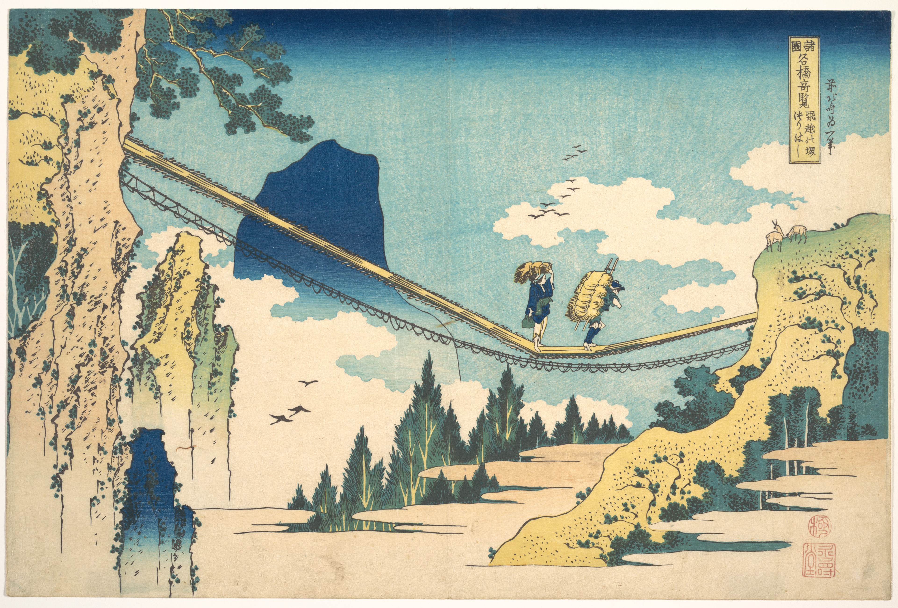
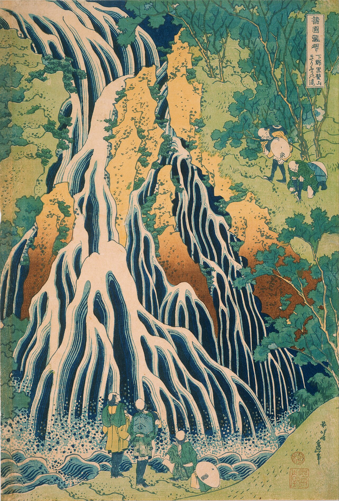
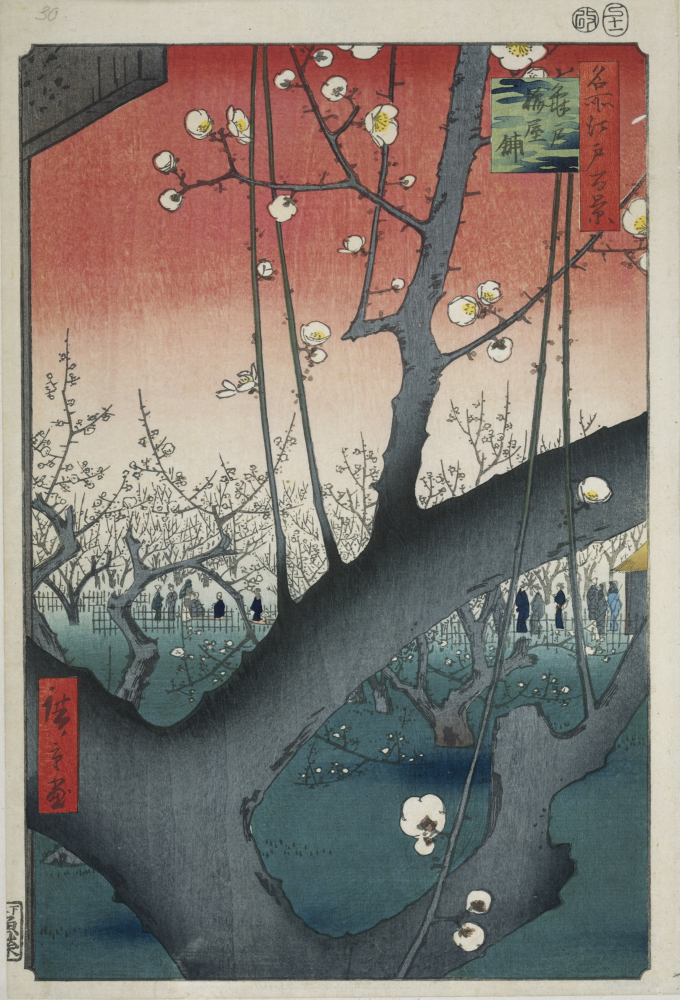
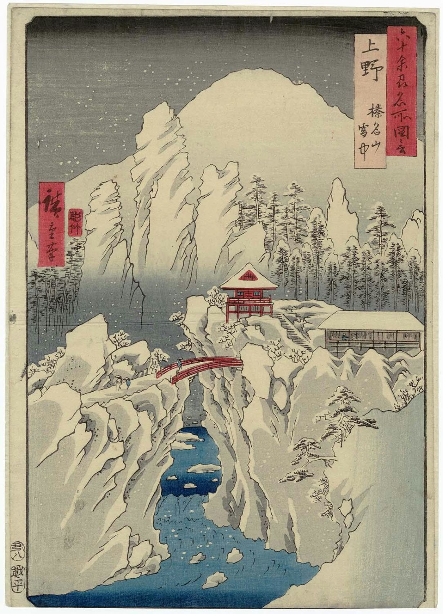
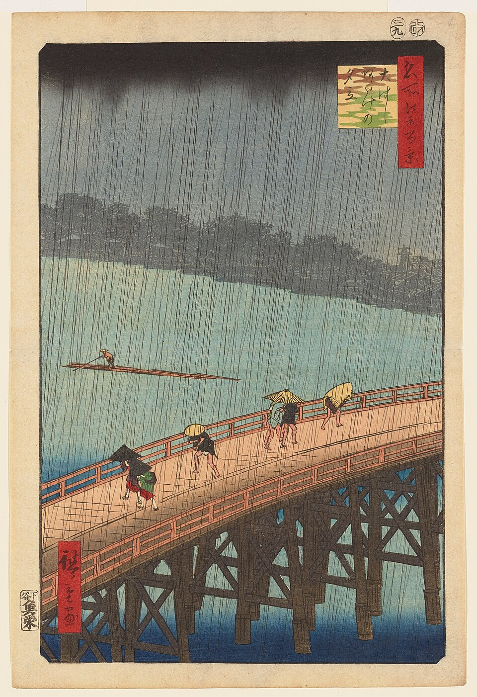
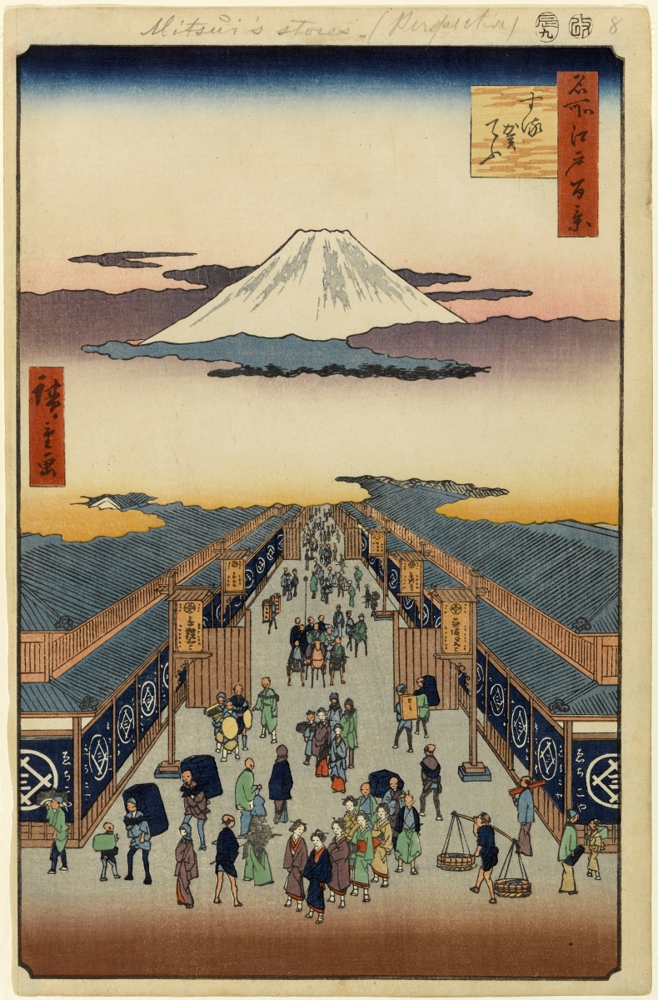

Whenever I visit Manchester—and I do frequently—I stop by the [Manchester Museum](https://www.museum.manchester.ac.uk/). It’s a great place to spend a few hours at, immersed in natural history, archaeology, geology, and anthropology. On my last visit, I wanted to explore somewhere I hadn’t been to before, and I had a full day to do it.

When I saw that [The Whitworth](https://www.whitworth.manchester.ac.uk/) had an exhibition on the Japanese wood block printing style, I was immediately convinced. I must admit that I lack any real knowledge about the discipline, and my interest is purely in the aesthetics rather than one of academic rigour. Nevertheless, I was excited at the prospect of this exhibition. Here was a chance to see the best of the genre, curated and presented by those who passionately study it. And all for free.

So, this morning after breakfast I made my way to the gallery.

The focus of this exhibition was on the artists Katsuhika Hokusai and Utagawa Hiroshige, who were active during the Edo (the old name for Tokyo) period of Japan (1615-1868). Their mastery of the craft made woodblock prints a popular and profitable enterprise. Called *ukiyo-e* in Japanese, the technique involves carefully carving the scene onto a block of wood, painting the block, and then pressing it on paper to achieve the final product. From Wikipedia:

<blockquote>The text or image is first drawn onto thin washi (Japanese paper), called gampi, then glued face-down onto a plank of close-grained wood, usually a block of smooth cherry. Oil could be used to make the lines of the image more visible. An incision is made along both sides of each line or area. Wood is then chiseled away, based on the drawing outlines. The block is inked using a brush and then a flat hand-held tool called a baren is used to press the paper against the woodblock to apply the ink to the paper.</blockquote>

Perhaps the most famous example of the style is Hokusai’s [*The Great Wave off Kanagawa*](https://upload.wikimedia.org/wikipedia/commons/a/a5/Tsunami_by_hokusai_19th_century.jpg), which many would recognise. Aptly named, the painting depicts three boats on a stormy sea, being tossed around violently by a great cresting wave on the brink of crashing on them. Mount Fuji, which makes an appearance in innumerable pieces from this period, is visible in the distance. While I appreciate this painting for its cultural significance and the place it occupies in the history of the style, I find myself drawn more to the landscapes and scenes from everyday life *ukiyo-e* artists painted.

Take the following paintings, for example. Using simple colours and gradients, they bring to life bustling towns, perilous journeys across snow-covered landscapes, dramatic skies, imposing waterfalls, and rising mountains. I’m enraptured by the greys and whites of snowfall, the blacks and blues of heavy rain, the pinks and oranges of the evening sun, and the soft blue-hued glow of moonlight.

<figure>

<figcaption>The Suspension Bridge on the Border of Hida and Etchū Provinces. Katsushika Hokusai, 1760–1849. The Metropolitan Museum of Art.</figcaption>

</figure>

<figure>

<figcaption>Pilgrims at Kirifuri Waterfall on Mount Kurokami in Shimotsuke Province. Katsushika Hokusai, Japanese, 1760 - 1849. Philadelphia Museum of Art, Public domain, via Wikimedia Commons</figcaption>

</figure>

<figure>

<figcaption>Plum Park at Kameido. Utagawa Hiroshige, 1797-1858. Public domain, via Wikimedia Commons.</figcaption>

</figure>

<figure>

<figcaption>Kōzuke Province: Mount Haruna Under Snow. Utagawa Hiroshige, 1797-1858. Public domain, via Wikimedia Commons.</figcaption>

</figure>

<figure>

<figcaption> Evening Shower at Atake and the Great Bridge. Utagawa Hiroshige, Public domain, via Wikimedia Commons.</figcaption>

</figure>

The power of nature is a recurring theme in these paintings. This is not only evident in paintings of landscapes battered by heavy rainfall and snow, but also in the framing of magnificent natural landmarks like Mount Fuji in repetition. Hokusai famously painted a series of 46 views of the grand mountain. The reverence for *Fujisan* in Japanese culture is encapsulated in unrivaled virtuosity in these paintings. Take Hiroshige’s *Suruga-cho*, for example, where the mountain looms over a busy town, shrouded in clouds, large than life, almost mythical.

<figure>

<figcaption> Suruga-cho. Utagawa Hiroshige, 1797-1858. Public domain, via Wikimedia Commons.</figcaption>

</figure>

Unmistakably, the mountain lends itself to metaphor: an enduring presence, a constant through the changing seasons. Solemn, majestic, ever-present. Even in the turbulent seas of *The Great Wave*, the mountain stands still in the distance. A beacon perhaps; a resolute and steady force in uncertain times.

*Ukiyo-e* extended beyond dramatic landscape paintings. The exhibition included various prints depicting armour-clad warriors setting off for battle, actors in plays, elegant courtesans, and exaggerated (in my eyes) poses of swordsmanship. I was fascinated by the fine level of detail included in these paintings—in clothing especially. Intricate patterns of colour and shape lifting the subjects beyond the frame and giving them life—it was a marvel to behold.

<blockquote>Living only for the moment, savoring the moon, the snow, the cherry blossoms and the maple leaves, singing songs, drinking sake, and diverting oneself just in floating, floating... this is what we call the floating world. —Asai Ryoi, Tales of the Floating World (1661)</blockquote>

This is the essence of *ukiyo-e* (pictures of the floating world), which draws you away from worldly troubles into a dreamworld of hedonism and beauty. That beauty has endured. Even after 200 years, these paintings, in my amateur opinion, appear quite modern. It's a wonder how these precise brushstrokes survive the laborious and tactile process of creation. *Ukiyo-e* is a testament to human ingenuity. I will be thinking about these paintings for a long time.

**Further reading:**

<ol id="post-footer-list">

<li>The Whitworth's page on the exhibition: <a href="https://www.whitworth.manchester.ac.uk/whats-on/exhibitions/beneaththegreatwave/">Beneath the Great Wave: Hokusai and Hiroshige</a></li>
<li>Wikipedia: <a href="https://en.wikipedia.org/wiki/Woodblock_printing_in_Japan">Woodblock printing in Japan</a></li>

</ol>

