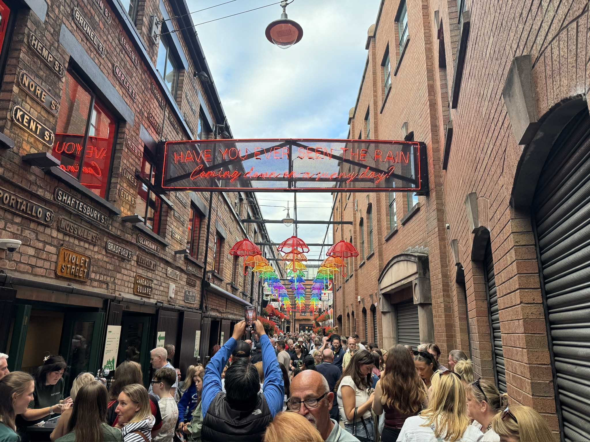
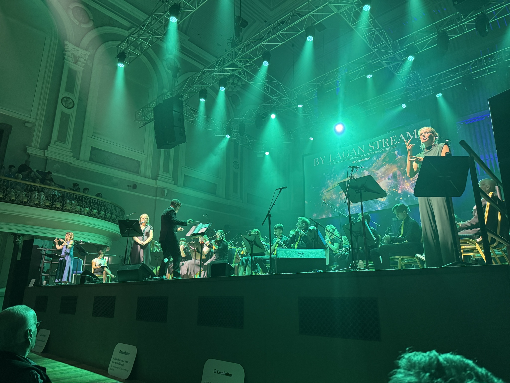
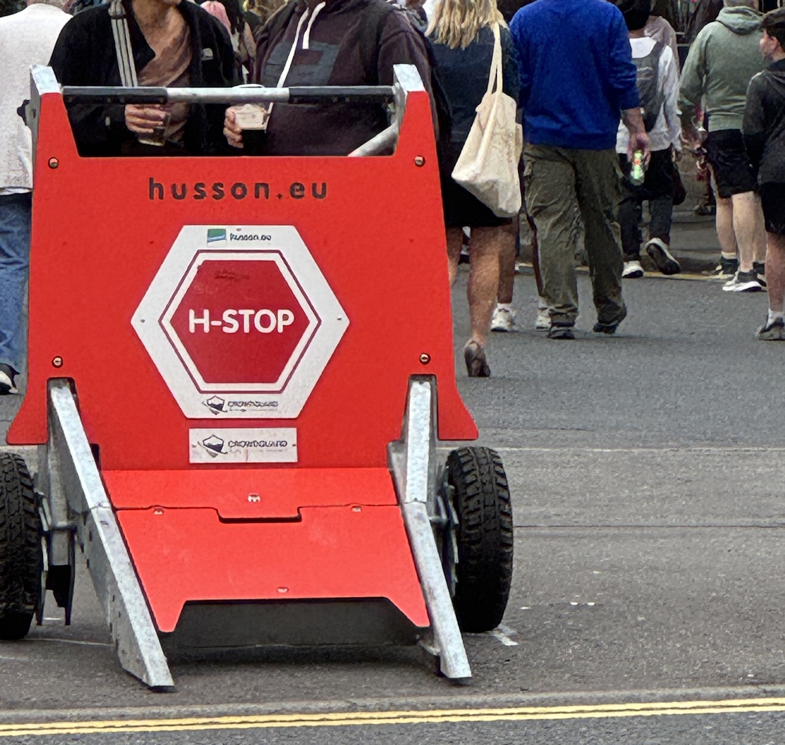

Belfast is abuzz this week with [Fleadh Cheoil na hÉireann](https://fleadhcheoil.ie/), a grand celebration of Irish culture and music that takes place every summer. This is the first time Belfast is hosting the event. With more than 700,000 visitors from around the world expected to attend over a period of 8 days, it almost feels like Belfast is too small a city for something as ambitious as this. But Belfast has a way of proving cynics wrong.

The city centre and many surrounding areas have been pedestrianised. My regular bus stops have changed, but all my concerns about getting to and from work on time were allayed on the first day. Everyday life continues as normal for us residents, but there is a great sense of excitement everywhere you look. People are playing music in the streets. There are tap dancers in every corner. Little kids with guitars, banjos, and fiddles are giving impromptu performances to eager audiences who gather around. Makeshift stages along the streets invite public performances by seasoned musicians and keen amatuers alike. Belfast looks more alive than I've ever seen it look before.

Pubs and restaurants are packed, too. People like a good time here. It's heartening to see Belfast in a relaxed mood, especially after the [summer we've had](https://www.theguardian.com/uk-news/ng-interactive/2026/aug/08/how-northern-ireland-race-riots-unfolded-belfast). People are milling about at all hours of the day, taking in the sights and sounds of the city. Although this doesn't happen every day, there is a strange familiarity to it all. Like the city has been preparing for this all along. Like it was always meant to be this way. I can't quite explain it.

Last night we attended a [performance](/gigs/2026/national-folk-orchestra) by the National Folk Orchestra of Ireland. It was at the beautiful Ulster Hall, almost packed to capacity with enthusiasts of Irish folk music from around the island, and I'm sure, beyond. The theme of the evening was "By Lagan Stream". The music centred around the Lagan river which flows through the city, weaving a thread through its industrial history and the more recent eventful past. The orchestra peformed for almost 2 hours, with vocal performances by wonderful local musicians peppered throughout. Two sign language interpreters, one for British Sign Language and another for Irish Sign Language, stood on either side of the stage for its entirety.

QFT screened several music-related films this week, too, in conjunction with the festivities. I watched the excellent Sinéad O'Connor documentary [_Nothing Compares_](https://en.wikipedia.org/wiki/Nothing_Compares_(film)), followed by a Q&A with the Belfast-born director Kathryn Ferguson. There was no shortage of activities to do for those who had the time and the inclination. On the way home on the bus one day, we overheard a woman talking about how she had taken the week off work to enjoy Fleadh, and how she was planning to do the same next year.

<figure>

<figcaption>New microformat property?</figcaption>

</figure>

I like seeing Belfast this way. Fleadh will return next year—every city hosts the festival two years in a row. I should plan for next year's installment a bit better. Perhaps take a day or two off.  

Music in the streets: what a wonderful thing.