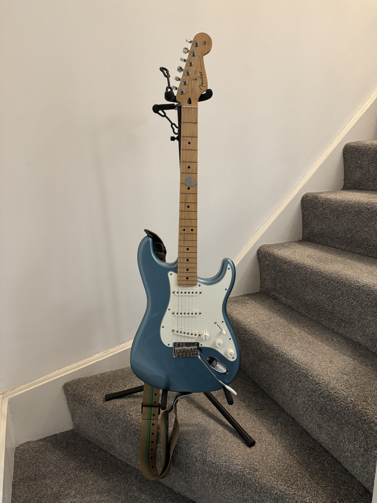
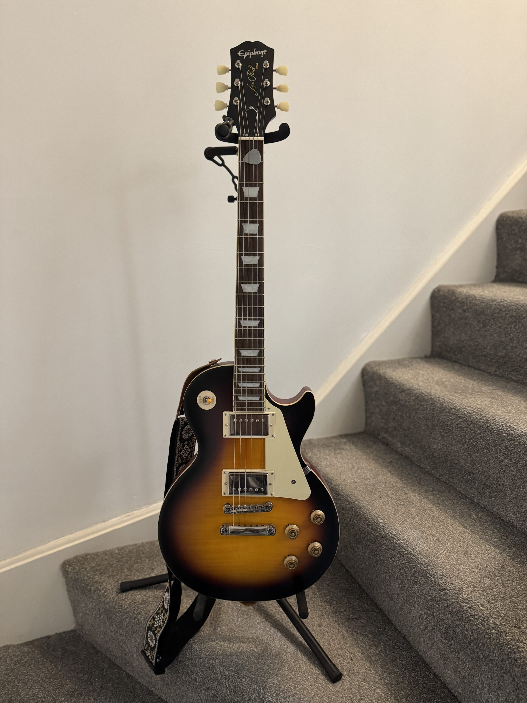
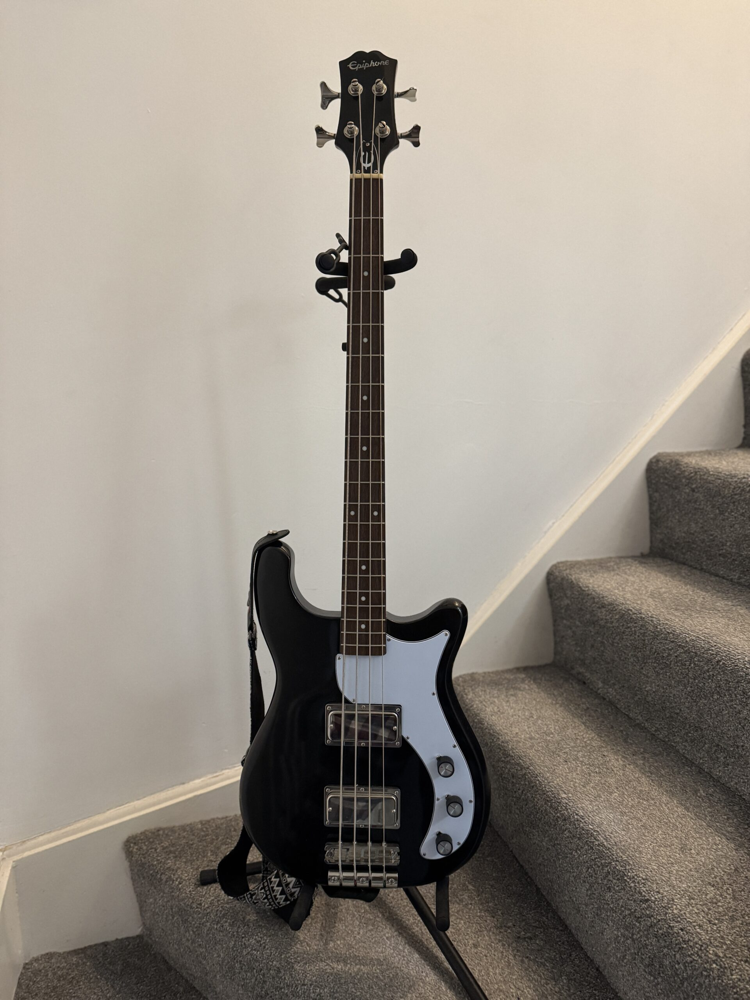
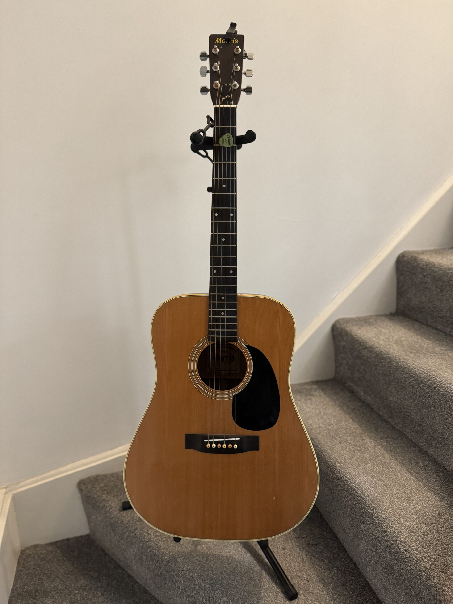

On the morning of Saturday, 11 September 2021, I texted my wife to say that I would love to learn to play guitar. I can't remember what her reply was, but as soon as I finished work that day I hailed a cab and made my way to the Yamaha Music Centre on Bauddhaloka Mawatha in Colombo. After browsing for a few minutes, I bought a Squier Stratocaster. My wife wasn't impressed when I returned home with it. In fact, she was shocked. It was all a bit sudden. I hadn't shown any active interest in this before. In her view, I had blown a considerable amount of money on a whim. And I'm certain she was concerned about all the noise I was going to make.

To me, it hadn't been a rash decision at all. I had spent most of my life admiring guitar-heavy music. Before I was enamoured with the grand American blues tradition and British rock of the 60s and 70s, I had long admired Sri Lankan guitarists like [Anthony Surendra](https://youtu.be/l6vCLlctbZU) and [Amaranath Ranathunga](https://www.amaranathranatunga.com/). Most of the music I was listening to on a daily basis featured guitars prominently. I had been fantasising about guitars as long as I could remember. I was glad I possessed the ability to appreciate good guitar music, but constantly and bitterly disappointed that I couldn't make any of my own.

In my view, I had finally done something about this. It wasn't a whim at all.

Thinking back, I realise that I must blame [Marc Maron](https://www.wtfpod.com/), the American comedian, for convincing me to pick up the instrument. When his podcast was active, he used to play at the end of each episode before the iconic closing lines "*Boomer lives. Monkey and Lafonda. Cat angels everywhere.*" He is a gifted player, and I remember falling in love with the raw, dirty tone he managed to get out of his amplifier.

The second guitar that I got my hands on wasn't bought at a shop. It was a Morris W-18, a Japanese-made guitar modeled after the [Martin D-18](https://www.martinguitar.com/10Y25D18.html). It had been given to my father as a present many years ago, and sat in a forgotten corner of the house, unplayed. After I was reminded of its existence, I dug it out, the case caked in a layer of dust, its strings loose, and its neck twisted out of shape. Moisture had got to it. At first I was unsure it could be rescued, but a talented local guitar tech and luthier—he manufactures his [own line of guitars](http://www.emmesguitars.com/)—proved me wrong. After he worked his magic the guitar felt as good as new. It produced—and still does—a rich and warm sound with a hefty bottom end that makes a statement. Even though I spent some money fixing it, I still think of it as a freebie. After all, the best guitar is a free guitar.

When we moved to Northern Ireland in 2022, I lugged my two guitars through four airports. While we were looking for a house to rent, I left them with two other Sri Lankans we barely knew at that stage for safekeeping. After we moved into a new apartment, one of the first things I bought was a double stand to rest them on. These machines were part of my life; they had crossed continents with me. And even though I couldn't play very well, every time I picked them up I felt the same inexplicable explosion of delight I felt on that first day.

Soon after the move, I decided I was due for an upgrade. I sold the Squier to a local buyer, and treated myself to a Fender Stratocaster: the real deal. Two more guitars followed in quick succession: a 1959 Les Paul Standard (the Epiphone version, with Gibson Burstbucker pickups), and an Epiphone Embassy bass.

These four guitars make up my current arsenal. They aren't the most expensive, but they serve me well. Because I didn't, and don't, have any aspirations of being a musician, or even performing in public for that matter, they aren't sources of resentment or harsh reminders of a life that could have been. As Maron likes to put it, his (and my) guitars aren't vessels for broken dreams. They are simply there when I need them, always ready to be played, always willingly making the splendid cacophony I love to make with them.

<figure>

<figcaption>Fender Stratocaster</figcaption>

</figure>

<figure>

<figcaption>Epiphone Les Paul</figcaption>

</figure>

<figure>

<figcaption>Epiphone Embassy</figcaption>

</figure>

<figure>

<figcaption>Morris W-18</figcaption>

</figure>

I've never stuck to any teachers or courses, choosing instead to look up songs I want to play when I want them. On the internet, there is no shortage of lessons, websites full of tabs for every song you can imagine, and fellow axe-wielders eager to impart their knowledge for free to anyone eager to listen.

The best thing I could wish for anyone in life is this: music, in abundance. If you've got music in your life, be grateful. I also wish you get to experience what it is like to pick up an instrument and play a note someday, just one, and feel its joyous and healing power. I wish you get to make your own music someday, even just for your own ears. There are few greater joys. 

**Acknowledgements:**

<ol id="post-footer-list">

<li>Thank you, <a href="https://jamesg.blog/">James</a>, for nudging me in the right direction when I was looking for some writing inspiration today.</li>

<li>I was listening to various renditions of Traffic's <em><a href="https://en.wikipedia.org/wiki/Dear_Mr._Fantasy">Dear Mr Fantasy</a></em> on repeat while writing this post.</li>

</ol>

