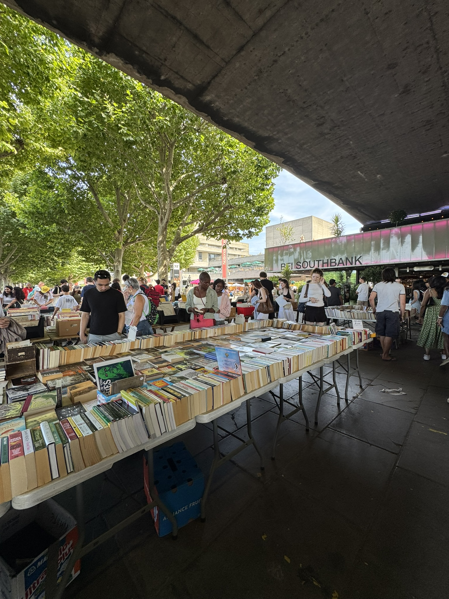
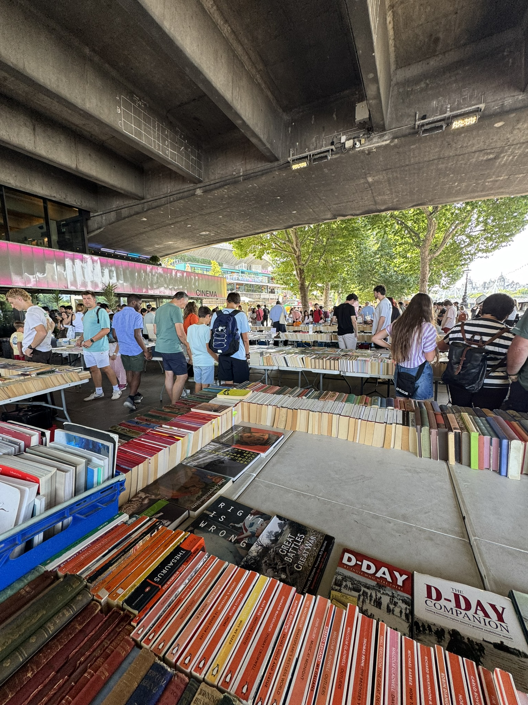
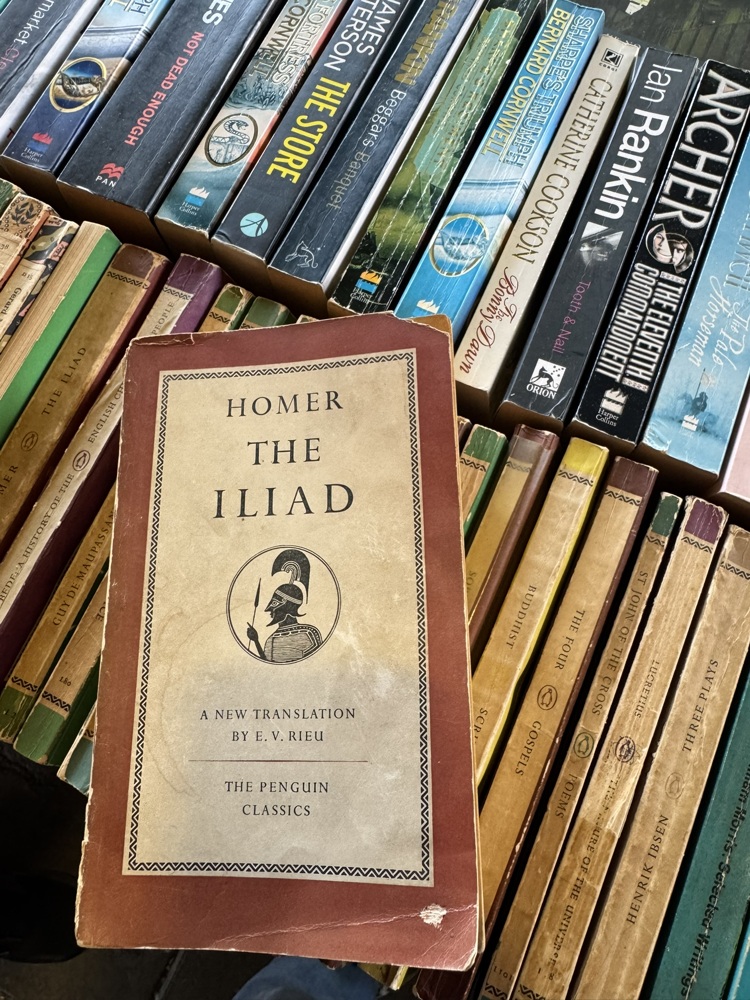
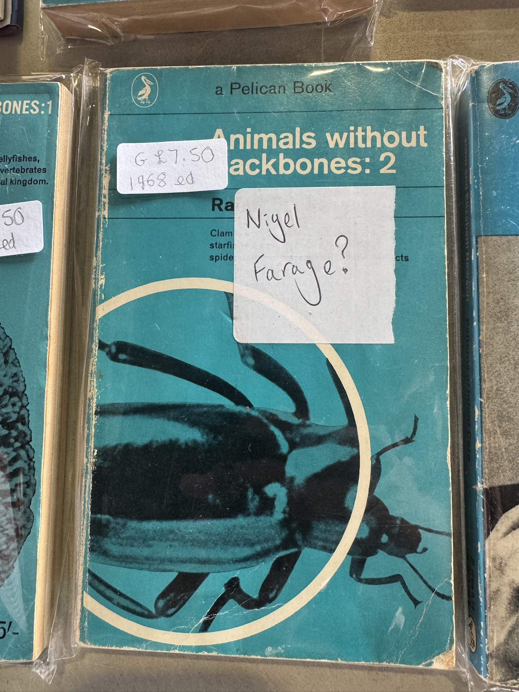
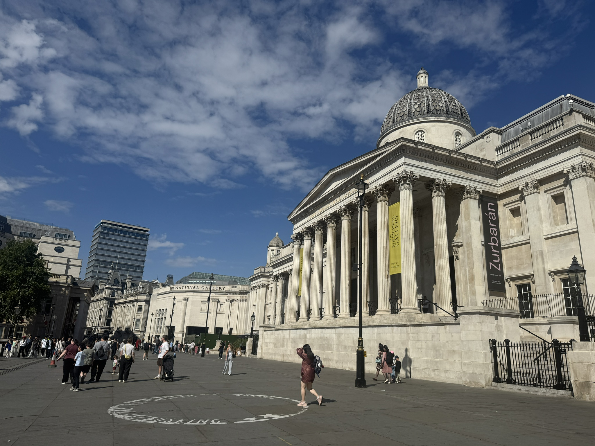

We arrived in London yesterday morning. The primary reason for the visit was to see _The Odyssey_ at the BFI IMAX, the largest screen in the UK, and one of the few places in the world where you can see a film projected in 70mm IMAX. We had seen James Gunn's _Superman_ in this cinema, projected digitally, the year before. IMAX film is the 'purest' and largest format available currently, so when Nolan shot an entire feature film in the format for the first time in history, I knew I had to come back here to see it. As I mentioned in my [review of the film](/notebook/2026/08/the-odyssey), I was willing to forgive this adaptation's faults because the technical achievement alone was gargantuan.

When I first bought tickets a few months ago, we had planned to make a weekend out of it by exploring London a bit more. Our tickets were for the 10.30pm screening—it was the only one I could get decent seats for—so we caught up with a friend who lives in London. We walked around the Southbank for a bit. The place is always busy, with foodstalls, street performers, and plenty of patrons. We explored an open-air bookstall at the entrance to BFI Southbank, which had a massive selection of books of all genres neatly laid out on tables. Nuwani bought a book on Ancient Egypt for her niece—gotta get them started young.

<figure>

<figcaption>A first edition of the Rieu translation of The Iliad</figcaption>

</figure>

<figure>

<figcaption>I don't know who runs this bookstall, but I like them</figcaption>

</figure>

No trip to London is complete without a visit to the Prince Charles Cinema. This was our next stop for the evening. The timing worked out great because they were showing a 35mm film print of _In The Mood for Love_. It is one of my favourite films, and I particularly enjoyed seeing a gorgeous film print of it. Nuwani and my friend, however, were unimpressed.

We had dinner in Chinatown, and then it was time for the main event. We said goodbye to our friend and made our way to the unmistakable BFI IMAX building in Waterloo. The circular building, located in the middle of a busy roundabout, somehow manages to shield itself from the noisy outside world thanks to its "underground" entrance. It evokes the feeling of a true oasis of cinema; a place where you could sink into the calming embrace of magical worlds without a care in the world. 

Unsurprisingly, we were both thoroughly impressed with the 70mm presentation. Even after a full and tiring day, the film managed to hold our unbroken attention for almost 3 hours. By the time the film ended, I had forgiven Nolan for his very Christian adaptation of the story and made my peace with it. Strangely, some of the irritants from the first viewing (like the whiplash-inducing cuts) didn't bother me so much this time. For my first experience of IMAX 70mm film, this was perfect.

This morning we visited the [National Gallery](https://www.nationalgallery.org.uk/). We only had a few hours to spare before meeting a friend for lunch, so we made a beeline to the [Gavron Room](https://www.nationalgallery.org.uk/visiting/floorplans/level-2/room-22) of the gallery where a number of Rembrandt portraits are displayed. This was a recommendation from [James](https://jamesg.blog/), and I'm glad I followed it. My art history knowledge is limited, but I know what I like, and I do like the Dutch masters. The National Gallery's collection of [Baroque paintings](https://en.wikipedia.org/wiki/Baroque_painting) is quite impressive, and I found myself drawn to the works of Frans Hals, Jacob van Ruisdael, Claude Lorrain, and Nicolas Poussin. Landscape paintings are a particular favourite of mine. For reasons I can't explain, I enjoy the composition of stark figures against airy, idyllic, pastoral landscapes; shepherds and goatherds with their animals, travellers on long roads, angels appearing on the mortal plain, military expeditions—the subjects do not matter so much as the composition. They all manage to elicit a sense of serenity that I haven't quite found when I experience any other form of art.

<figure>

<figcaption>The National Gallery</figcaption>

</figure>

The highlight of the trip, however, came in the form of a musical just a few hours before I hit the publish button for this post. [Matilda The Musical](https://uk.matildathemusical.com/), which we went to see at the Cambridge Theatre in the West End this afternoon, was an excellent stage adaptation of Roald Dahl's story supported by a wonderful cast of actors. The dynamic set-pieces accentuated their performances and grounded them in the world of this story. It was a joy to watch and was done so well that on more than one occasion I forgot I was watching a stage performance. The children didn't just hold their own with seasoned adult actors, but frequently ran circles around them with what looked like relative ease. Matilda, especially, was a delight. She stole the show.

It's quite warm in London today, but I'm not willing to forgo my Sunday run because of it. We're heading out now to the vibrant Southbank again for a dander. I love walking in London, and I'm sure I'm going to love running here, too.