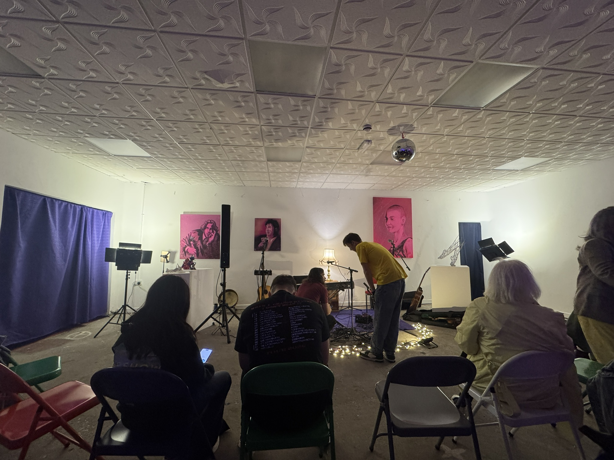
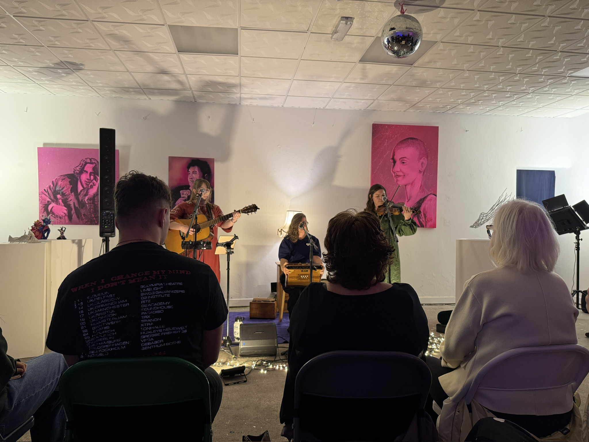
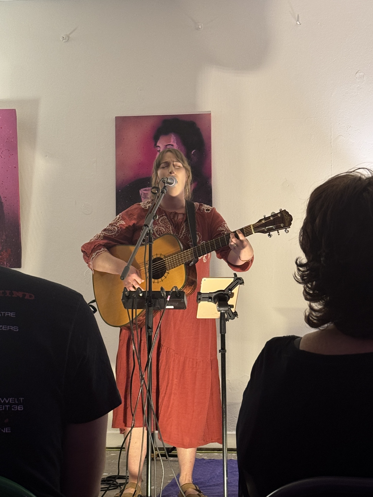
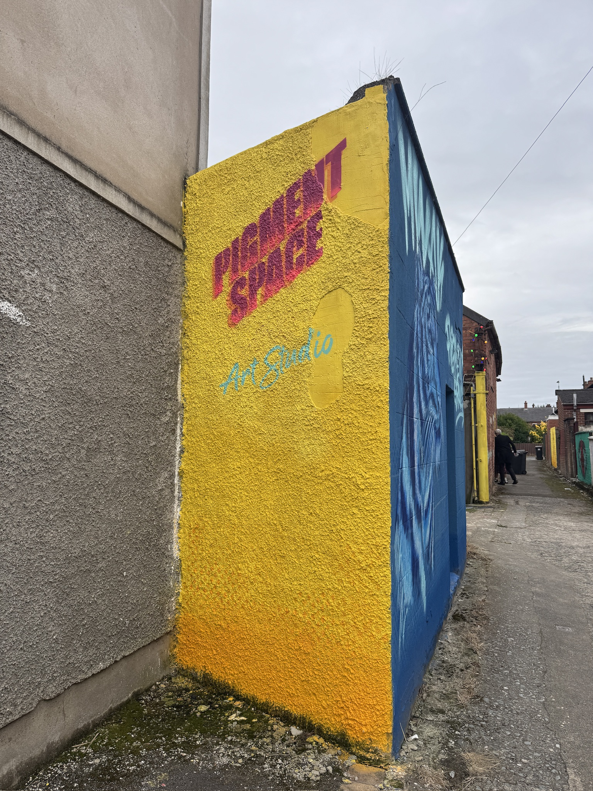

During the event, the team announced that Regard will return in October and November, for which plans had already been made. The dates are 11 October and 8 November. Tickets will be released very soon. If you're in Belfast on these dates, do come.

Here are some useful links.

1. [Tickets](https://www.ticketsource.com/regard)

2. [Newsletter](https://docs.google.com/forms/d/1icmw8I4oVjnDpYR-ea4pxDUawOB2PRv3jeoLobKqKog/viewform?edit_requested=true): sign up for updates on upcoming events

3. [Regard on Instagram](https://www.instagram.com/regardbelfast)

## More photos from today's event

