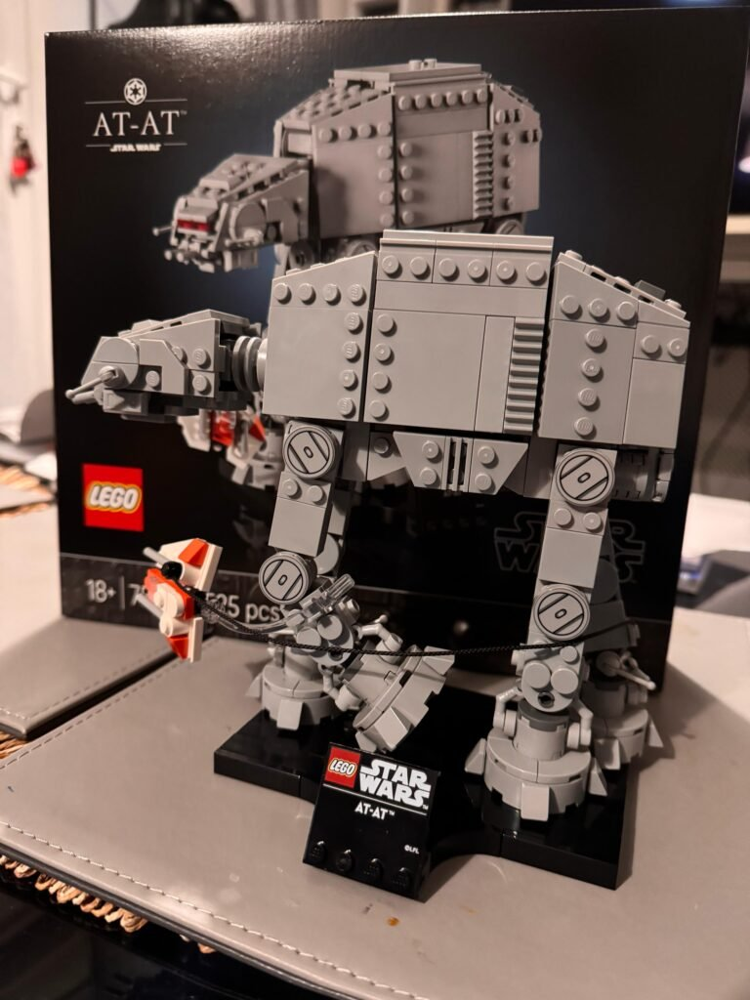

Built our first Lego set this weekend.

An Imperial AT-AT. Complete with Luke's snowspeeder and the tow cable around the AT-AT's legs. I have friends who are obsessed with Lego, and I have bought sets as presents in the past, but this is the first set I bought for myself.

My wife helped. She is now demanding that we buy some Harry Potter sets. This could be the start of a collection.

