For the longest time, my Blu-ray collection was catalogued on a spreadsheet. Compared to heavy-hitters on [r/4kbluray](https://www.reddit.com/r/4kbluray/) and other corners of the physical media loving internet, my collection is unremarkably small (around 250 titles at the time of writing), and my spreadsheet served its purpose. It was tedious to manually input data into it every time I bought something, but my purchases were few and far between, and it was manageable.

I could have happily used the spreadsheet for a while longer as my purchasing habits have now stalled due to lack of space. But I have been cursed with a brain that craves novelty at every turn. What follows was an inevitability—it began taking root when I finally had the tools to bring my new idea to life.

## Planning

Having used [Lovable](https://lovable.dev) to create a few simple apps to embed on my [/now](https://thamara.co.uk/now/) page, I was confident in my prompt mastery to take on a bigger project. I set my sights on creating a web-based app to host my media catalogue, and began with a list of basic needs.

I wanted the app to:

- have a clean UI

- have the ability to filter and sort titles based on rich metadata, such as media type (film, film collection, concert, documentary, TV, etc.), director, year, region, audio and video format, HDR format, and publisher

- have the ability to scrape an online database, in this case, [blu-ray.com](https://blu-ray.com), to enrich metadata

- have a Wishlist section that I could easily manage

Over several days and close to 200 iterations, I built a simple, multi-page app tailored to my exact needs. I hosted it on the subdomain [physicalmedia.thamara.co.uk](https://physicalmedia.thamara.co.uk), and this is what it looks like.

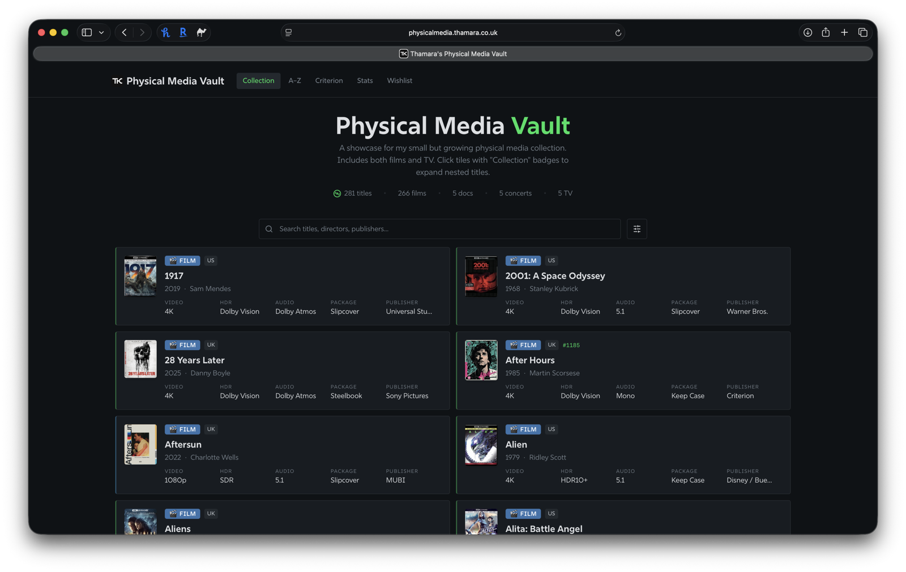

I'm documenting my motivations, thought process, and design minutiae here, in the unlikely event that another sod like me with too much time on their hands stumbles upon it and decides this may be of some use. At the end of the post, I have linked a GitHub repository which includes the source code of this project, which you can adapt and make your own.

## Design language

For inspiration, I used [Letterboxd](https://letterboxd.com) as a starting point, mimicking the dark grey page backgrounds with white monochromatic typography complemented by green for emphasis.

The font used throughout the app is **Rig Sans**, the same one you're reading this post in right now, sourced from Adobe Fonts through TypeKit.

Here is a detailed breakdown of the colour palette used throughout the app.

### Colour Palette

| Role | Hex | HSL | Usage |
| --- | --- | --- | --- |
| **Background** | `#101519` | `210 20% 7%` | Page background |
| **Foreground** | `#D8DCE0` | `210 10% 88%` | Primary text |
| **Card** | `#181D23` | `210 18% 11%` | Card / panel surfaces |
| **Surface Elevated** | `#1C2129` | `210 16% 13%` | Raised surface elements |
| **Muted** | `#1F2429` | `210 14% 14%` | Subdued backgrounds |
| **Muted Foreground** | `#737A80` | `210 8% 50%` | Secondary / placeholder text |
| **Border** | `#262C33` | `210 12% 17%` | Borders and dividers |

#### Accent Colours

| Role | Hex | HSL | Usage |
| --- | --- | --- | --- |
| **Primary (Green)** | `#00E054` | `145 100% 44%` | Primary actions, links, active states |
| **Green Dim** | `#1B7237` | `145 60% 28%` | Subtle green borders and accents |
| **Orange** | `#FF8000` | `30 100% 50%` | Secondary accent, warnings |
| **Destructive** | `#E03E3E` | `0 72% 50%` | Delete actions, errors |

#### Media Type Badges

| Type | Hex | HSL |
| --- | --- | --- |
| Film | `#3D6DB8` | `210 50% 45%` |
| Film Collection | `#CC7A1A` | `30 80% 50%` |
| Documentary | `#30994D` | `145 50% 38%` |
| Concert Film | `#B83D78` | `330 55% 48%` |
| TV | `#6633CC` | `265 50% 50%` |

## Film ti(t)les

Each title I own is represented by a tile.

I built a hidden login flow that allows me to access the app and add/edit titles as necessary. While I wanted this to be a publicly viewable showcase of my media collection, giving editorial access to itinerant strangers on the web would have been disastrous indeed, so this was crucial.

Let's look at the individual tiles in detail. Each one is populated with the following metadata:

- media type identifier badge (eg: film)

- film title

- year

- director/s

- video format (e.g., 4K)

- HDR format (e.g., Dolby Vision)

- audio format (e.g., Dolby Atmos)

- package type (e.g., Slipbox)

- publisher (e.g., Warner Bros.)

Each tile has a subtle green or blue accent on the left hand border—green for 4K, and blue for 1080p.

There are two types of tiles: standard tiles for individual titles, and expandable tiles to allowed nested titles (for film collections.)

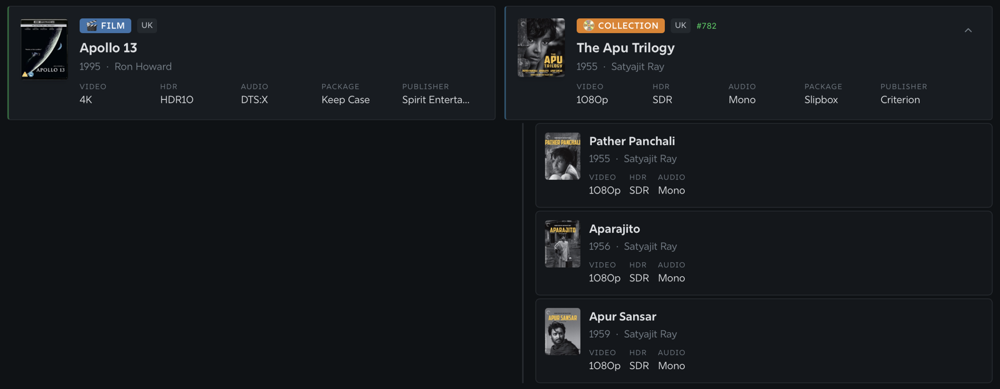

## Adding titles

I can add new titles to the collection by using the window below, which is only accessible to me when I'm logged in. Titles can be added by:

1. searching the blu-ray.com database directly from the app

3. pasting a blu-ray.com link

5. manual entry

The first two methods scrape the data from blu-ray.com and populate the corresponding fields in the form below. I can change them manually if I need to.

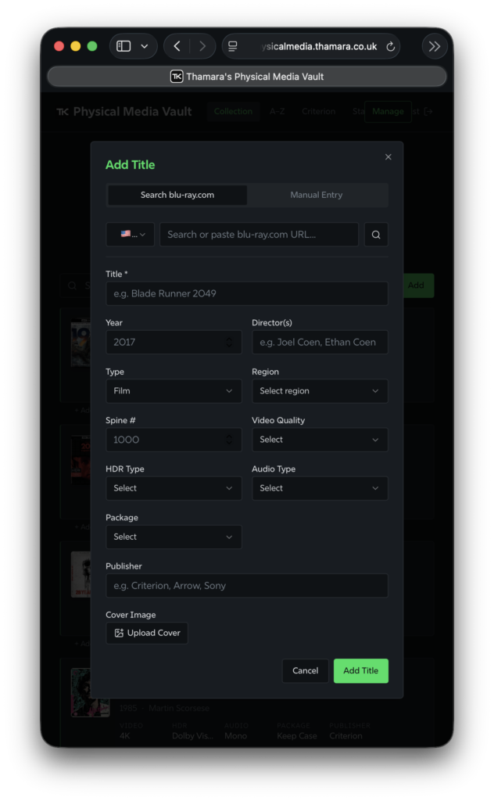

## Alphabetical index

The next section of the app is an alphabetised list of the collection. This allows me to view all the titles I own in a simplified, distraction-free environment for easy sorting.

Before I moved across continents and left half of my collection in the care of a friend, I preferred to sort my shelves in alphabetised order. Having this section in the app makes me feel closer to a sense of normalcy again, even though the chances of reuniting with my full collection soon are slim.

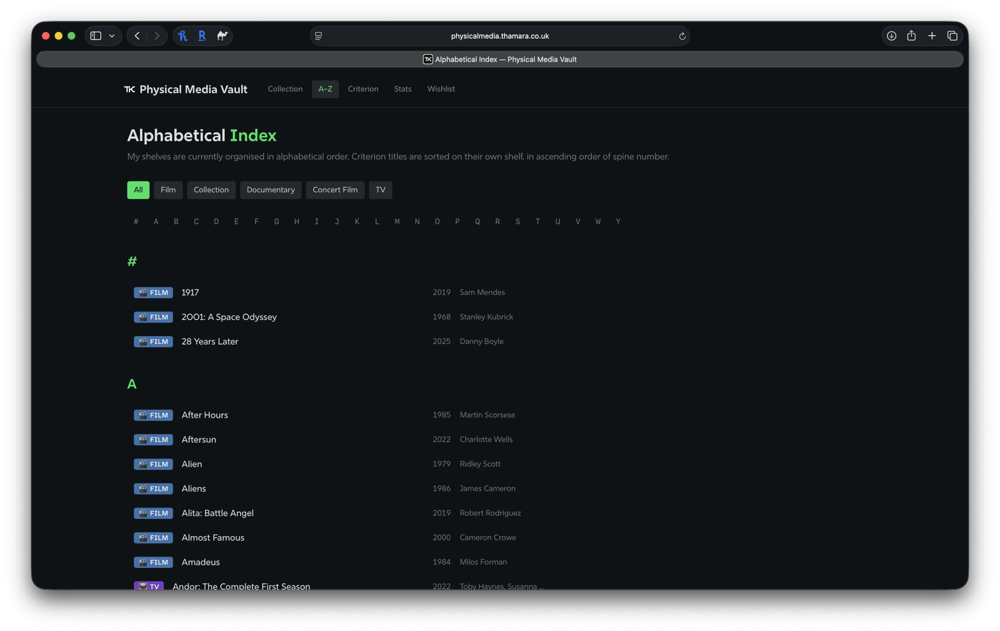

## My Criterion Closet

On my previous spreadsheet, I had set up a pivot table to sort all my Criterion releases by spine number—my preferred way of sorting them—so it made sense to bring the same functionality to this app. My current Criterion Closet is abysmally small, and I would love to expand it; seeing this regularly will help me get there, although my wallet will hate me for it.

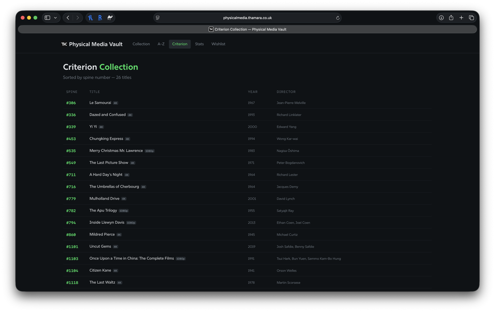

## Vital statistics

My friends know that I'm obsessed with quantifying everything. Why else would I [track every single film and TV episode I watch, catalogue every book I read, chase PlayStation trophies](https://thamara.co.uk/now/) and build things like this?

I took inspiration from Letterboxd for the stats section, too. The counting logic has been set to correct for duplicate metadata entries (e.g., on film collections, main title metadata is ignored and only nested title entries are counted.)

The stats dashboard is designed in tiled sections to improve visibility. The sections are as follows:

### Overview

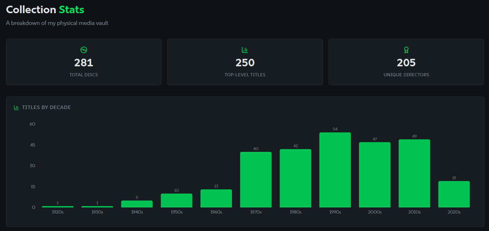

### Top directors

I kept this section limited to 15 directors. Anything more than that would have been excessive, and too "leggy" on mobile.

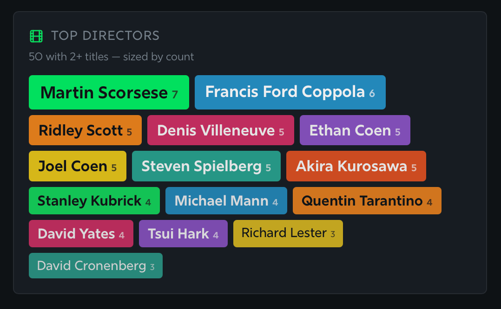

### Formats

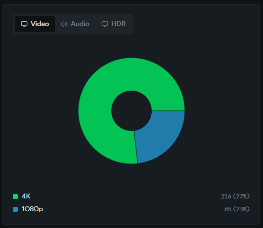

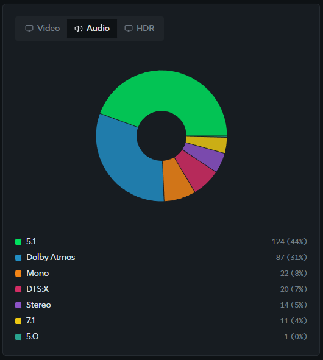

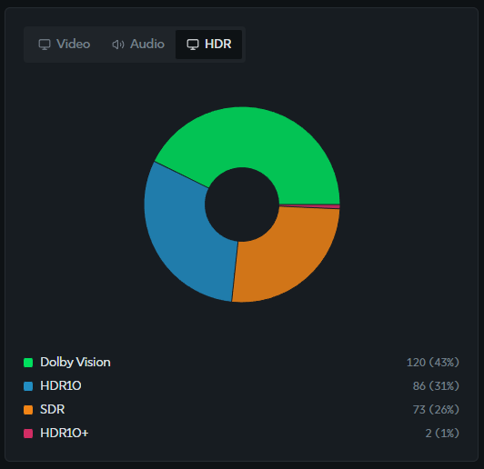

### Other

The final section of the stats page utilises the other snippets of data scraped from blu-ray.com.

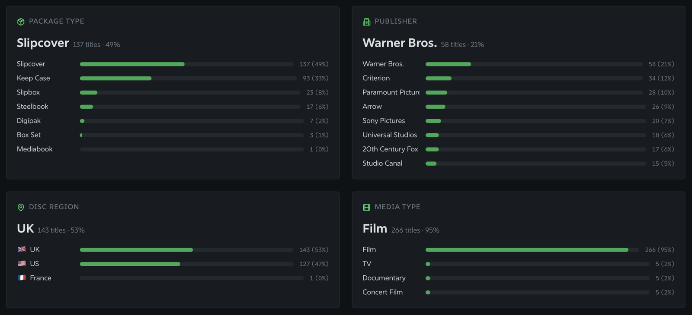

## Wishlist

It was important for me to have a functional Wishlist tool, and I wanted this to be an improvement on the basic list-of-links-pasted-on-to-a-spreadsheet that I had been using previously.

I wanted to make the Wishlist view-only for all external visitors, with me retaining the ability to edit and manage it while logged in. See the comparison below:

- The screenshot on the left of the slider shows what I see. I have the ability to add new titles to the list by simply pasting a link from a reputed retailer such as HMV. The new listing that is created includes a thumbnail, price, and a link to the retailer's e-commerce page. "Delete" and "Mark as done/purchased" buttons help me manage the list.

- The screenshot on the right of the slider shows what other visitors see. The list is still richly populated with metadata, but all the list management options are hidden.

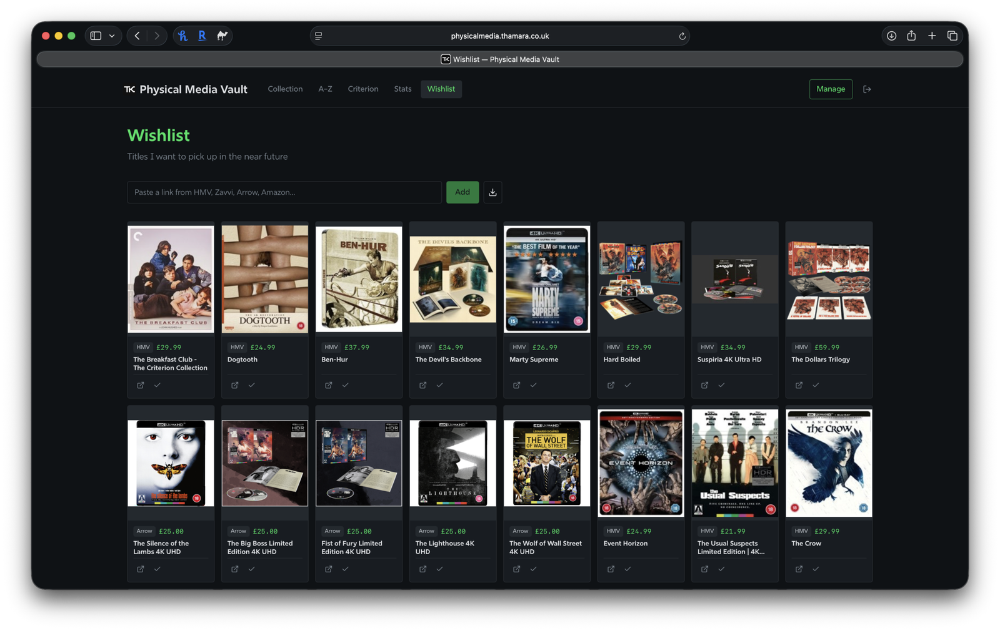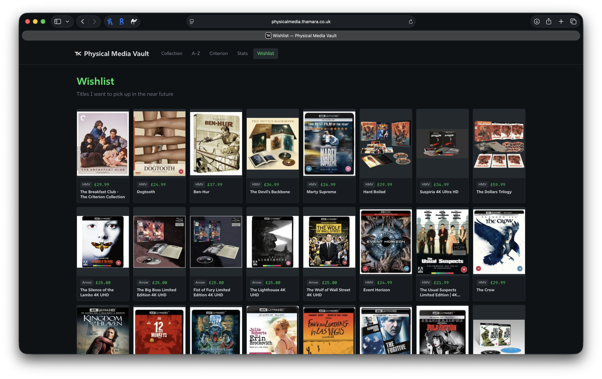

I've also implemented basic checks to:

- avoid duplication of wishlisted titles

- warn me if I wishlist a title that I already own

These checks aren't strictly enforced, and are currently unnecessarily flagging a number of similar titles (see screenshots below) but I am happy with this level of scrutiny for now.

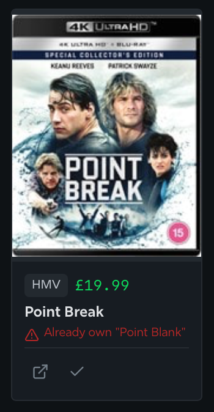

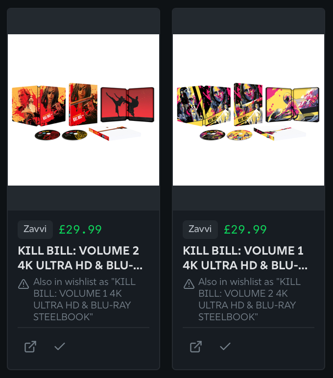

When I mark a title as purchased, it moves to the bottom of the page, to a separate section named "Purchased" and is greyed out.

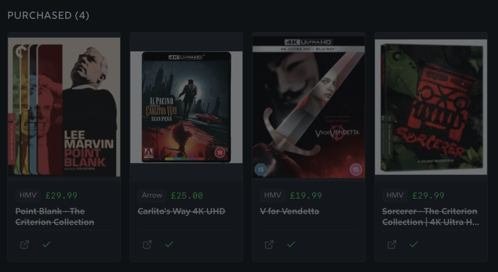

That covers the full functionality of this simple web app. I couldn't leave things here without adding a subtle flourish to ensure this Physical Media Vault and my main website shared the same design spirit, hence the footer and the 404 page.

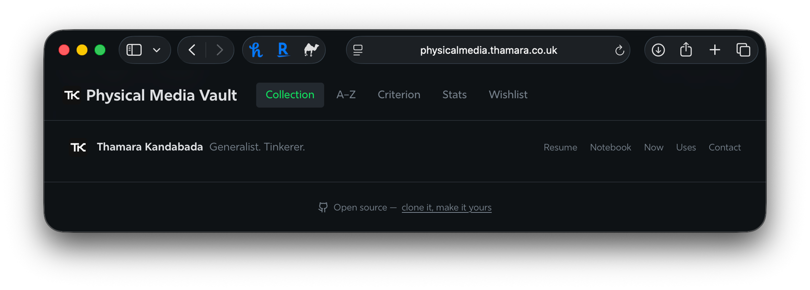

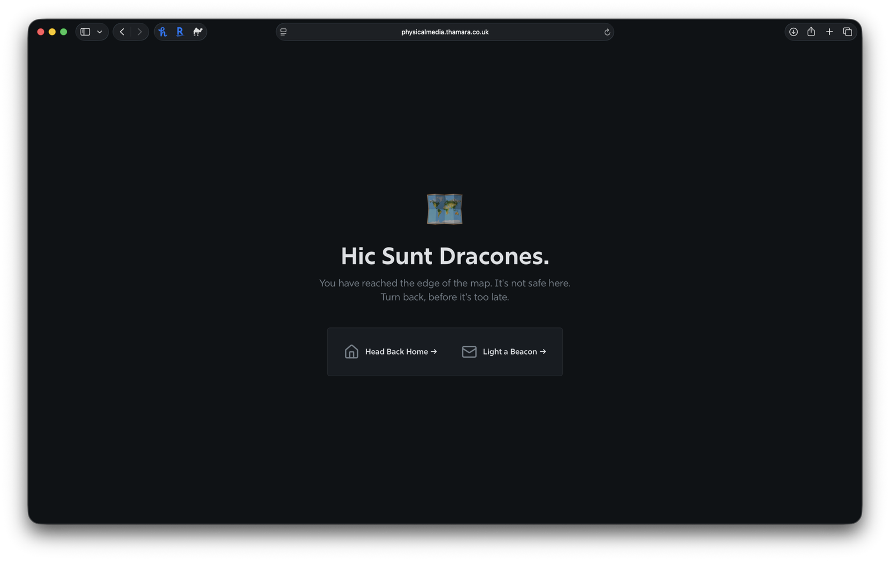

I was quite pleased with what I could achieve by typing a few prompts into an AI-powered building tool. The finished product is built on an impressive [tech stack](https://physicalmedia.thamara.co.uk/colophon), including React, Supabase, and Tailwind CSS—tools that would have taken me years to learn and master.

I've published the source code on GitHub for anyone interested in taking this for a spin. This app, of course, was built for my own personal collection needs, so it may not cover every use case. You're welcome to fork it, adapt it to your own workflow, and submit improvements back via PR (although I may not be inclined to accept every contribution—I have already built what I needed.)

You can access the GitHub repository [here](https://github.com/thamarakandabada/physicalmediavault).

Until next time.
