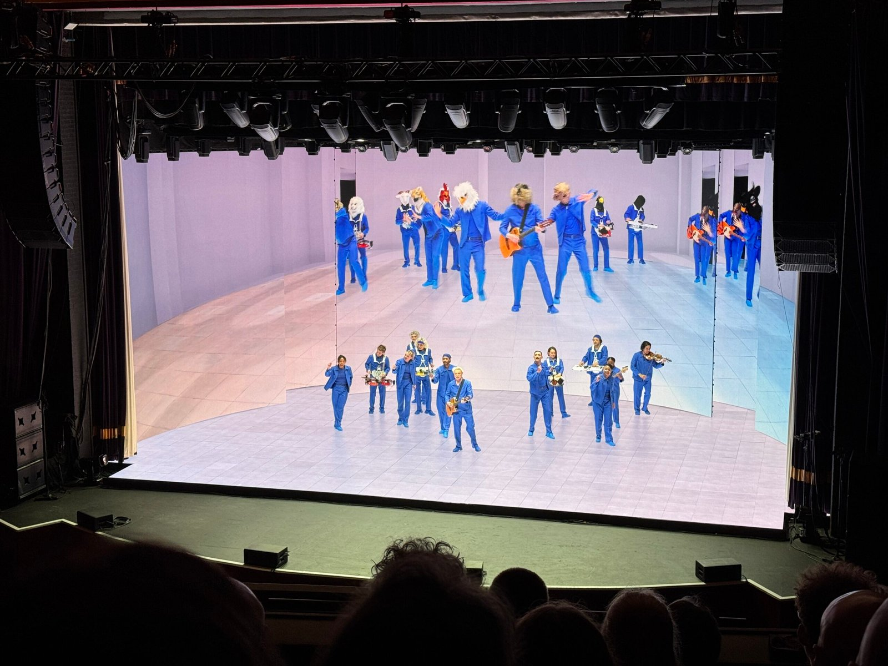
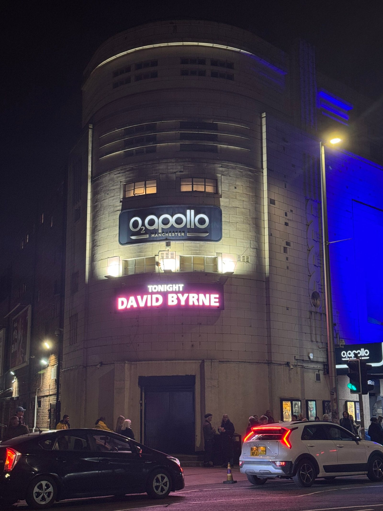

I took two days off work this week—which is quite a rare thing for me to do—to fly off the Manchester. I go there quite a lot for [gigs](https://thamara.co.uk/gigs/), and I feel like I know the city quite well even though I have never lived there.

This was a quick trip. I flew there on Monday and flew back to Belfast on Tuesday. But it was no ordinary gig. I went to see David Byrne, a once-in-a-generation genius, and one of my musical heroes.

It was my first time at the O2 Apollo. It's a beautiful venue, about the same size as the Waterfront Hall in Belfast.

As much as I would like to wax poetic, I can't quite find the right words. It was a transcendental experience. The show was bookended with Talking Heads songs ("Heaven" at the beginning, and "Burning Down the House" at the end) but we did get quite a few songs from his solo career, too, including some fairly new ones.

Everyone was up and dancing by the end. I, too, tried. I don't think anyone noticed—the music was too good.

I would gladly go again. I hope he keeps touring.
