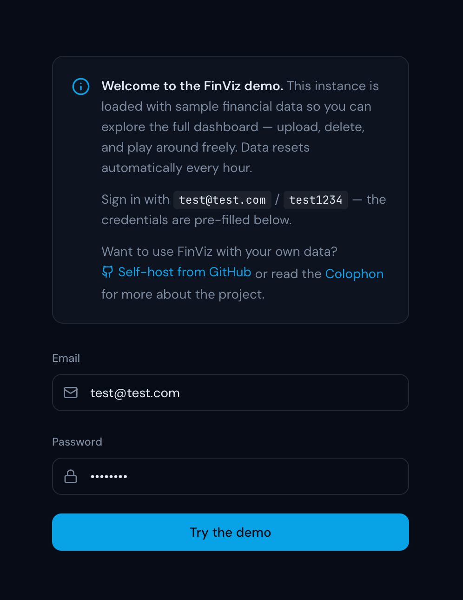
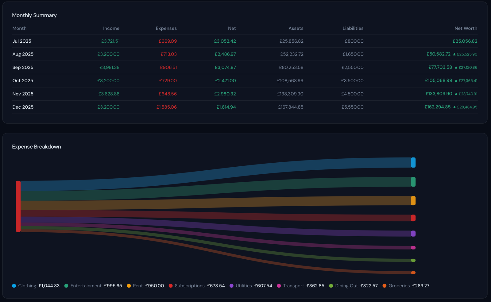
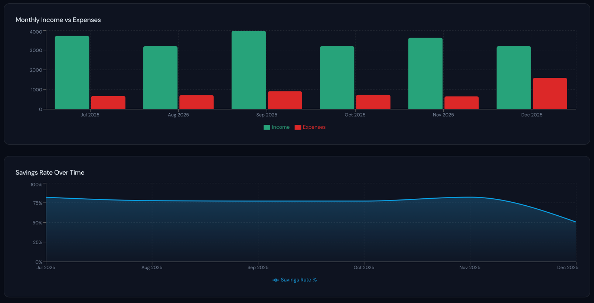
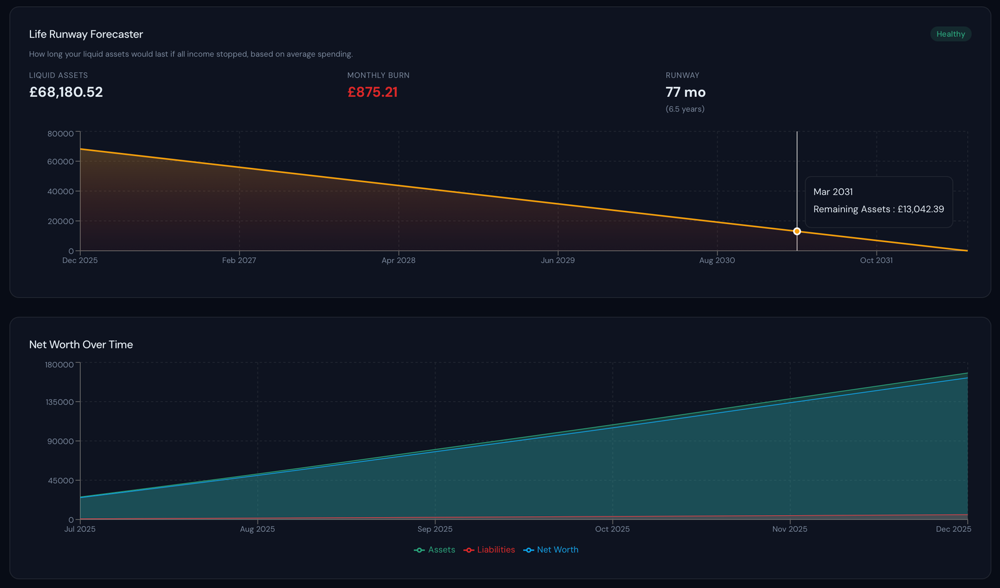
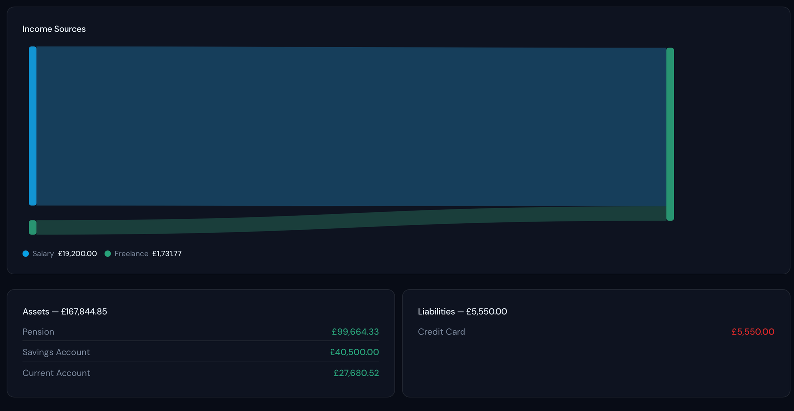

I have been continuing to use Lovable to make things for personal use. My second public project is a data visualiser, specifically, one that can be used with CSV exports from my personal finance app of choice, [Finances 2](https://hochgatterer.me/finances/). I've named it _Finviz_. Not the most imaginative name, but it gets the idea across.

Just like [the first project](https://thamara.co.uk/building-a-physical-media-showcase-with-lovable/), this was made entirely using natural language prompts. And like the first project, this too is open source. You can find the GitHub repo [here](https://github.com/thamarakandabada/finviz). The app is designed to be a private, self-hosted tool. You own your data. The app lives in your server and is not accessible by anyone else.

I have used the export format from Finances 2 as standard. But the column mapping is customisable for anyone using different apps to adapt as they please.

Crucially, the app is for data visualisation only and is not intended to be any form of financial advice.

A demo of the app can be accessed here: [finviz.thamara.co.uk](https://finviz.thamara.co.uk/login)

Feel free to upload your own data and play about. (The data resets periodically.) Here are a few screenshots to tickle your fancy.

I don't know what I will build next. It's bound to be something that I would use myself. I've not forced a financial outcome on this enterprise, and I'm keen to open source the things I make (if I can even use the word). I have to admit, it's exciting work.
