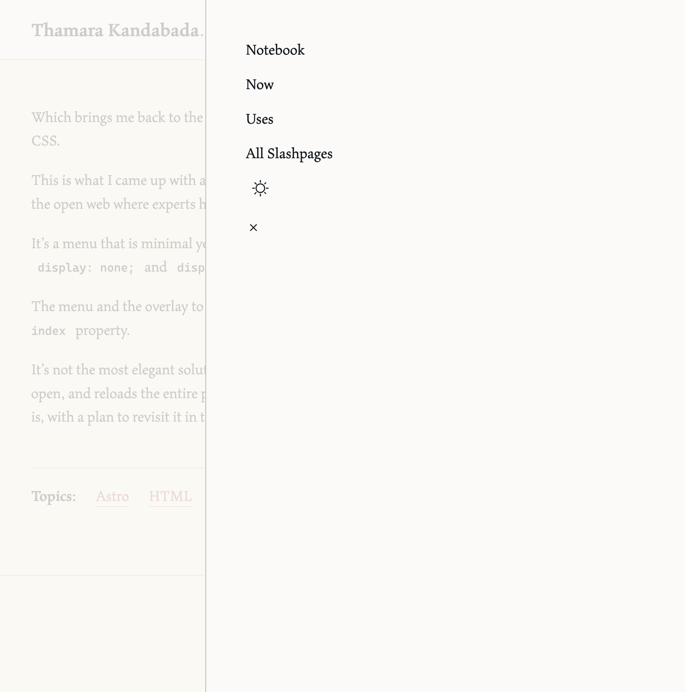

I’ve been making steady progress with the new website except in one area. I’m writing lots of HTML and CSS almost every day, but not knowing any JavaScript has become an issue. Key elements like injecting a blog, making content collections, and making ineteractive menus require JS knowledge. While I've been able to implement all this by following the Astro's tutiorials and how-to guides documented by other good samaritans on the internet, I've also had to resort to the following:

1. Write as much of the website as possible with simple HTML and CSS. This approach has made me rethink some elements I had initially wanted to port over from the current website, but I’m enjoying the challenge. 

2. Postpone the implementation of JS-heavy elements as much as possible, until after I’ve completed the JavaScript certification on freeCodeCamp. 

One thing I couldn’t postpone, however, was a navigation menu. I had already made a simple menu that works perfectly on desktop, but making a vertical version of it for smaller screens required some JS manipulation—or so I thought.

<figure>

<figcaption>My desktop menu</figcaption>
</figure>

Which brings me back to the first point: write as many elements as possible with simple HTML and CSS.

This is what I came up with after spending some time on StackOverFlow and various other corners of the open web where experts happily impart their knowledge.

<figure>

<figcaption>My mobile menu</figcation>
</figure>

It’s a menu that is minimal yet functional, using the `:target` pseudo-class to toggle between `display: none;` and `display: flex;`.

The menu and the overlay to its left is layered on top of the other elements of the page by using the `z-index` property.

It’s not the most elegant solution (for example, it leaves a trailing `#mobile-menu` in the URL bar when open, and reloads the entire page to the top when closed) but it works. For now I’m happy to leave it as is, with a plan to revisit it in the near future after arming myself with some JS chops.